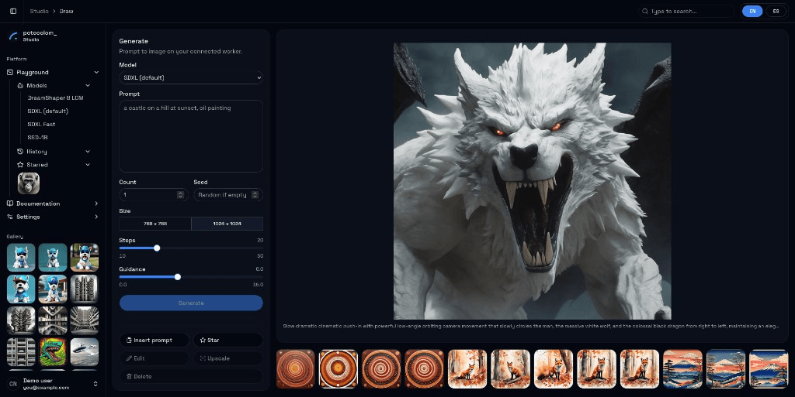

# potocolom

Draw it. Watch it render.

potocolom is an open source realtime generative image platform: sketch on a canvas and the drawing steers a scene the model renders live, then refine, generate, or upscale when you want a finished still. One AGPL codebase runs self-hosted on your own GPU for free, or as a managed cloud when you do not want to operate hardware.



## Status

Pre-alpha, under active development in the open. The architecture, protocols and economics are fully documented below; the walking skeleton (a real generation, end to end, on a self-hosted install) is the current milestone, and v0.1 tags when it passes. The cloud service opens later as an invite-only beta - the waitlist lives at [potocolom.leonfuller.com](https://potocolom.leonfuller.com).

## What makes it different

- A live loop, not a prompt queue: canvas frames stream to a GPU worker over one WebSocket and generated frames stream back while you draw.
- One codebase, two modes: the self-hosted install and the paid cloud run the same three container images; every difference is configuration behind documented seams.
- Self-hosting is a first-class citizen: docker compose, one machine, NVIDIA (CUDA) or AMD (ROCm), no account, no telemetry you cannot see and switch off.
- Models without releases: drop a model manifest and the interface adapts to its parameters.
- Private by default: no public gallery, signed URLs, self-serve GDPR export and deletion.

## Requirements

To run potocolom on your own machine. Contributing to it instead needs a different set, under [Development](#development).

| What | Needed | Notes |
|---|---|---|
| OS | Linux | What the project is developed, tested and released on. Docker Desktop hosts are untested. |
| Docker | Engine with Compose v2 | Everything ships as containers; nothing is installed on the host. Your user must be in the `docker` group (`sudo usermod -aG docker $USER`, then log back in) or every command below needs `sudo`. |
| GPU | NVIDIA or AMD, or none | NVIDIA needs the [Container Toolkit](https://docs.nvidia.com/datacenter/cloud-native/container-toolkit/latest/install-guide.html); AMD needs the ROCm kernel driver, so `/dev/kfd` and `/dev/dri` exist. Without a GPU the stack still runs against the simulated worker. |
| VRAM | 8 GB minimum, 12-16 GB comfortable | 8 GB is the floor of the lowest selectable model (`ssd-1b`, `vega-rt`); 12-16 GB covers the SDXL class at 1024 px, and `sd35-medium` wants 14 GB. Each manifest declares its own floor. Below it the worker still loads the model, offloaded, but drops the `realtime` capability: you get stills, not the live loop. |
| RAM | 8 GB, 16 GB comfortable | |
| Disk | 20 GB free, 50 GB+ comfortable | Model weights are 2-7 GB each, plus your generated images. |
| Network | Port 8080 free, outbound HTTPS | The studio is served on 8080; weights download from Hugging Face on first use of each model. |

No account, no API key and no telemetry endpoint are required. [docs/self-hosting.md](docs/self-hosting.md) has the full breakdown, including GPU passthrough and what persists in which volume.

## Self-hosting

Docker is the only thing this needs. Everything here is `docker compose` on
purpose, so nothing beyond the table above has to be installed on the host -
the `make` targets further down are for working *on* potocolom, not running it.

```bash
scripts/preflight.sh          # checks this machine; writes deploy/compose/.env when missing
docker compose -f deploy/compose/compose.yml --profile gpu up -d --build
# AMD card: use --profile rocm instead of --profile gpu
```

`scripts/preflight.sh` starts nothing and installs nothing. It checks the table
above against the running machine, names the profile you can run, prints the
fix for anything missing, and writes `deploy/compose/.env` from the example
when that file is missing (hex `POSTGRES_PASSWORD` and `FLEET_SECRET`). It
refuses to overwrite an existing `.env`. Copy `FLEET_SECRET` to a worker on
another machine.

If you happen to have `make`, `make compose-up`, `make compose-down` and
`make compose-logs` wrap exactly the commands above and pick the profile from
the GPU they find. They are a shortcut, never a requirement: the `docker
compose` lines are the supported path.

Open http://localhost:8080. Hardware requirements, NVIDIA and AMD GPU passthrough, first-run notes and what persists in which volume are covered in [docs/self-hosting.md](docs/self-hosting.md). The fleet WebSocket (`/api/v1/fleet`) authenticates workers with the shared `FLEET_SECRET` from your compose environment. An unset key refuses the handshake; preflight is what writes the secret on a fresh install. Signed cloud tokens remain issue #225. Validate the stack without a GPU: `scripts/compose-smoke.sh` (uses port 18080 by default; override with `COMPOSE_SMOKE_PORT`).

## Documentation

The design is documentation-first: every load-bearing decision is recorded with its rejected alternatives before the code lands.

- [Architecture](docs/architecture.md)
- [Deployment profiles and migration](docs/deployment-profiles.md)
- [Implementation blueprint](docs/blueprint.md)
- [API reference and user journeys](docs/api.md)
- [Connection handling](docs/connection-handling.md)
- [Local development and testing](docs/local-development.md)
- [Cloud infrastructure](docs/cloud-infrastructure.md)
- [AWS setup guide](docs/aws-setup.md)
- [Cloud delivery and access model](docs/cloud-delivery.md)
- [Repository boundary, licensing and delivery pipeline](docs/repository-boundary.md)
- [Usage metrics and telemetry](docs/metrics.md)
- [GPU performance reference](docs/gpu-performance.md)
- [Design decisions](docs/decisions.md)

Editable diagram sources (draw.io, with AWS service icons) live in [docs/diagrams/](docs/diagrams/).

## Development

The repository is a monorepo: `frontend/` (SvelteKit SPA), `backend/` (FastAPI API server), `worker/` (Python inference worker), `deploy/` (compose files and deployment configuration) and `docs/`.

### Prerequisites

- Docker with Compose v2, for the development dependencies.
- Python 3.11 or newer, for the backend and the worker, with its `venv` module: Debian and Ubuntu ship that separately, as `python3.11-venv` or equivalent. `make setup` uses `python3` when it is new enough and otherwise falls back to `python3.13` / `python3.12` / `python3.11` on PATH, so the system default may stay at 3.10; project packages install into `backend/.venv` and `worker/.venv` only.
- Node.js 24 or newer, for the frontend. `frontend/package.json` declares it and `engine-strict` is on, so npm refuses to install on an older Node rather than failing later in the build.
- A GPU is optional until inference lands (issue #15). Both NVIDIA (CUDA) and AMD Radeon (ROCm) are supported worker targets; machines without a supported GPU run the simulated worker (flat images, real protocol). Machine-specific setup, including AMD desktops, is documented in [Local development and testing](docs/local-development.md).

### Common tasks

Unlike self-hosting above, this is where `make` earns its place: these targets
drive a native toolchain, not containers, so they need the prerequisites listed
above rather than Docker alone.

```
make setup      # create virtualenvs, install all dependencies
make deps       # start PostgreSQL; make deps-all adds the cloud-sim containers
make verify     # lint, test and build all components: exactly what CI runs
make simulate   # live connection handling demo (API + workers + simulated browser)
```

See [Local development and testing](docs/local-development.md) for running each component individually.

## License

AGPL-3.0. The full product in this repository is self-hostable forever: self-hosting, private use, internal use and contribution are all permitted at no cost under the license's ordinary terms. Anyone who modifies the platform and distributes it, or operates it as a network service, must make their modified source available under the AGPL - or obtain a commercial license, see [COMMERCIAL.md](COMMERCIAL.md). The commercial cloud's billing and fleet orchestration live in a separate private repository behind documented HTTP contracts, and the cloud runs the same unmodified images published here. The reasoning is in [the repository boundary document](docs/repository-boundary.md).

Contributions require a `Signed-off-by` line ([DCO](https://developercertificate.org/)) - see [CONTRIBUTING.md](CONTRIBUTING.md).
