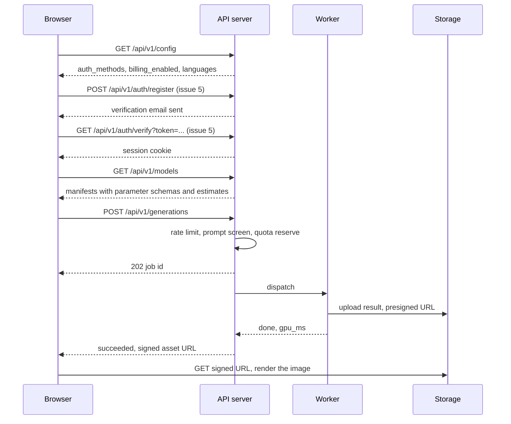
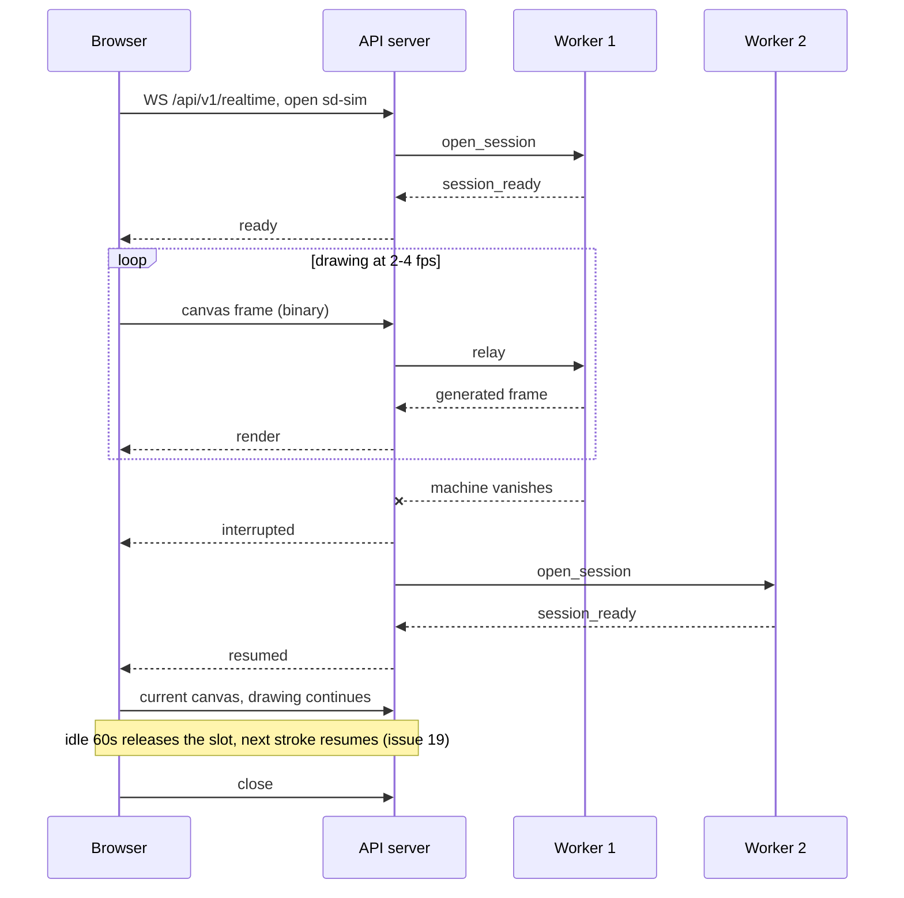
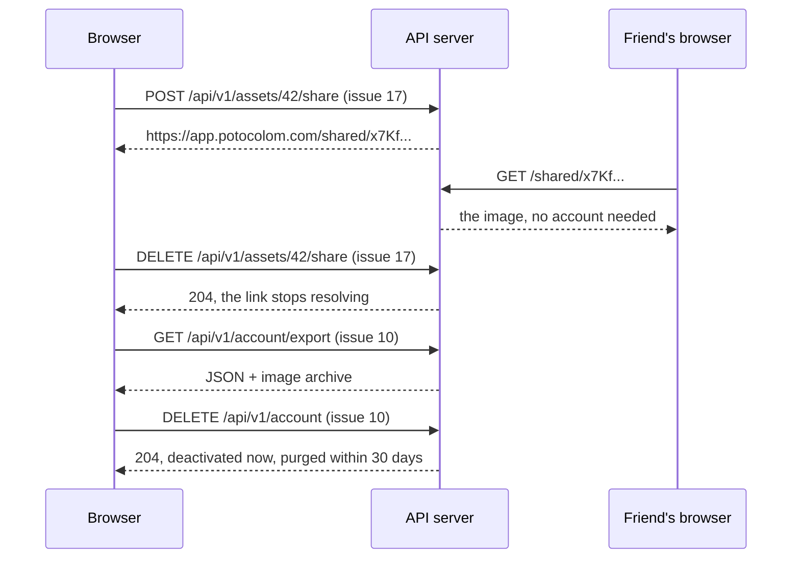

# API reference and user journeys

Every call a customer's browser makes, from first page load to account deletion. Endpoints that exist today are marked implemented; everything else names the issue that ships it, so this document doubles as the API-level view of the roadmap. The wire-level details of the two WebSocket endpoints live in [connection-handling.md](connection-handling.md); this document covers what flows over them and over REST.

<!-- Status markers corrected 2026-07-23: models + generations + history + progress + studio/metrics/benchmark/files endpoints are implemented (were marked planned). -->

## Conventions

- Base path `/api/v1`. JSON request and response bodies.
- Authentication is a session cookie (opaque token, httpOnly), set by the auth endpoints (issue #5). Until those ship, the prototype endpoints are unauthenticated and run as a single implicit local user (`AUTH_MODE=none`).
- REST errors use FastAPI's shape: `{"detail": "..."}` with a conventional status code.
- WebSocket errors are control messages `{"type": "error", "code": <int>, "message": "..."}` followed by a close with the same code; the code table is in [connection-handling.md](connection-handling.md).
- API versioning is the path prefix. The worker protocol versions independently with an N-1 compatibility promise.

## Endpoint catalogue

| Method and path | Status | Purpose |
|---|---|---|
| GET `/api/v1/health` | implemented | process liveness for the load balancer |
| GET `/api/v1/config` | implemented | runtime configuration for the SPA |
| WS `/api/v1/realtime` | implemented (prototype) | realtime drawing sessions |
| WS `/api/v1/fleet` | implemented (prototype) | worker fleet connection, not for browsers |
| GET `/api/v1/models` | implemented (#11, #15) | registered models with parameter schemas and GPU-time estimates |
| POST `/api/v1/generations` | implemented (#11, #16) | queue a generation job (text2img, img2img, or upscale) |
| GET `/api/v1/generations/{id}` | implemented (#16) | job state, result asset when done |
| GET `/api/v1/generations` | implemented (#16) | generation history: jobs with nested signed-URL assets, cursor paging |
| GET `/api/v1/generations/{id}/events` | implemented (#16) | server-sent-events stream of job progress (polling the job endpoint is the fallback) |
| GET `/api/v1/studio/gpu` | implemented (#93) | live GPU snapshot (util, VRAM, temperature, power) for the studio metrics panel |
| GET `/api/v1/metrics/gpu/history` | implemented (#98) | GPU telemetry over a time range (raw, or 5-minute rollups) |
| GET, POST `/api/v1/benchmark/*` | implemented (#83), `BENCHMARK_API`-gated | list, run, load and unload models for benchmarking |
| PUT, GET `/api/v1/files/{key}` | implemented (#18) | local-storage upload target and serve path (self-hosted, non-S3) |
| POST `/api/v1/auth/register` | issue #5 | email and password signup |
| GET `/api/v1/auth/verify` | issue #5 | email verification link target |
| POST `/api/v1/auth/login` | issue #5 | session cookie issuance |
| POST `/api/v1/auth/logout` | issue #5 | revoke the current session |
| GET `/api/v1/auth/redirect/{provider}` | issue #5 | OAuth authorization redirect |
| GET `/api/v1/auth/callback/{provider}` | issue #5 | OAuth code exchange, then a session cookie |
| GET `/api/v1/account` | issue #10 | profile, active sessions list |
| DELETE `/api/v1/account/sessions/{id}` | issue #10 | revoke another session |
| GET `/api/v1/account/export` | issue #10 | GDPR data export (JSON plus image archive) |
| DELETE `/api/v1/account` | issue #10 | deactivate now, hard delete within 30 days |
| POST `/api/v1/assets/{id}/share` | issue #17 | mint a public share token |
| DELETE `/api/v1/assets/{id}/share` | issue #17 | revoke the share token |
| GET `/shared/{token}` | issue #17 | public share link target (CDN path in the cloud) |
| GET `/api/v1/telemetry/preview` | issue #29 | the exact telemetry payload that would be sent, see [metrics.md](metrics.md) |

## Implemented endpoints

### GET /api/v1/health

Answers from process state only, so a database incident cannot convince the load balancer to kill healthy tasks.

```json
{"status": "ok"}
```

### GET /api/v1/config

The SPA's first call. One build artifact serves every deployment; this response tells it what to show.

```json
{
  "auth_methods": [],
  "billing_enabled": false,
  "languages": ["en", "es"]
}
```

`auth_methods` is empty in `AUTH_MODE=none` (self-hosted default: auto login, account UI hidden), `["local"]` for email and password, and `["local", "google", "github"]` when OAuth is configured.

<!-- Note: the shipped SPA does not yet consume /api/v1/config (built but unused). -->

### WS /api/v1/realtime

The drawing tool's connection. Text messages are JSON control, binary messages are image frames (17 byte header, then payload); framing, timeouts and close codes are specified in [connection-handling.md](connection-handling.md).

Browser to API: `{"type": "open", "model_id": "sd-sim"}` first, then binary canvas frames carrying the session id, then `{"type": "close"}`.

API to browser: `{"type": "ready", "session_id": "..."}`, generated frames as binary, and during recovery `{"type": "interrupted"}` then `{"type": "resumed"}` (re-send the current canvas). Terminal failures arrive as `error` messages before the close. Issue #19 adds `queued` with a live position, `idle` and `resuming` for slot release, prompt updates, `credits_tick`, and an out of credits close (an `error` message then the close) when a session's chunked reservation cannot be extended.

### GET /api/v1/models

Registered models, each with its JSON-Schema `parameters` and its measured GPU-time estimate.

```json
[
  {
    "id": "sdxl-base",
    "name": "SDXL Base",
    "capabilities": ["text_to_image", "image_to_image"],
    "min_vram_gb": 10,
    "default": true,
    "benchmark_only": false,
    "estimated_gpu_ms_default": 4200,
    "parameters": {
      "type": "object",
      "properties": {
        "prompt": {"type": "string"},
        "strength": {"type": "number", "minimum": 0, "maximum": 1, "default": 0.7}
      },
      "required": ["prompt"]
    }
  }
]
```

`parameters` is JSON Schema; the frontend renders generic controls from it, which is what makes a newly dropped model usable without a frontend release. `capabilities` is the routing key (a job is matched to a model that has the requested capability). Upscale models additionally carry an `estimated_gpu_ms_by_factor` map (per scale factor). `benchmark_only` models are hidden from normal selection and exist for the benchmark harness.

<!-- Corrected 2026-07-23: removed the "tier" field from this example (the wire Manifest has no "tier"; tier-based routing is unshipped) and added the shipped "default"/"benchmark_only"/"estimated_gpu_ms_default" fields. -->

### Generations and history

`POST` queues a job; the job endpoint and the SSE stream report progress; the list endpoint is the history.

```
POST /api/v1/generations     {"model_id": "sdxl-base", "params": {"prompt": "a castle at sunset"}}
                             model_id is REQUIRED. For image_to_image or upscale, also pass
                             "source_asset_id"; upscale requires a source and is mutually
                             exclusive with the diffusion capabilities.
                             202 {"job_id": "..."}   after rate limit, prompt screen (cloud) and quota reserve
                             402 when credits are insufficient, 422 when params fail the model's schema

GET /api/v1/generations/{id} {"state": "queued|running|succeeded|failed",
                              "asset": {...} when succeeded, "thumbnail_url": "...",
                              "source_asset_id": "..." (img2img/upscale),
                              phase timings "input_fetch_ms"/"load_ms"/"postprocess_ms",
                              "dispatched_at"/"finished_at", "failure_reason" on failure}

GET /api/v1/generations      generation history: a list of jobs, each with its nested assets
                             carrying short-lived signed URLs and "thumbnail_url"; cursor paging.
                             (This is the real history endpoint. There is no /api/v1/assets.)

GET /api/v1/generations/{id}/events   server-sent events: progress ticks until a terminal state
```

Progress also streams as control messages over the realtime WebSocket once issue #19 lands. A failed job (after its single automatic retry) carries the refunded state and the UI shows a retry button.

<!-- Corrected 2026-07-23: model_id is required (was documented optional with tier routing, which is unshipped); history is GET /api/v1/generations (was mislabeled GET /api/v1/assets); added shipped response fields and the SSE events endpoint. -->

### Studio, metrics, benchmark and local files

```
GET /api/v1/studio/gpu                 {"gpu": {device, util_pct, vram_used_pct, vram_used_bytes,
                                        vram_total_bytes, temperature_c, power_w, available}}
GET /api/v1/metrics/gpu/history        ?from&to&rollup - GPU samples over a range; the endpoint
                                        auto-picks raw samples (48h retention) or 5-minute rollups
                                        (30d retention) for the requested window. See metrics.md.
GET  /api/v1/benchmark/models          list benchmarkable models (BENCHMARK_API-gated)
POST /api/v1/benchmark/{load|unload|run}   drive a model for a benchmark run
PUT  /api/v1/files/{key}               local-storage upload target (self-hosted, non-S3); a PUT is
                                        authorized only for a storage key the API minted in-flight
GET  /api/v1/files/{key}               serve a stored object (self-hosted, non-S3)
```

## Planned endpoints, shapes fixed by the blueprint

Request and response shapes below are the contract [blueprint.md](blueprint.md) pseudocode implements; the issues fill in the behavior.

### Authentication (issue #5)

```
POST /api/v1/auth/register   {"email": "ana@example.com", "password": "...", "attest_18": true}
                             201, verification email sent (cloud); 200 with session cookie (self-host, verification off)
POST /api/v1/auth/login      {"email": "ana@example.com", "password": "...", "persistent": true}
                             204 + Set-Cookie: session=...; HttpOnly; SameSite=Lax (Secure over HTTPS)
                             401 on bad credentials, 429 when rate limited
POST /api/v1/auth/logout     204, session row deleted, cache invalidated across replicas
```

OAuth: the browser navigates to `/api/v1/auth/redirect/google`; the callback exchanges the code, finds or creates the user, and ends in the same session cookie as local login. (Google and GitHub at launch; Apple is deferred.)

### Sharing (issue #17)

Share operates on an asset id (assets are returned nested in the generations history). The share collection itself is not yet built.

```
POST   /api/v1/assets/{id}/share    201 {"url": "https://.../shared/<unguessable token>"}
DELETE /api/v1/assets/{id}/share    204, the token stops resolving (short CDN cache bounds the tail)
```

### Account and GDPR (issue #10)

```
GET    /api/v1/account            profile, plan (cloud), active sessions with created/last-used
DELETE /api/v1/account/sessions/2 204, that device is signed out instantly
GET    /api/v1/account/export     the account's data as JSON plus an archive of images
DELETE /api/v1/account            204, deactivated now, rows and assets hard deleted within 30 days
```

## User journeys

The same calls, in the order a customer actually makes them. Solid arrows exist today; the issue numbers mark the rest.

### First visit to first image



### A drawing session, including the rough parts



### Sharing and leaving



## Trying it today

`make simulate` runs the implemented slice of the first journey against real processes: the health check, the config fetch a real SPA would make, then a full realtime session with a mid-session worker loss and recovery. The editable diagrams in [diagrams/potocolom.drawio](diagrams/potocolom.drawio) include the full journey with every planned call, colored by implementation status.
