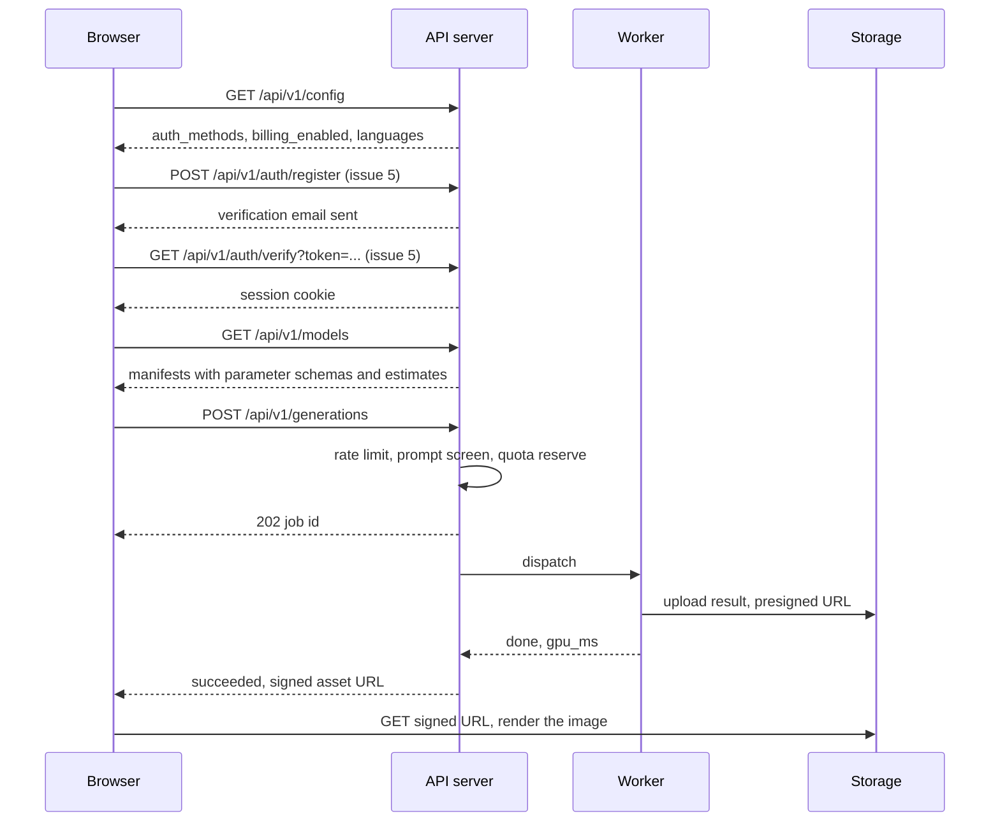
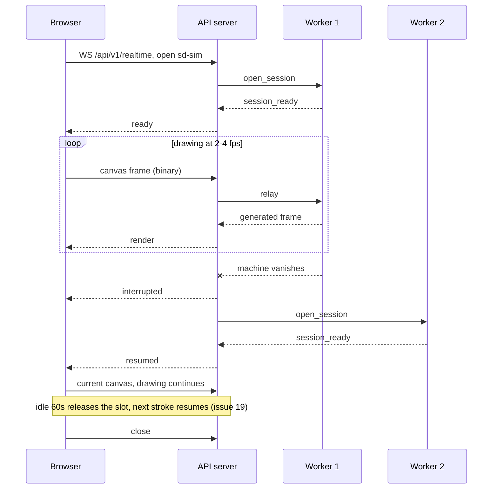
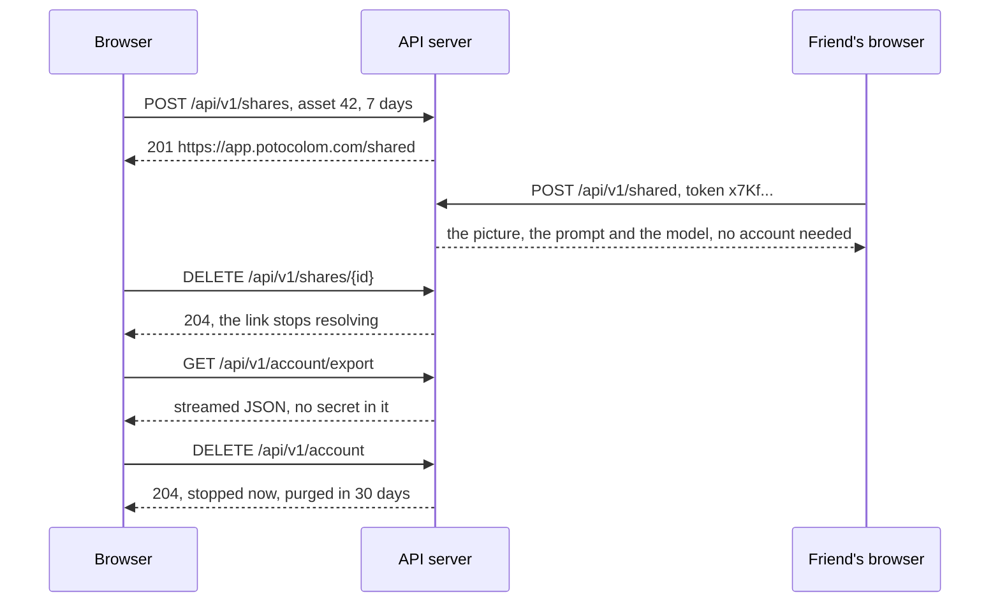

# API reference and user journeys

Every call a customer's browser makes, from first page load to account deletion. Endpoints that exist today are marked implemented; everything else names the issue that ships it, so this document doubles as the API-level view of the roadmap. The wire-level details of the two WebSocket endpoints live in [connection-handling.md](connection-handling.md); this document covers what flows over them and over REST.

<!-- Status markers corrected 2026-07-23: models + generations + history + progress + studio/metrics/benchmark/files endpoints are implemented (were marked planned). -->

## Conventions

- Base path `/api/v1`. JSON request and response bodies.
- Authentication resolves requests to a principal. With `AUTH_MODE=none`, the principal is one implicit local admin.
- Authorization is the `role` column on the user, ranked `viewer` < `user` < `admin`:
  `admin` covers everything including install configuration, `user` creates and mutates
  its own work, `viewer` is read-only. Write endpoints require `user` or `admin` and
  answer 403 for a `viewer`. The code calls the `user` tier "member" in
  `require_role("member")`; the stored value is `user`.
- In `AUTH_MODE=accounts` a request authenticates with a session: 32 random bytes, kept only as a SHA-256 hash. Over HTTPS the cookies are `__Host-potocolom_session` and `__Host-potocolom_csrf`; over plain HTTP, which is what LAN self-hosting uses, they are `potocolom_session` and `potocolom_csrf`, because the `__Host-` prefix requires `Secure` and a browser drops a `Secure` cookie on plain HTTP. The session cookie is `HttpOnly`, `SameSite=Lax`, host-only and `Path=/`. The CSRF cookie is readable, because the browser has to echo it back.
- An unsafe request authenticated by cookie needs an exact `Origin` and an `X-CSRF-Token` header matching the CSRF cookie, or it answers 403. An absent `Origin` is refused. A request authenticated by `Authorization: Bearer` needs neither, because a bearer is presented deliberately rather than sent along by the browser. A bearer wins outright: an invalid one answers 401 and never falls back to the cookie.
- Sessions last 12 hours. Remember-me lasts 30 days with a 7-day idle window. An administrator gets 12 hours with a 30-minute idle window and cannot be remembered. Recent authentication lasts 30 minutes, is granted by signing in, and is never granted by claiming the installation.
- `disabled`, `deletion_pending` and `purging` accounts cannot sign in, and their existing sessions stop resolving. A `suspended` account signs in read-only: safe methods answer normally and anything else answers 403.
- Registration is invitation-only. An invitation is bound to one address, good once, and valid 72 hours. It may be copied and handed over by any means, because a self-hosted install is not required to have mail. Only the hash is stored, so the link is shown once at creation; revealing it again mints a fresh one and retires the previous, on the assumption that a link nobody could see may have leaked on the way.
- Promoting an account to `admin` needs recent authentication from the caller, and either a verified address on the target or an explicit `attested` flag. The attestation is recorded with the target, because on an install with no mail nothing else can say who that address belongs to. An administrator can never change their own role, and the last administrator cannot be demoted: an install with no administrator can only be recovered offline.
- A role change revokes every session the account held, since the old session carries the old authority.
- Enrolling a second factor writes nothing until it is confirmed. `POST /api/v1/account/totp` returns the secret, its `otpauth://` URI, the recovery codes, and an opaque `enrolment` value the browser hands back to `POST /api/v1/account/totp/confirm` along with a code from the authenticator. Only that confirmation writes the factor and its codes, replacing whatever the account had before in one transaction. An enrolment that is started and abandoned therefore leaves a working factor working, and the `enrolment` value is bound to the account that started it and expires in 30 minutes. The confirming code is spent like any other, so a sign-in inside the same 30 seconds needs the next one.
- A second factor is optional for every role. When an account has enrolled and confirmed one, a correct password or a provider sign-in returns `200 {"totp_required": true}` and a short-lived challenge cookie instead of a session. `POST /api/v1/auth/totp` answers it with a TOTP code or a one-use recovery code and returns the session. The challenge lives ten minutes, allows ten attempts, and carries no authority of its own: an administrator part way through it can reach nothing. TOTP gates sign-in and nothing else; it does not gate setup, invitation acceptance, promotion or recovery, and it changes neither what an account may do nor how long its session lasts.
- `POST /api/v1/auth/reset` always answers `202` with the same body, whether or not anybody holds that address. A non-administrator is emailed a one-use link valid 30 minutes. An administrator is emailed nothing, ever: their way back is `make auth-recover`, run at the machine, which prints a one-use link valid 10 minutes. Completing either sets the password, revokes every session that account held, and returns the person to the login screen with no session and no recent-authentication grant.
- Changing how an account is proved needs recent authentication, and changing a password that already exists needs the current one as well: recent authentication says this browser was somebody's, and the current password says it is still theirs at this keyboard. Every such change ends the account's other sessions and leaves the browser making it signed in, because the usual reason to change a credential is that somebody else holds the old one.
- Changing the primary address resets `mail_verified` and moves the password identity with it. A provider proved the old address and says nothing about the new one, and login matches on the identity, so leaving it behind would sign somebody in under an address they no longer hold. An address another account holds answers 409.
- Unlinking a provider refuses when it is the only credential left, because an account with no way in can only be recovered offline.
- A route requiring `admin` with an unsafe method is audited before it runs, with the actor, the role, and the route template as the action name. Admin reads are not audited; a read that reaches another user's data will record its own target when those routes exist. The record is durable in PostgreSQL and kept 90 days. Audit fails open: an action still proceeds when only its record fails, and the gap becomes visible instead of silent (see [SECURITY.md](../SECURITY.md)). No audit route is exposed yet.
- REST errors use FastAPI's shape: `{"detail": "..."}` with a conventional status code.
- Responses under `/api/v1/` include `Cache-Control: no-store`.
- WebSocket errors are control messages `{"type": "error", "code": <int>, "message": "..."}` followed by a close with the same code; the code table is in [connection-handling.md](connection-handling.md).
- API versioning is the path prefix. The worker protocol versions independently with an N-1 compatibility promise, and the API tolerates the previous release's SPA through additive-only response changes over the same release window.

## Endpoint catalogue

| Method and path | Status | Purpose |
|---|---|---|
| GET `/api/v1/health` | implemented | process liveness for the load balancer |
| GET `/api/v1/ready` | implemented | PostgreSQL and asset-storage readiness |
| GET `/api/v1/config` | implemented | runtime configuration for the SPA |
| WS `/api/v1/realtime` | implemented (prototype) | realtime drawing sessions; in accounts mode the session cookie authenticates the upgrade, and revoking that session closes the socket |
| WS `/api/v1/fleet` | implemented (prototype) | worker fleet connection, not for browsers: a handshake carrying a non-allowlisted `Origin` is refused, as is one without the `X-Fleet-Token` shared secret |
| GET `/api/v1/models` | implemented | registered models with parameter schemas and GPU-time estimates; requires a principal |
| POST `/api/v1/generations` | implemented (#11, #16) | queue a generation job (text2img, img2img, or upscale) |
| GET `/api/v1/generations/{id}` | implemented (#16) | job state, result asset when done |
| GET `/api/v1/generations` | implemented (#16) | generation history: jobs with nested opaque asset-ID URLs, cursor paging |
| GET `/api/v1/generations/{id}/events` | implemented (#16) | server-sent-events stream of job progress (polling the job endpoint is the fallback) |
| POST, DELETE `/api/v1/generations/{id}/star` | implemented (#124) | idempotently star or unstar an owned generation |
| GET `/api/v1/generations/{id}/lineage` | implemented (#129) | ancestry, direct derivatives and subtree size of an owned generation |
| GET `/api/v1/generations/{id}/subtree` | implemented (#130) | bounded descendants and render data for one Images canvas tree |
| GET `/api/v1/benchmark/sessions/*` | implemented | list and read durable benchmark sessions; admin only |
| POST `/api/v1/benchmark/sessions` | implemented, `BENCHMARK_API`-gated | ingest a completed benchmark session; admin only |
| GET `/api/v1/studio/gpu` | implemented | live GPU snapshot (util, VRAM, temperature, power) for the studio metrics panel; admin only |
| GET `/api/v1/metrics/gpu/history` | implemented | GPU telemetry over a time range (raw, or 5-minute rollups); admin only |
| GET, POST `/api/v1/benchmark/*` | implemented, `BENCHMARK_API`-gated | list, run, load and unload models for benchmarking; admin only |
| PUT `/api/v1/files/{key}` | implemented | local-storage upload target; capability-bound worker writes |
| GET `/api/v1/assets/{id}` | implemented | owner- or admin-checked asset bytes; missing and unauthorized assets return 404 |
| POST `/api/v1/auth/register` | implemented | accept an invitation and set a password; returns a clean session |
| GET `/api/v1/auth/verify` | issue #5 | email verification link target |
| POST `/api/v1/auth/setup` | implemented | claim the installation with the one-use link; returns a clean session |
| POST `/api/v1/auth/login` | implemented | password sign-in; sets the session and CSRF cookies |
| POST `/api/v1/auth/logout` | implemented | revoke the session this request used |
| GET `/api/v1/auth/redirect/{provider}` | implemented | start a provider sign-in; 404 unless that provider is listed and has credentials |
| GET `/api/v1/auth/callback/{provider}` | implemented | finish a provider sign-in or a link; never creates an account |
| POST `/api/v1/invitations` | implemented | invite an address to a role; returns the link once, admin only |
| GET `/api/v1/invitations` | implemented | the open invitations, without their links; admin only |
| DELETE `/api/v1/invitations/{id}` | implemented | revoke an open invitation; admin only |
| POST `/api/v1/invitations/{id}/reveal` | implemented | re-mint the link and retire the previous one; admin only |
| POST `/api/v1/users/{id}/role` | implemented | change an account's role; admin only |
| POST `/api/v1/users/{id}/state` | implemented | suspend, disable, or mark an account for deletion; admin only |
| POST `/api/v1/generations/{id}/cancel` | implemented | stop a queued or running job |
| POST `/api/v1/auth/totp` | implemented | answer a sign-in challenge with a TOTP code or a recovery code |
| POST `/api/v1/auth/reset` | implemented | ask for a password reset link; always answers the same |
| POST `/api/v1/auth/reset/complete` | implemented | spend a reset or recovery link and set a password; returns to login |
| POST `/api/v1/account/totp` | implemented | begin enrolling a second factor; needs recent authentication |
| POST `/api/v1/account/totp/confirm` | implemented | prove the authenticator holds the secret, which is what enrols it |
| POST `/api/v1/account/identities/{provider}` | implemented | start linking a provider to this account; needs recent authentication |
| DELETE `/api/v1/account/identities/{provider}` | implemented | unlink a provider; refuses the last way in |
| POST `/api/v1/account/password` | implemented | change or add a password; needs recent authentication |
| POST `/api/v1/account/email` | implemented | change the primary address; resets mail assurance |
| GET `/api/v1/account` | implemented | this account, and its live sessions |
| DELETE `/api/v1/account/sessions/{id}` | implemented | revoke one of this account's own sessions |
| GET `/api/v1/account/export` | implemented | everything this install holds about the account, as streamed JSON |
| DELETE `/api/v1/account` | implemented | stop the account now; the rows and objects go in 30 days |
| POST `/api/v1/users/{id}/restore` | implemented | put an account waiting to be deleted back where it was; admin only |
| POST `/api/v1/shares` | implemented | mint the link for one asset, for 1, 7 or 30 days |
| DELETE `/api/v1/shares/{id}` | implemented | revoke a share; the link stops resolving |
| POST `/api/v1/shared` | implemented | resolve a share token; no account needed |
| GET `/api/v1/mail/status` | implemented | what the mail outbox is doing; admin only |
| GET `/api/v1/telemetry/preview` | implemented (#29) | the exact telemetry payload that would be sent, see [metrics.md](metrics.md) |

## Implemented endpoints

### GET /api/v1/health

Answers from process state only, so a database incident cannot convince the load balancer to kill healthy tasks.

```json
{"status": "ok"}
```

### GET /api/v1/ready

Checks PostgreSQL and the configured asset store. It returns `200` when both
are available and `503` otherwise. Use `/api/v1/health` for process liveness;
this endpoint reports whether required data services are ready.

### GET /api/v1/config

The SPA's first call. One build artifact serves every deployment; this response tells it what to show.

```json
{
  "auth_methods": [],
  "billing_enabled": false,
  "languages": ["en", "es"]
}
```

`auth_methods` is empty in `AUTH_MODE=none`; the implicit local admin is used for requests.

<!-- Note: the shipped SPA does not yet consume /api/v1/config (built but unused). -->

### WS /api/v1/realtime

The drawing tool's connection. Text messages are JSON control, binary messages are image frames (17 byte header, then payload); framing, timeouts and close codes are specified in [connection-handling.md](connection-handling.md).

Both WebSocket endpoints refuse a handshake carrying an `Origin` that is not `PUBLIC_URL` or one of `ALLOWED_ORIGINS`; the connection fails as HTTP 403 before any close code applies (see [connection-handling.md](connection-handling.md)).

Browser to API: `{"type": "open", "model_id": "sd-sim", "params": {"prompt": "a red house"}}` first, then binary canvas frames carrying the session id, `{"type": "update_params", "params": {"prompt": "a blue house"}}` to change a subset of the session's parameters, then `{"type": "close"}`.

API to browser: `{"type": "ready", "session_id": "..."}`, generated frames as binary, and during recovery `{"type": "interrupted"}` then `{"type": "resumed"}` (re-send the current canvas). An accepted parameter update is confirmed with `{"type": "params_updated", "params": {...}}` carrying the merged parameters the API holds for the session (the browser's keys over the session's, the seed riding along) - what later frames are rendered with once a worker has them, though the worker may fill in the manifest's declared defaults for keys nobody has set, and the acknowledgement arrives even when no worker holds the session at that moment (a reassignment in flight). The browser re-sends the current canvas when this confirmation arrives, so a prompt or slider change takes effect without a new stroke. Terminal failures arrive as `error` messages before the close. A rejected `update_params` (invalid params, a `seed` change - a session's seed is fixed at open - or an assigned worker whose protocol predates `update_session`, which ships at protocol 3) also arrives as an `error` but leaves the session running. From protocol 4, `update_session` carries `control_generation` so a stale update cannot land on a newer attempt; a protocol 3 worker still gets the unfenced form and may serve a session's first attempt only. When no worker answers the `open` within the ready timeout, the browser sees `{"type": "error", "code": 4003, "message": "worker did not become ready"}` before the close. A worker that cannot serve the attempt sends `session_refused`; the API tries another protocol 4 worker or closes 4003. Issue #19 adds `queued` with a live position, `idle` and `resuming` for slot release, `credits_tick`, and an out of credits close (an `error` message then the close) when a session's chunked reservation cannot be extended.

### GET /api/v1/models

Registered models, each with its JSON-Schema `parameters` and its measured GPU-time estimate.

```json
[
  {
    "id": "sdxl-base",
    "name": "SDXL Base",
    "capabilities": ["text_to_image", "image_to_image"],
    "min_vram_gb": 10,
    "prompt_token_limit": 77,
    "default": true,
    "benchmark_only": false,
    "studio_capabilities": null,
    "realtime_p95_ms": null,
    "estimated_gpu_ms_default": 4200,
    "parameters": {
      "type": "object",
      "properties": {
        "prompt": {"type": "string"},
        "strength": {"type": "number", "minimum": 0, "maximum": 1, "default": 0.7}
      },
      "required": ["prompt"]
    }
  }
]
```

`parameters` is JSON Schema; the frontend renders generic controls from it, which is what makes a newly dropped model usable without a frontend release. `capabilities` is the routing key (a job is matched to a model that has the requested capability). Upscale models additionally carry an `estimated_gpu_ms_by_factor` map (per scale factor). `benchmark_only` models are hidden from normal selection and exist for the benchmark harness. `prompt_token_limit` is the text encoder window the studio warns against (issue #148); 0 or absent means the model declared no window and no warning is shown. `studio_capabilities` is the subset of `capabilities` the studio offers; null when every capability is offered. On this endpoint it is informational only: the narrowing has already been applied to `capabilities`, so the two are identical whenever it is non-null, and a client should not filter on it again. `realtime_p95_ms` is the measured single-frame p95 on the reporting worker's card, which the realtime picker labels models with; null until a worker has measured it, and a live heartbeat measurement supersedes the value from hello.

<!-- Corrected 2026-07-23: removed the "tier" field from this example (the wire Manifest has no "tier"; tier-based routing is unshipped) and added the shipped "default"/"benchmark_only"/"estimated_gpu_ms_default" fields. -->

### Generations and history

`POST` queues a job; the job endpoint and the SSE stream report progress; the list endpoint is the history.

```
POST /api/v1/generations     user or admin; viewer receives 403
                             {"model_id": "sdxl-base", "params": {"prompt": "a castle at sunset"}}
                             model_id is REQUIRED. For image_to_image or upscale, also pass
                             "source_asset_id"; upscale requires a source and is mutually
                             exclusive with the diffusion capabilities. A thumbnail cannot be
                             used as source_asset_id and returns 422.
                             202 {"job_id": "..."}   after rate limit, prompt screen (cloud) and quota reserve
                             402 when credits are insufficient, 422 when params fail the model's schema

GET /api/v1/generations/{id} {"state": "queued|running|succeeded|failed|cancelled",
                              "asset": {...} when succeeded, "thumbnail_url": "...",
                              "source_asset_id": "..." (img2img/upscale),
                              "has_derivatives": true when any job uses one of its assets,
                              phase timings "input_fetch_ms"/"load_ms"/"postprocess_ms",
                              "dispatched_at"/"finished_at", "failure_reason" on failure}

GET /api/v1/generations      generation history: a list of jobs, each with its nested assets
                             carrying opaque asset-ID URLs and "thumbnail_url", plus
                             "has_derivatives" for stable client layout; cursor paging.
                             ?starred=true uses starred_at newest-first; false excludes favorites.
                             ?roots_only=true returns source_asset_id IS NULL; false returns only
                             derivatives. Omit it for the existing unfiltered history. Cursors must
                             come from the same filtered result and retain created_at/id ordering.

GET /api/v1/generations/{id}/events   server-sent events: progress ticks until a terminal state

POST /api/v1/generations/{id}/cancel  204; idempotent, and open to the owner whatever their
                                      role, since calling off your own work is not a mutation
                                      of anybody else's. 404 for a job that is not yours.
                                      A job that already finished stays finished.

POST /api/v1/generations/{id}/star    user or admin; 204; idempotent, 403 for viewer,
                                      404 for another user's or missing job
DELETE /api/v1/generations/{id}/star  user or admin; 204; idempotent, 403 for viewer,
                                      404 for another user's or missing job

GET /api/v1/generations/{id}/lineage  the derivation chain around one generation (#129)
                                      {"ancestors": [entry], root first, direct parent last, [] for a root
                                       "children":  [entry], direct derivatives, created_at ascending
                                       "descendant_count": subtree size through depth 100,
                                       "descendants_truncated": true when deeper rows exist}
                                      entry = {"job_id": null when the source was an upload,
                                               "asset_id", "action": generate|image_to_image|upscale|upload,
                                               "model_id", "created_at", "state", "thumbnail_url",
                                               "missing": true once the bytes are gone, renders a ghost}
                                      404 for another user's or missing job. The walk is bounded at depth
                                      100 and skips already-visited assets, so a cycle cannot hang it.
                                      A missing ancestor keeps its place: the chain stays intact because
                                      purging an asset drops its bytes and keeps the row (decisions.md).

GET /api/v1/generations/{id}/subtree  one canvas tree in one database query (#130)
                                      {"nodes": [{"parent_job_id": null, "output_asset_ids": [],
                                                  "entry": entry,
                                                  "generation": generation}],
                                       "truncated": false,
                                       "remaining_count_lower_bound": 0,
                                       "max_depth": 100, "max_nodes": 600}
                                      Nodes are breadth-first and include the generation fields and first
                                      non-thumbnail master asset needed by the canvas. parent_job_id joins
                                      each child to its parent generation; output_asset_ids lets cache
                                      revalidation match derivatives of any output. The walk is user-owned, cycle safe, excludes
                                      thumbnail assets, and stops at both limits. When truncated, the lower
                                      bound counts known omitted branches, not every unseen descendant.
                                      404 for another user's, missing, or assetless anchor job.
```

Asset URLs use `/api/v1/assets/{id}`. The API checks the asset owner or admin role. A missing
or unauthorized asset returns 404. For an accessible asset, an unsafe `download` name returns 400.

The studio opens at most four generation event streams. An `EventSource` error
before or after the initial event moves that job to the 1.5-second history
polling fallback; jobs above the stream cap share the same fallback refresh.
After a streamed terminal event, the studio reads that generation once so its
final row, timings and assets equal a history poll. A missed cross-replica event
cannot leave a spinner running forever, by one of two paths: while every working
job is streamed, each streamed row is reconciled on its own every 15 seconds;
while any job is on the fallback, the 1.5-second history refresh already covers
every row, streamed or not.

Progress also streams as control messages over the realtime WebSocket once issue #19 lands. A failed job (after its single automatic retry) carries the refunded state and the UI shows a retry button.

<!-- Corrected 2026-07-23: model_id is required (was documented optional with tier routing, which is unshipped); history is GET /api/v1/generations (was mislabeled GET /api/v1/assets); added shipped response fields and the SSE events endpoint. -->

### Studio, metrics, benchmark and local files

```
GET /api/v1/studio/gpu                 admin only; {"gpu": {device, util_pct, vram_used_pct, vram_used_bytes,
                                        vram_total_bytes, temperature_c, power_w, available}}
GET /api/v1/metrics/gpu/history        admin only; ?from&to&rollup - GPU samples over a range; the endpoint
                                        auto-picks raw samples (48h retention) or 5-minute rollups
                                        (30d retention) for the requested window. See metrics.md.
GET  /api/v1/benchmark/models          admin only; list benchmarkable models (BENCHMARK_API-gated)
POST /api/v1/benchmark/{load|unload|run}   admin only; drive a model for a benchmark run
POST /api/v1/benchmark/sessions       admin only; BENCHMARK_API-gated completed
                                        scripts/benchmark.py report;
                                        201 {"id": "..."}; 404 when the benchmark API is disabled;
                                        malformed reports return 422
GET  /api/v1/benchmark/sessions       admin only; 200 newest-first install-scoped session summaries;
                                        ?limit defaults to 50 and is capped at 200; pass the last
                                        session id as ?cursor to read the next page
GET  /api/v1/benchmark/sessions/{id}  admin only; 200 full report in the existing results.json shape;
                                        404 for a missing session
GET  /api/v1/telemetry/preview        admin only; 403 for viewer or user; 200 exact previous
                                        UTC day's anonymous aggregate payload;
                                        503 when the database is unavailable
PUT  /api/v1/files/{key}               local-storage upload target (self-hosted, non-S3); a PUT is
                                        authorized only for a storage key the API minted in-flight
                                        AND an X-Upload-Token header matching that dispatch, which
                                        the worker echoes from upload.headers; 403 otherwise, and
                                        409 on a second write, since outputs are write-once
GET  /api/v1/files/{key}               always 404; this route is retired
GET  /api/v1/assets/{id}                owner or admin; serves local bytes, with 404 for missing or
                                        unauthorized assets and 400 for an unsafe download name
```

For local storage, worker input URLs use `/api/v1/worker-input` with an opaque 32-byte capability.
The capability expires after 15 minutes. The URL does not contain the storage key.

## Planned endpoints, shapes fixed by the blueprint

Request and response shapes below are the contract [blueprint.md](blueprint.md) pseudocode implements; the issues fill in the behavior.

### Authentication (shipped, kept here for the exact shapes)

These four routes and the OAuth flow below them are implemented. Only `GET /api/v1/auth/verify` is still open under issue #5.

```
POST /api/v1/auth/setup      {"token": "...", "email": "ana@example.com", "password": "..."}
                             204 + the session cookies; the link is one use and lasts one hour
POST /api/v1/auth/register   {"token": "...", "password": "..."}
                             204 + the session cookies; the invitation carries the address
POST /api/v1/auth/login      {"email": "ana@example.com", "password": "...", "remember_me": true}
                             204 + Set-Cookie: potocolom_session (HttpOnly, SameSite=Lax,
                             Path=/, Secure and __Host- prefixed over HTTPS) and potocolom_csrf
                             401 on bad credentials, and on an address nobody holds
POST /api/v1/auth/logout     204, session revoked and both cookies cleared
```

OAuth: the browser navigates to `/api/v1/auth/redirect/google`; the callback exchanges the code and ends in the same session cookies as a password login. It **never finds or creates an account by email**. Registration is invitation-only, so a provider sign-in only succeeds for an identity somebody already linked deliberately, and a provider account that happens to know an address cannot become that person. Linking is a separate act: `POST /api/v1/account/identities/{provider}` needs a live session and authentication within the last 30 minutes.

The flow is authorization code with PKCE S256. The state is minted here and only its hash is stored, the verifier and nonce never leave the server, the redirect URI is exact, and the flow row is one use and expires in ten minutes. Google's `id_token` must carry a valid issuer, audience, expiry and nonce, and a verified email. GitHub's address is the primary verified entry from `/user/emails`. The provider's access token is discarded as soon as the identity is read; nothing here acts as an agent for the provider.

A provider-verified address raises this account's `mail_verified` only when it normalizes equal to the account's own primary address. A provider proving some other address says nothing about this one. (Google and GitHub; Apple is deferred.)

## Account states

An account is `active`, `suspended`, `disabled`, `deletion_pending`, or `purging`. `cancelled` is a job state and never an account state.

```text
POST /api/v1/users/{id}/state   {"state": "active" | "suspended" | "disabled" | "deletion_pending"}
                                204; admin only; idempotent
                                409 when that transition does not exist
                                403 for an administrator's own account
```

- Compare and set: the transition is checked against the state the account holds inside the same transaction that writes the new one. Setting the state an account already holds is a no-op `204`, so a retry after a timeout is not a second event.
- `purging` is absent from the request on purpose: the deletion sweep moves an account there, never an administrator with a form.
- Leaving `active` revokes every session the account holds, closes the realtime sockets bound to them, spends its outstanding reset and recovery links, and cancels its queued and running jobs.
- A `suspended` account may sign in and read: its own work, its account settings, its billing. It may change nothing, hold no GPU slot, and its share links resolve `404` until it is restored. The links are paused rather than revoked, so restoring the account restores what it shared.
- `disabled`, `deletion_pending` and `purging` cannot sign in at all, through any door: password, provider, or a link that was already in a mailbox.
- An administrator cannot change their own state, and the last active administrator cannot be suspended: an install with no administrator can only be recovered offline.

## Cancelling work

Cancellation is cooperative and PostgreSQL is the authority. The row is marked `cancelled` first, and the worker holding the job is told afterwards, best effort and bounded. A worker that never hears, or that runs an older protocol, changes nothing: whatever it uploads afterwards is discarded, and the GPU milliseconds it reports are still recorded against the job and charged as usage, because the GPU really did run for that long.

## Sharing

A share is a link that shows one picture to whoever holds it. The token lives in the URL fragment, which a browser never sends to a server, and comes back in a POST body. There is no GET that takes one: a token in a path or a query would sit in access logs, proxy traces and `Referer` headers all the way to whoever the link was forwarded to.

```text
POST   /api/v1/shares          {"asset_id": "...", "days": 1 | 7 | 30}
                               201 {"id": "...", "url": "https://.../shared#<token>"}
DELETE /api/v1/shares/{id}     204, the link stops resolving
POST   /api/v1/shared          {"token": "..."}
                               200 {"asset": {"id", "width", "height", "mime"},
                                    "prompt": "...", "model": "...", "url": "..."}
```

- One active share per asset. Sharing an asset that is already shared mints a new link and revokes the previous one in the same transaction, so revoking the link somebody can see never leaves an older one alive behind it.
- The token is reusable until it is revoked or its 1, 7 or 30 days run out. Only its SHA-256 is stored, so a share cannot be read back out of the database and shown again.
- The answer carries the picture and nothing about the account behind it: no address, no account id, no storage key. `url` is an address for the original asset that lasts 60 seconds, minted fresh on every resolve.
- Every refusal is the same `404`, whether the token was never minted, was revoked, or expired.
- Creating a share needs the owner's session at the `user` role, because minting a public link is a mutation. Revoking one stays open to a `viewer`, so an account demoted while a link was live can still take it down. Resolving needs nothing at all, which is what makes it a share.

### Account, export and deletion

```text
GET    /api/v1/account            profile, plan (cloud), active sessions with created/last-used
DELETE /api/v1/account/sessions/2 204, that device is signed out instantly
GET    /api/v1/account/export     200 application/json, streamed:
                                  {"account": {...}, "identities": [...],
                                   "generations": [{..., "assets": [...]}, ...]}
DELETE /api/v1/account            204, the account stops now and is purged in 30 days
POST   /api/v1/users/{id}/restore 204, admin only; idempotent; 409 for an account
                                  that was never waiting to be deleted
```

- The export is paged out of PostgreSQL and written as it goes, so a library of ten thousand generations never has to fit in memory, here or in the process that asked for it. It carries no secret of any kind: no password hash, no session hash, no TOTP secret, no recovery code. A file that leaves the building takes whatever is in it wherever it goes, and a password hash is an offline cracking target.
- Deleting an account stops it immediately: the state becomes `deletion_pending`, every session is revoked, every outstanding link is spent, the realtime sockets close, and the queued and running jobs are cancelled. Nothing is destroyed yet.
- The account remembers the state it was in, one level deep, and a restore inside the window puts it back there. An account that was suspended when it asked to be deleted comes back suspended: a restore undoes the deletion, not everything before it.
- After 30 days a sweep purges it: the objects first, because the row is the only thing that names them, then the assets, then the jobs, and only then the user row, which is the order the foreign keys demand. A purged user row no longer exists. Audit rows carry plain ids with no foreign key, so what an administrator did survives the account they did it to.
- The last administrator may delete their own account. An install with nobody in charge can be recovered offline; an administrator held hostage by their own install cannot.

## User journeys

The same calls, in the order a customer actually makes them. Solid arrows exist today; the issue numbers mark the rest.

### First visit to first image


```mermaid
sequenceDiagram
    participant B as Browser
    participant A as API server
    participant W as Worker
    participant S as Storage
    B->>A: GET /api/v1/config
    A-->>B: auth_methods, billing_enabled, languages
    B->>A: POST /api/v1/auth/register (issue 5)
    A-->>B: verification email sent
    B->>A: GET /api/v1/auth/verify?token=... (issue 5)
    A-->>B: session cookie
    B->>A: GET /api/v1/models
    A-->>B: manifests with parameter schemas and estimates
    B->>A: POST /api/v1/generations
    A->>A: rate limit, prompt screen, quota reserve
    A-->>B: 202 job id
    A->>W: dispatch
    W->>S: upload result, presigned URL
    W-->>A: done, gpu_ms
    A-->>B: succeeded, signed asset URL
    B->>S: GET signed URL, render the image
```

### A drawing session, including the rough parts


```mermaid
sequenceDiagram
    participant B as Browser
    participant A as API server
    participant W1 as Worker 1
    participant W2 as Worker 2
    B->>A: WS /api/v1/realtime, open sd-sim
    A->>W1: open_session
    W1-->>A: session_ready
    A-->>B: ready
    loop drawing at 2-4 fps
        B->>A: canvas frame (binary)
        A->>W1: relay
        W1-->>A: generated frame
        A-->>B: render
    end
    W1--xA: machine vanishes
    A-->>B: interrupted
    A->>W2: open_session
    W2-->>A: session_ready
    A-->>B: resumed
    B->>A: current canvas, drawing continues
    Note over B,A: idle 60s releases the slot, next stroke resumes (issue 19)
    B->>A: close
```

### Sharing and leaving


```mermaid
sequenceDiagram
    participant B as Browser
    participant A as API server
    participant F as Friend's browser
    B->>A: POST /api/v1/shares, asset 42, 7 days
    A-->>B: 201 https://app.potocolom.com/shared#x7Kf...
    F->>A: POST /api/v1/shared, token x7Kf...
    A-->>F: the picture, the prompt and the model, no account needed
    B->>A: DELETE /api/v1/shares/{id}
    A-->>B: 204, the link stops resolving
    B->>A: GET /api/v1/account/export
    A-->>B: streamed JSON, no secret in it
    B->>A: DELETE /api/v1/account
    A-->>B: 204, stopped now, purged in 30 days
```

## Trying it today

`make simulate` runs the implemented slice of the first journey against real processes: the health check, the config fetch a real SPA would make, then a full realtime session with a mid-session worker loss and recovery. The editable diagrams in [diagrams/potocolom.drawio](diagrams/potocolom.drawio) include the full journey with every planned call, colored by implementation status.
