# Architecture

This document describes the architecture of potocolom: an open source, real time generative AI image platform that can be self-hosted or used through a paid cloud service. Both forms are built from this repository, from the same code. The concrete shape of each mechanism described here (configuration keys, Redis layout, scheduler loop, protocols, seam interfaces) is specified with pseudocode in [blueprint.md](blueprint.md).

## Goals

- One codebase, two deployment modes. A self-hosted install and the cloud service run the same frontend, API server and inference worker. All differences are configuration, not forks or separate builds.
- Self-hosting stays simple. One machine with an NVIDIA GPU and Docker is enough. No accounts required, no external services.
- The cloud mode adds accounts, subscriptions with credits and a managed pool of GPU workers. Its commercial components (billing, fleet orchestration) live in a separate private repository and integrate over service boundaries.
- New image models can be added without frontend releases (issue #11).
- Real time interaction: drawing on a canvas produces generated frames continuously (issue #3).
- Realistic target scale is hundreds to thousands of users. The design must allow growing past that by adding replicas and workers, not by rewriting.

## Components

The same three deployable components exist in every mode.

### frontend/

SvelteKit single page application built with the static adapter. There is exactly one build artifact for all deployments: runtime behavior is driven by `GET /api/v1/config` (which auth methods exist, whether billing is enabled) instead of build time flags. In self-hosted mode the API server serves the built files; in the cloud they are served from a CDN.

Every user facing string passes through an i18n layer from the first component onward; English and Spanish ship at launch. Retrofitting string extraction into a finished SPA is the expensive path, so the discipline starts on day one.

### backend/

FastAPI API server. It provides:

- REST endpoints for authentication, accounts, the model registry, generation jobs and generation history.
- A WebSocket endpoint for real time generation sessions.
- Admin endpoints behind an admin role flag: worker fleet status, user lookup and disable, job and session debugging. The same views serve a self-hoster inspecting their own install and the cloud operator running the service.

It is stateless: any replica can serve any request, which is what allows horizontal scaling in the cloud.

### worker/

Python inference worker built on Hugging Face diffusers and PyTorch. It loads models described by manifests (see Model manifests), registers them with the API server and executes two kinds of work:

- Queued jobs: full quality generation with progress reporting.
- Real time sessions: few step image to image pipelines (SD-Turbo / LCM class) processing a stream of canvas frames, always the latest input.

The worker supports three device targets behind one `DEVICE` setting: `cuda` (NVIDIA, what the cloud fleet runs), `rocm` (AMD, a supported target with its own image variant) and `cpu` (no GPU; used by CI with a tiny model and by contributors without one). Everything above the device layer is identical code.

The worker accepts no inbound connections. It dials out to the API server's fleet endpoint and holds one persistent connection; registration, job dispatch, real time frames and heartbeats are all multiplexed over it. The direction is identical in both modes, which is what lets the same worker image run on a home GPU and on rented cloud machines (see [cloud-infrastructure.md](cloud-infrastructure.md)).

The connection protocol carries a version, and each API release keeps supporting workers from the previous release (N-1). Cloud deploys therefore never require draining the whole fleet at once, and a self-hosted install that upgrades the API before the worker keeps working for one release, with an outdated worker warning in the logs and admin view.

### Infrastructure

- PostgreSQL stores users, sessions, the model registry, jobs and generation history.
- Object storage sits behind a storage adapter: local disk by default when self-hosted, any S3 compatible service in the cloud.
- Redis exists only in the cloud profile, for the job queue, session scheduling and rate limiting.

## Deployment profiles

Self-hosted: a single docker compose file, one machine, no Redis, no billing, authentication optional.

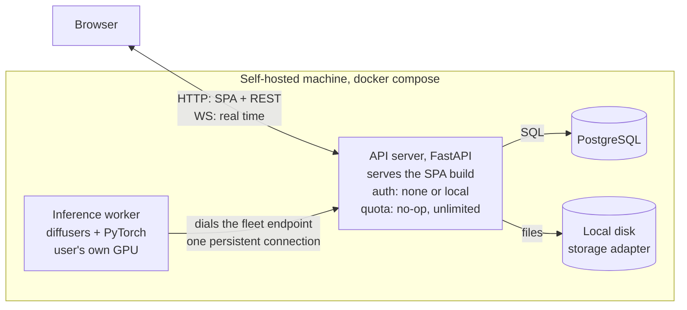

Cloud: the same three container images, plus orchestration and the private repository services. The worker pool runs on rented GPU machines. The concrete AWS services, network layout and costs are specified in [cloud-infrastructure.md](cloud-infrastructure.md).

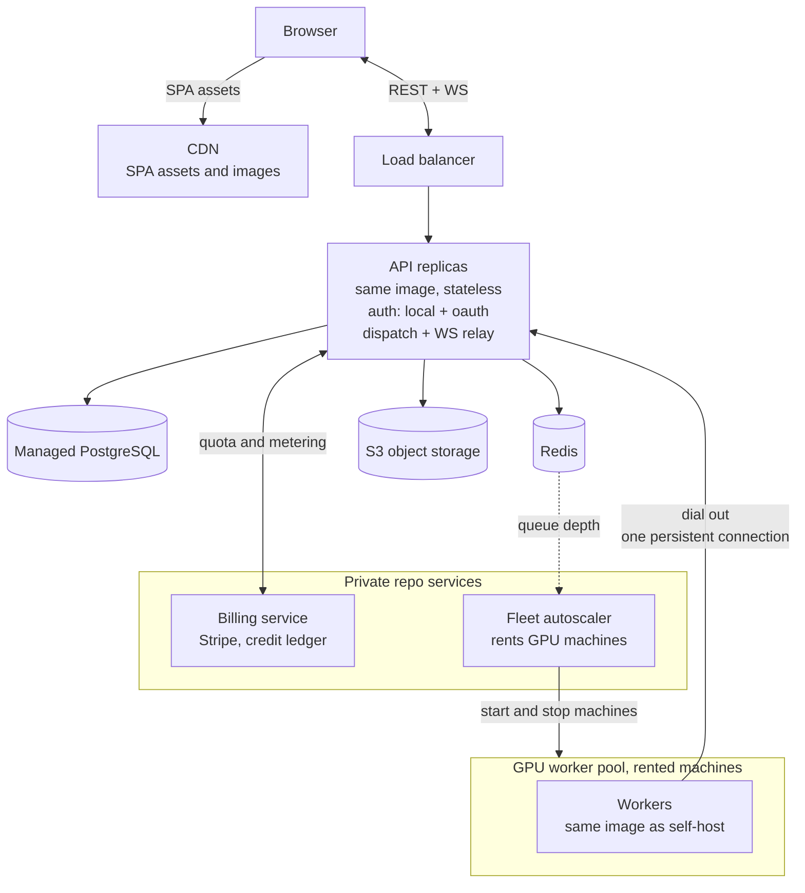

## Pluggable seams

The differences between the two modes are concentrated in four interfaces. Everything else is shared code. The full profile matrix and the migration paths these seams make possible (local to S3 storage, enabling accounts, scaling out with Redis, moving an install into or out of the cloud) are consolidated in [deployment-profiles.md](deployment-profiles.md).

- Authentication mode: `none` (auto login as a single local user), `local` (email and password, persistent login option) or `oauth` (Google, GitHub and Apple at cloud launch). Logged in state is an opaque random token in an httpOnly cookie, mapped to a session row in PostgreSQL and cached in Redis in the cloud; sessions can therefore be listed and revoked instantly, which is what the session management in issue #5 needs. The `auth_methods` field of `GET /api/v1/config` tells the frontend which methods are available, satisfying the discovery requirement in issue #5.
- Dispatch: work is handed to workers over their persistent connections. Self-hosted, that means the single connected worker; in the cloud, a Redis queue plus a session scheduler pick among the connected pool (see GPU scheduling below). Same interface, two implementations.
- Quota: a QuotaService interface with reserve, commit and refund operations. The default implementation allows everything (self-hosted behavior). The cloud implementation calls the private billing service over HTTP using metering events (GPU milliseconds, images) reported by workers. This service boundary is also the license boundary.
- Storage: local filesystem or S3 compatible, behind one interface that yields URLs the frontend can load in both modes. In the cloud those URLs are short lived signed URLs, since assets are private by default (see Content safety and privacy).

## GPU scheduling

GPU seconds are the scarce and expensive resource, so how work maps onto workers is specified here rather than left to implementation. Self-hosted installs are the degenerate case of every rule below: one worker, one user, no queue.

### Capacity and the real time bar

The real time target is 2 to 4 generated frames per second at 512 px, which an SD-Turbo or LCM class model delivers on an RTX 4090 class GPU. At that bar one GPU carries one or two concurrent drawing sessions, so each worker advertises a fixed number of real time slots in its registration (per model, from the manifest and measured hardware). The scheduler admits sessions against slots, never against hope: it does not oversubscribe.

### One pool, real time first

Queued jobs and real time sessions share the same workers. Jobs fill idle capacity; an arriving session request preempts queued work (the worker finishes or checkpoints the current job between denoising steps, then frees the slot), and queued work resumes when sessions end. When several workers can take a job, the scheduler prefers those serving the model on a lower memory ladder rung, keeping fully resident workers free for realtime admission, which only they can serve. This is the right trade at launch scale, where the pool may be one or two GPUs and a dedicated real time pool would mean paying for an idle machine. The scheduler treats pool membership as configuration, so splitting into dedicated real time and batch pools later (scaling stage 2) is a config change, not a redesign.

### Model placement

A worker's VRAM holds roughly one or two models, so balancing users onto models is really deciding which workers keep which models loaded:

- A hot set, defined in fleet configuration, stays pinned: the real time model always, plus the most used generation models. Requests for these never wait on a model load.
- Everything else loads on demand: the scheduler picks a worker, the user sees a loading state (about 60 seconds) once, and the model stays warm for a while afterward so a second request is instant.

### Model routing

A request that pins a `model_id` gets that model. A request that does not is resolved by the API to the cheapest registered model whose `tier` (`draft`, `standard`, `premium`, from the manifest), capabilities and parameter schema satisfy it. Difficulty needs no classifier because the interface states it: drawing strokes are realtime work on a draft-tier turbo model, a refine action is a queued job routed to a heavier tier. This is a selection function inside dispatch, not a service; the draft-then-refine loop it enables is frontend composition of the two workflows below.

### Low VRAM operation: the memory ladder

`min_vram_gb` in a manifest is the full residency requirement, but full residency is not the only way to run a model. Layer streaming tools like airLLM proved that models far larger than VRAM can run by holding only the executing layers on the GPU; diffusers ships the same techniques natively (model CPU offload, and group offloading with stream prefetch and optional disk backing), so the worker exposes them as a ladder rather than adding any dependency. At model load the worker measures free VRAM and takes the highest rung that fits:

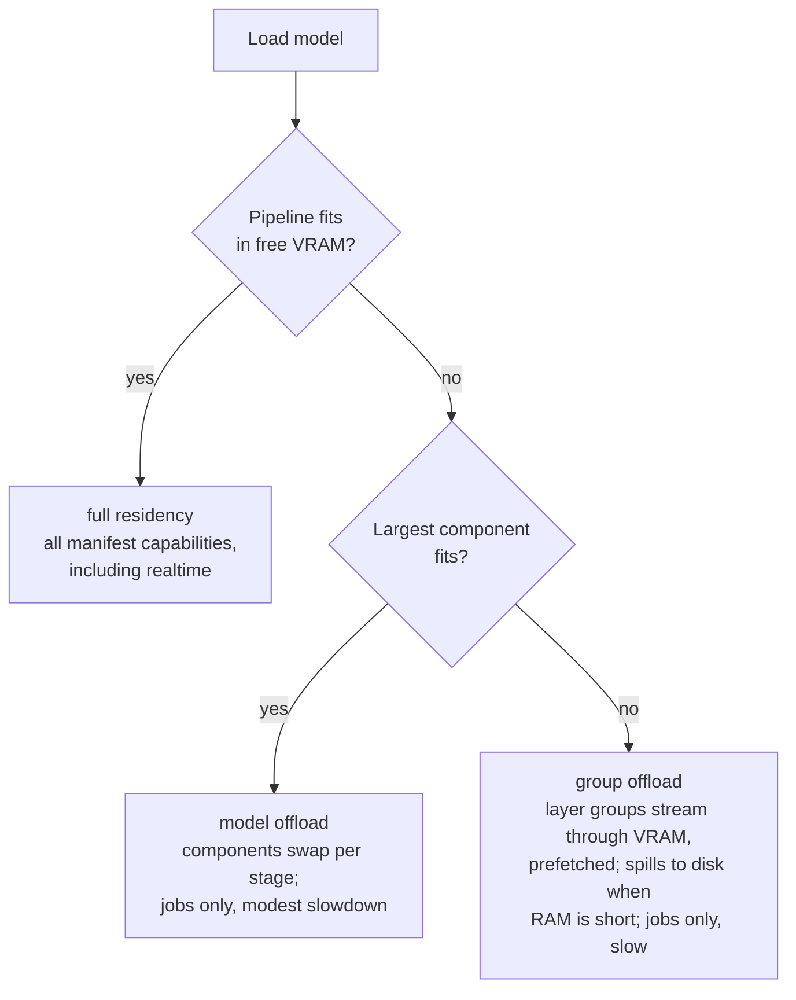

- Full residency: the pipeline lives on the GPU. The only rung that meets the 2 to 4 fps realtime bar, so it is the only rung that advertises the `realtime` capability.
- Model offload: whole components (text encoder, UNet, VAE) move to the GPU only for their stage of the pipeline. VRAM drops to the largest single component; a generation gets slower by roughly the transfer time per stage.
- Group offload: layer groups stream through the GPU while the next group is prefetched on a parallel stream, the airLLM technique applied through `enable_group_offload`. VRAM drops to a few layers; when system RAM cannot hold the model either, groups spill to disk under the models directory. A generation takes several times longer, which a queued job tolerates and a drawing session does not.

The rung is per model, not per worker: an 8 GB card can hold sd-turbo fully resident for drawing sessions while running a much larger generation model on group offload beside it. Registration therefore advertises capabilities as measured, and the model registry's `available` flag reflects what each capability can actually be served with right now. The operator can pin a rung with the worker's `MEMORY_MODE` setting; `auto` is the default and the ladder above. This is primarily a self-hosted feature, which is where consumer GPUs live; the cloud fleet rents GPUs sized for full residency, and the scheduler's hot set logic is unchanged.

### When the pool is full

A session request that finds no free slot waits in an admission queue. The user sees their position and an estimated wait; the autoscaler treats queue length as a scale up signal, so waits shrink as new machines boot (one to two minutes on rented GPU providers). Once billing exists, paid tiers move ahead in the queue; nothing ever preempts an active session. There is no time slice sharing and no hard reject.

### Idle sessions

An open drawing session pins a slot and burns GPU money whether or not the user is drawing. After about 60 seconds without input the slot is released and credit metering stops; the canvas stays intact in the browser. The next stroke reacquires a slot transparently, usually instantly since the model is hot, with a brief resuming state if the pool is busy.

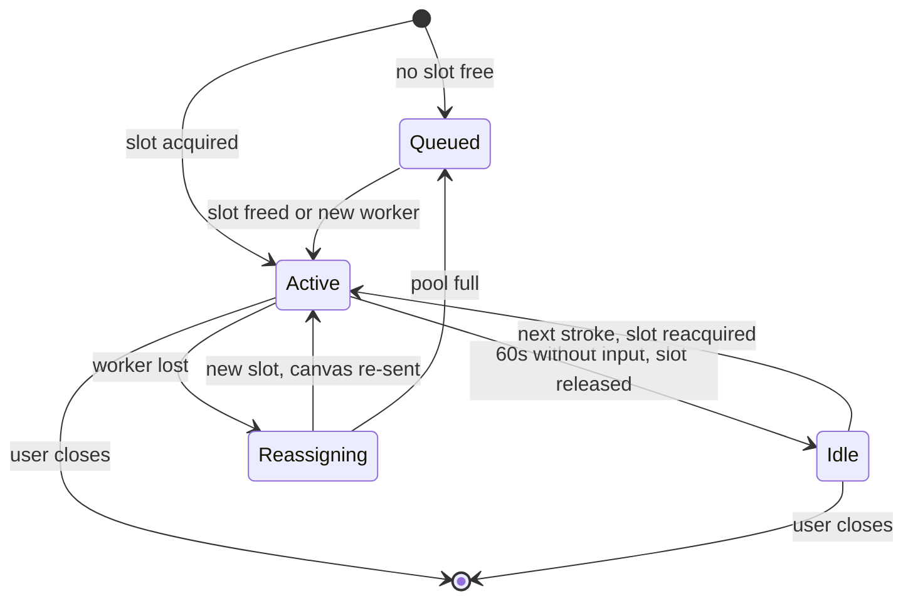

Credits are metered only in the Active state.

### Frame relay across API replicas

In the cloud the browser's WebSocket and the assigned worker's persistent connection usually terminate on different API replicas, because the load balancer spreads connections. Frames hop between replicas through Redis pub/sub channels keyed by session id: whichever replica holds each socket publishes inbound traffic and subscribes to the other direction. The hop is sub millisecond inside the VPC and removes any need for sticky sessions. Self-hosted, one process holds both sockets and the relay is an in-process call through the same interface.

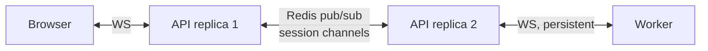

## Workflows

### Job based generation

Issues #2 and #11. The result is stored through the storage adapter and recorded in the user's history.

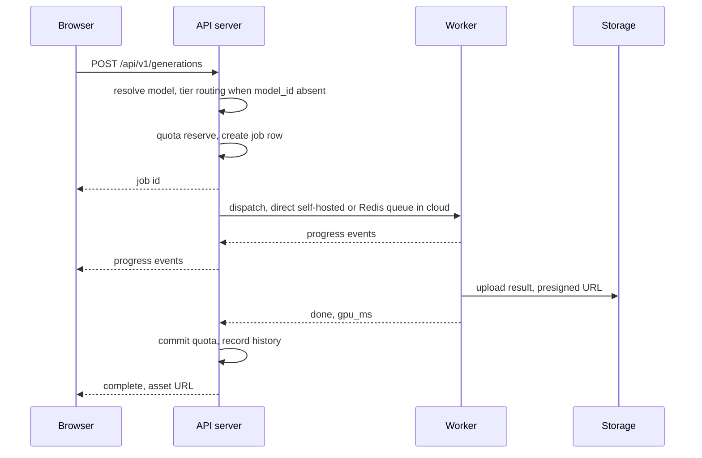

The job row in PostgreSQL is the source of truth, not the queue. If a worker dies mid job (spot reclaim, provider failure), the job is requeued once on another worker and the user only sees a longer wait. A second failure marks the job failed, refunds the reserved credits and surfaces a retry button. Nothing is retried more than once automatically, so an input that crashes workers cannot burn GPU money in a loop.

### Real time drawing session

Issues #3 and #11. The API relays frames so workers are never exposed publicly and authentication stays centralized. The worker always processes the latest input and drops stale frames.

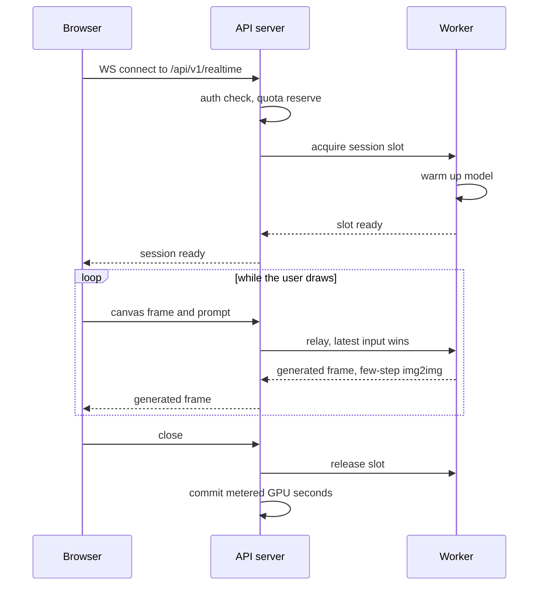

Slot acquisition, the admission queue, idle release and how frames cross API replicas in the cloud are specified in GPU scheduling above.

### Real time session recovery

Rented GPU machines can disappear at any time, so losing a worker mid session must be an expected event, not an error path.

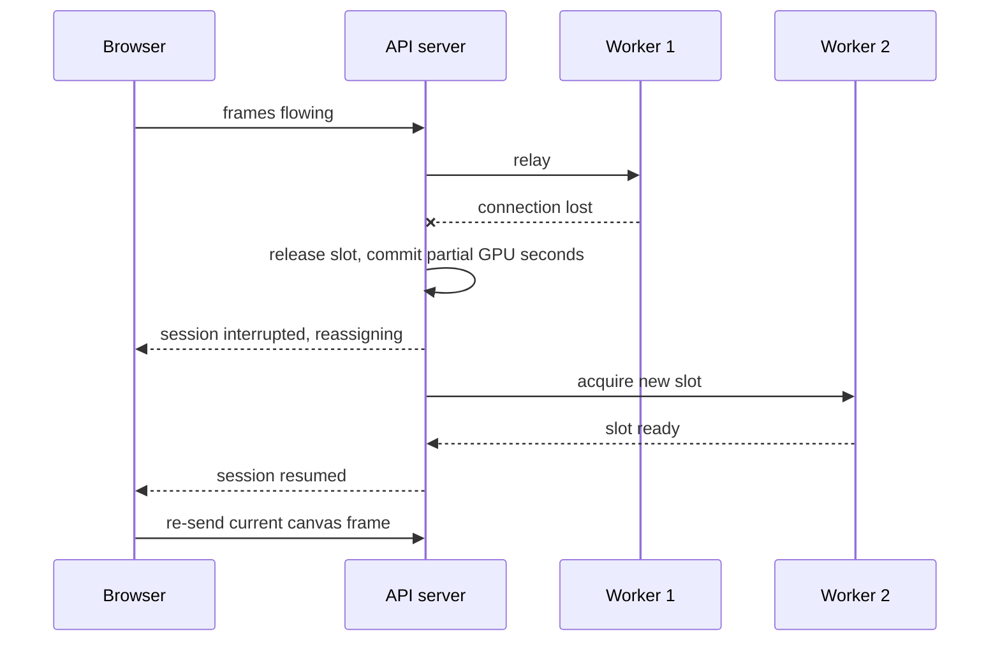

Self-hosted installs have a single worker, so the session simply ends with an error the user can retry once the worker is back.

### Authentication by deployment mode

Issues #5 and #9.

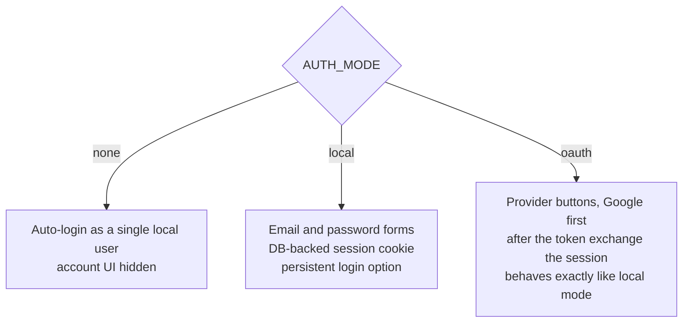

The frontend never hardcodes this: it builds the login screen from the `auth_methods` field of `GET /api/v1/config`.

### Registration and login

Cloud deployments verify email addresses through the email service; self-hosted installs can disable verification. Both paths end in the same DB backed session cookie. Cloud signups attest to being 18 or older, which keeps the terms simple and avoids parental consent machinery entirely.

Local accounts launch with argon2 password hashing, rate limited login attempts and an email notification on new sign ins; the schema reserves room for TOTP two factor authentication as a fast follow, so adding it needs no migration. OAuth users carry their provider's two factor already.

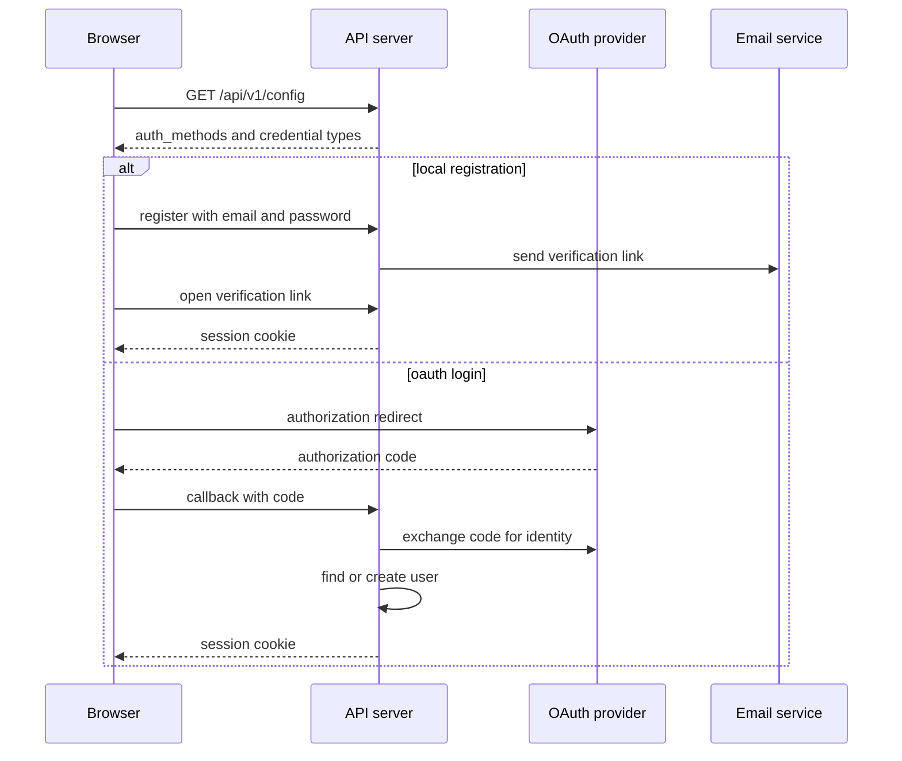

### Adding a new model

The issue #11 goal: no frontend release needed.

```
1. Drop weights + manifest into the worker's models directory
2. Worker validates the manifest, measures free VRAM and picks a
   memory ladder rung (full residency, model offload, group offload)
3. Worker registers the model with capabilities as measured:
   realtime only at full residency
4. GET /api/v1/models now lists it: capabilities + parameter JSON Schema
5. Frontend renders generic controls from the schema
   -> usable before any model-specific frontend work exists
```

### Subscription and credits

Cloud only. The billing service lives in the private repository.

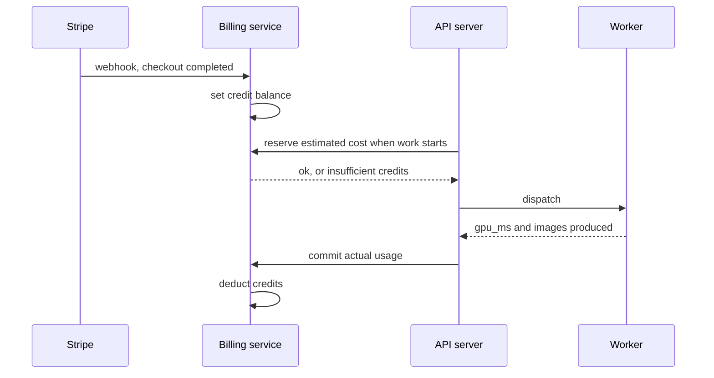

Every step above tolerates replay: webhooks deduplicate on the Stripe event id, the credit ledger is append-only with unique source keys, and reserve, commit and refund are idempotent on a caller-supplied reservation id with a TTL that returns stranded credits. Balances reset to the tier grant each paid period; realtime sessions meter through the same reserve and commit calls in chunks. When the billing service is unreachable, reserve fails closed and settlement retries through an outbox. The mechanisms are specified under Quota contract semantics in [blueprint.md](blueprint.md) and the rationale in [decisions.md](decisions.md).

## Model manifests

Every model the worker can serve is described by a manifest. Example:

```json
{
  "id": "sd-turbo",
  "name": "SD Turbo",
  "capabilities": ["image_to_image", "realtime"],
  "tier": "draft",
  "min_vram_gb": 8,
  "parameters": {
    "type": "object",
    "properties": {
      "prompt": { "type": "string" },
      "strength": { "type": "number", "minimum": 0, "maximum": 1, "default": 0.7 }
    },
    "required": ["prompt"]
  }
}
```

`min_vram_gb` is the full residency requirement; a worker with less VRAM can still serve the model through the memory ladder (see Low VRAM operation under GPU scheduling), just without the `realtime` capability. `tier` feeds model routing: requests that do not pin a model resolve to the cheapest tier that satisfies them.

The parameters field is JSON Schema. `GET /api/v1/models` exposes the manifests to the frontend, which renders generic controls from the schema. This is what keeps newly added models usable before any model specific frontend work exists (issue #11). Not every model needs to offer every capability.

Manifests are operator controlled. User uploaded models (fine tunes, LoRAs) are explicitly out of scope for this architecture: nothing in the registry, storage or scheduler accommodates them, deliberately, so a future decision to support them starts from a clean sheet instead of leftover seams.

## Content safety and privacy

Two checks run in the cloud profile; self-hosted installs have both disabled by default, as profile flags rather than forks:

- Prompt screening in the API before dispatch: a blocklist plus a lightweight classifier. A refused prompt never consumes GPU time.
- The standard diffusers safety checker on the worker's outputs: flagged images are blocked, never stored, and the event is logged.

Both exist because a public service that turns prompts into images answers to GPU providers' terms of service and to payment processors, not only to its own policy.

Privacy: assets are private to their owner by default and served through short lived signed URLs in the cloud. A user can mint a share link, which makes one asset publicly reachable under an unguessable token, and revoke it later. There is no public gallery.

Account deletion and data export are self serve, since GDPR makes both obligations rather than features. Deletion deactivates the account immediately and hard deletes its rows and assets within 30 days; the window also absorbs accidental or malicious deletions of a paying user's library. Export produces the account's data as JSON plus an archive of images. Self-hosted installs get both for free.

## Usage metrics and telemetry

Two streams, specified in [metrics.md](metrics.md). Usage events: every completed job and closed realtime session writes one user-linked row (action, model, tier, output category from a CLIP zero-shot pass on the worker, gpu_ms, duration) to the deployment's own `usage_events` table - the same code in both modes, never crosses the network, dies with the account purge, and stores no prompts or images. Telemetry: self-hosted installs additionally send anonymous daily aggregates to project infrastructure, on by default with `TELEMETRY=false` to disable; the payload is documented, previewable and contains nothing joinable to a person. There are no cookies beyond the session cookie and no client side analytics anywhere.

## Data model

The tables owned by the open source backend. Credit balances and invoices belong to the private billing service and are never stored here; the backend only emits metering events. Assets carry an optional share token (private otherwise) and an optional expiry, which the cloud sets for trial accounts (subscribers keep their library indefinitely, trial assets expire after 30 days).

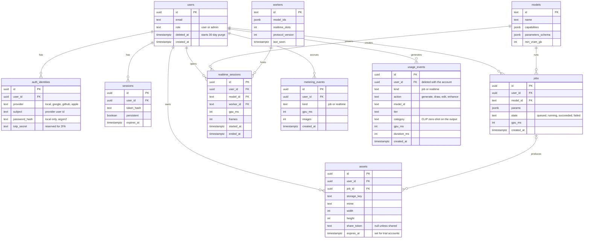

## UI structure

Illustrative sketches only, to anchor issues #1, #3, #4 and #10. The final design happens inside those issues.

App shell with the drawing tool active (issues #3, #4):

```
+---------------------------------------------------------------------------+
| potocolom   [ Draw ] [ Generate ] [ Edit ] [ Enhance ]          account   |
+----------------+--------------------------+-------------------------------+
| tools          |                          |                               |
|  pen           |                          |                               |
|  shapes        |     SVG drawing          |     live result               |
|  eraser        |     canvas               |     (frames stream in         |
|  color         |                          |      while you draw)          |
|                |                          |                               |
| model  [v]     |                          |                               |
| strength --o-- |                          |                               |
+----------------+--------------------------+-------------------------------+
| prompt [ a castle on a hill at sunset                                 ]   |
+---------------------------------------------------------------------------+
```

Generate tool, with controls rendered from the model's parameter schema (issues #2, #11):

```
+---------------------------------------------------------------------------+
| model [v]  size [v]  steps [ ]  seed [    ]                 [ Generate ]  |
| prompt [                                                              ]   |
+--------------------------------------+------------------------------------+
| history                              | selected result                    |
|  [img] [img] [img]                   |  [         image          ]        |
|  [img] [img] [img]                   |  params used  [reuse] [download]   |
+--------------------------------------+------------------------------------+
```

Account view (issue #10):

```
+---------------------------------------------+
| Account                                     |
|  email      user@example.com     [change]   |
|  password   ********             [change]   |
|  sessions   2 active             [manage]   |
|  plan       Creator, 512 credits [manage]   |  <- cloud only, hidden
+---------------------------------------------+     when self-hosted
```

## Scaling

- The API server is stateless; capacity grows by adding replicas behind the load balancer. No sticky sessions are needed: WebSocket legs that land on different replicas exchange frames through Redis pub/sub (see GPU scheduling).
- Job throughput grows with the number of workers. Queue depth drives the fleet autoscaler.
- A real time session pins GPU capacity for its whole duration, which makes it the most expensive resource in the system. One GPU carries one or two sessions at the 2 to 4 fps, 512 px bar; the admission queue, tier priority and idle release in GPU scheduling keep those slots from being wasted, and the credit system bounds their cost.
- PostgreSQL and Redis comfortably cover the target scale. Object storage plus a CDN carry the image traffic.
- The practical scaling constraint is GPU fleet cost, not the web tier.

## Open source and commercial boundary

This repository is licensed under GPL 3.0 and contains everything needed to self-host the full product. The commercial cloud service adds two private services, kept in a separate repository:

- Billing service: Stripe integration, subscriptions and the credit ledger.
- Fleet orchestrator: rents and scales the GPU machines that run the worker pool.

They integrate over HTTP through interfaces defined in this repository (QuotaService, metering events, worker registration). Nothing here depends on them: the default implementations allow everything, and the platform is fully functional without them. The full boundary, including the licensing analysis, the repository split and the delivery pipeline handoff, is specified in [repository-boundary.md](repository-boundary.md).

## Technology summary

| Area | Choice |
|---|---|
| Frontend | SvelteKit, static SPA build |
| API server | FastAPI (Python) |
| Inference worker | Hugging Face diffusers + PyTorch |
| Database | PostgreSQL (SQLAlchemy + Alembic) |
| Queue and cache | Redis, cloud profile only |
| Object storage | Local filesystem or S3 compatible |
| Packaging | Docker images, docker compose for self-hosting |
| GPU targets | NVIDIA CUDA and AMD ROCm; CPU mode for CI and development |
| Observability | CloudWatch and Sentry in the cloud; plain logs self-hosted |
| Cloud reference | AWS, detailed in [cloud-infrastructure.md](cloud-infrastructure.md) |

See [decisions.md](decisions.md) for why each was chosen.
