# Architecture

This document describes the architecture of potocolom: an open source, real time generative AI image platform that can be self-hosted or used through a paid cloud service. Both forms are built from this repository, from the same code. The concrete shape of each mechanism described here (configuration keys, Redis layout, scheduler loop, protocols, seam interfaces) is specified with pseudocode in [blueprint.md](blueprint.md).

## Goals

- One codebase, two deployment modes. A self-hosted install and the cloud service run the same frontend, API server and inference worker. All differences are configuration, not forks or separate builds.
- Self-hosting stays simple. One machine with an NVIDIA GPU and Docker is enough. No accounts required, no external services.
- The cloud mode adds accounts, subscriptions with credits and a managed pool of GPU workers. Its commercial components (billing, fleet orchestration) live in a separate private repository and integrate over service boundaries.
- New image models can be added without frontend releases (issue #11).
- Real time interaction: drawing on a canvas produces generated frames continuously (issue #3).
- Realistic target scale is hundreds to thousands of users. The design must allow growing past that by adding replicas and workers, not by rewriting.

## Components

The same three deployable components exist in every mode.

### frontend/

SvelteKit single page application built with the static adapter. There is exactly one build artifact for all deployments: runtime behavior is driven by `GET /api/v1/config` (which auth methods exist, whether billing is enabled) instead of build time flags. In self-hosted mode the API server serves the built files; in the cloud they are served from a CDN.

Every user facing string passes through an i18n layer from the first component onward; English and Spanish ship at launch. Retrofitting string extraction into a finished SPA is the expensive path, so the discipline starts on day one.

### backend/

FastAPI API server. It provides:

- REST endpoints for authentication, accounts, the model registry, generation jobs and generation history.
- A WebSocket endpoint for real time generation sessions.
- Admin endpoints behind an admin role flag: worker fleet status, user lookup and disable, job and session debugging. The same views serve a self-hoster inspecting their own install and the cloud operator running the service.

It is stateless: any replica can serve any request, which is what allows horizontal scaling in the cloud.

### worker/

Python inference worker built on Hugging Face diffusers and PyTorch. It loads models described by manifests (see Model manifests), registers them with the API server and executes two kinds of work:

- Queued jobs: full quality generation with progress reporting.
- Real time sessions: few step image to image pipelines (SD-Turbo / LCM class) processing a stream of canvas frames, always the latest input.

The worker supports three device targets behind one `DEVICE` setting: `cuda` (NVIDIA, what the cloud fleet runs), `rocm` (AMD, a supported target with its own image variant) and `cpu` (no GPU; used by CI with a tiny model and by contributors without one). Everything above the device layer is identical code.

The worker accepts no inbound connections. It dials out to the API server's fleet endpoint and holds one persistent connection; registration, job dispatch, real time frames and heartbeats are all multiplexed over it. The direction is identical in both modes, which is what lets the same worker image run on a home GPU and on rented cloud machines (see [cloud-infrastructure.md](cloud-infrastructure.md)).

The connection protocol carries a version, and each API release keeps supporting workers from the previous release (N-1). Cloud deploys therefore never require draining the whole fleet at once, and a self-hosted install that upgrades the API before the worker keeps working for one release, with an outdated worker warning in the logs and admin view.

### Infrastructure

- PostgreSQL stores users, sessions, the model registry, jobs and generation history.
- Object storage sits behind a storage adapter: local disk by default when self-hosted, any S3 compatible service in the cloud.
- Redis exists only in the cloud profile, for the job queue, session scheduling and rate limiting.

## Deployment profiles

Self-hosted: a single docker compose file, one machine, no Redis, no billing, authentication optional.

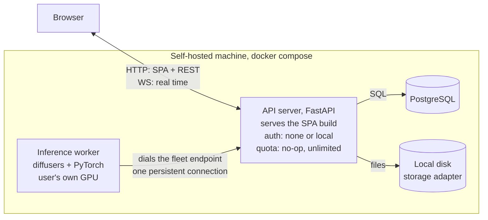
```mermaid
flowchart LR
    B["Browser"]
    subgraph H["Self-hosted machine, docker compose"]
        A["API server, FastAPI<br>serves the SPA build<br>auth: none or local<br>quota: no-op, unlimited"]
        P[("PostgreSQL")]
        D[("Local disk<br>storage adapter")]
        W["Inference worker<br>diffusers + PyTorch<br>user's own GPU"]
    end
    B <-->|"HTTP: SPA + REST<br>WS: real time"| A
    A -->|"SQL"| P
    A -->|"files"| D
    W -->|"dials the fleet endpoint<br>one persistent connection"| A
```

Cloud: the same three container images, plus orchestration and the private repository services. The worker pool runs on rented GPU machines. The concrete AWS services, network layout and costs are specified in [cloud-infrastructure.md](cloud-infrastructure.md).

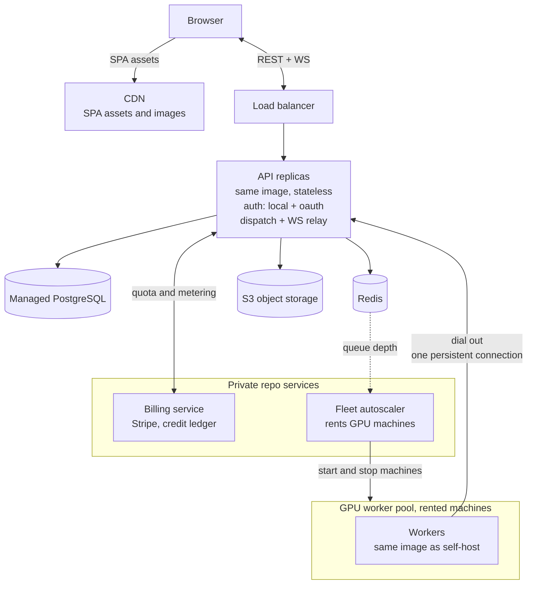
```mermaid
flowchart TB
    B["Browser"]
    CDN["CDN<br>SPA assets and images"]
    LB["Load balancer"]
    A["API replicas<br>same image, stateless<br>auth: local + oauth<br>dispatch + WS relay"]
    P[("Managed PostgreSQL")]
    R[("Redis")]
    S[("S3 object storage")]
    subgraph POOL["GPU worker pool, rented machines"]
        W["Workers<br>same image as self-host"]
    end
    subgraph PRIV["Private repo services"]
        BILL["Billing service<br>Stripe, credit ledger"]
        FLEET["Fleet autoscaler<br>rents GPU machines"]
    end
    B -->|"SPA assets"| CDN
    B <-->|"REST + WS"| LB
    LB --> A
    A --> P
    A --> R
    A --> S
    W -->|"dial out<br>one persistent connection"| A
    A <-->|"quota and metering"| BILL
    R -.->|"queue depth"| FLEET
    FLEET -->|"start and stop machines"| POOL
```

### The cloud profile in detail

The same picture opened one level: what runs inside the browser and inside each API replica, which Redis namespace serves which concern, and where the private-repo services attach. Every box inside the replica is shared code that also runs self-hosted; the cloud difference is which seam implementation is active. PostgreSQL is always the source of truth; losing Redis degrades features without losing data. This is the cloud target, so some boxes name work that is designed rather than running: the session-cookie path inside `current_user` (issue #5), the billing and fleet services behind their HTTP boundaries, and the CLIP category at `job_done` (issue #95).

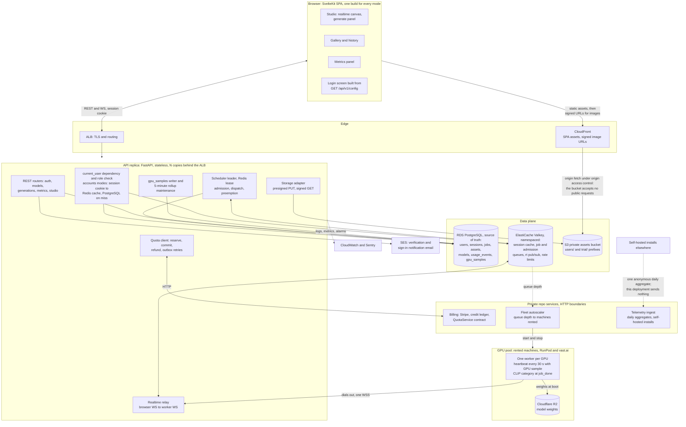
```mermaid
flowchart TB
    subgraph SPA["Browser: SvelteKit SPA, one build for every mode"]
        UI["Studio: realtime canvas,<br>generate panel"]
        GAL["Gallery and history"]
        MET["Metrics panel"]
        CFG["Login screen built from<br>GET /api/v1/config"]
    end
    subgraph EDGE["Edge"]
        CF["CloudFront<br>SPA assets, signed image URLs"]
        ALB["ALB: TLS and routing"]
    end
    subgraph API["API replica: FastAPI, stateless, N copies behind the ALB"]
        AUTH["current_user dependency and role check<br>accounts modes: session cookie to<br>Redis cache, PostgreSQL on miss"]
        REST["REST routers: auth, models,<br>generations, metrics, studio"]
        RELAY["Realtime relay<br>browser WS to worker WS"]
        SCHED["Scheduler leader, Redis lease<br>admission, dispatch, preemption"]
        SAMP["gpu_samples writer and<br>5-minute rollup maintenance"]
        STOR["Storage adapter<br>presigned PUT, signed GET"]
        QC["Quota client: reserve, commit,<br>refund, outbox retries"]
    end
    subgraph DATA["Data plane"]
        PG[("RDS PostgreSQL, source of truth:<br>users, sessions, jobs, assets,<br>models, usage_events, gpu_samples")]
        RED[("ElastiCache Valkey, namespaced:<br>session cache, job and admission<br>queues, rt pub/sub, rate limits")]
        S3[("S3 private assets bucket<br>users/ and trial/ prefixes")]
    end
    subgraph POOL["GPU pool: rented machines, RunPod and vast.ai"]
        W["One worker per GPU<br>heartbeat every 30 s with GPU sample<br>CLIP category at job_done"]
        R2[("Cloudflare R2<br>model weights")]
    end
    subgraph PRIV["Private repo services, HTTP boundaries"]
        BILL["Billing: Stripe, credit ledger,<br>QuotaService contract"]
        FLEET["Fleet autoscaler<br>queue depth to machines rented"]
        TEL["Telemetry ingest<br>daily aggregates, self-hosted installs"]
    end
    OBS["CloudWatch and Sentry"]
    SES["SES: verification and<br>sign-in notification email"]

    SPA -->|"static assets, then<br>signed URLs for images"| CF
    CF -->|"origin fetch under origin access control:<br>the bucket accepts no public requests"| S3
    SPA <-->|"REST and WS, session cookie"| ALB
    ALB --> API
    AUTH --> RED
    AUTH --> PG
    REST --> PG
    REST --> SES
    RELAY <--> RED
    SCHED <--> RED
    SCHED --> PG
    SAMP --> PG
    STOR --> S3
    QC <-->|"HTTP"| BILL
    W -->|"dials out, one WSS"| RELAY
    W -->|"weights at boot"| R2
    RED -.->|"queue depth"| FLEET
    FLEET -->|"start and stop"| POOL
    API -.->|"logs, metrics, alarms"| OBS
    INST["Self-hosted installs elsewhere"] -.->|"one anonymous daily aggregate;<br>this deployment sends nothing"| TEL
```

Reading the boxes against the seams: `AUTH` is the authentication seam (`none` short-circuits it), `SCHED` and the Redis queues are the dispatch seam, `QC` is the quota seam, and `STOR` is the storage seam. The realtime path is the only one that never touches PostgreSQL per frame: browser to relay to Redis pub/sub to worker and back.

> Shipped status (2026-07-30): **partially implemented.** Generation jobs use an in-process heap, while the realtime relay keeps workers and sessions in process-local dictionaries and directly awaits socket sends. The backend has no Redis dependency, realtime admission queue, FrameBus, or cross-replica control state. The target boxes are governed by "Realtime and queue Redis seam: optional, behaviorally equivalent" in [decisions.md](decisions.md) and the issue "Redis-optional Queues and FrameBus contracts".

## Pluggable seams

The differences between the two modes are concentrated in four interfaces. Everything else is shared code. The full profile matrix and the migration paths these seams make possible (local to S3 storage, enabling accounts, scaling out with Redis, moving an install into or out of the cloud) are consolidated in [deployment-profiles.md](deployment-profiles.md).

- Authentication mode: `none` (auto login as a single local user), `local` (email and password, persistent login option) or `oauth` (Google and GitHub at cloud launch). Logged in state is an opaque random token in an HttpOnly cookie, mapped to a session row in PostgreSQL and cached in Redis in the cloud; sessions can therefore be listed and revoked instantly, which is what the session management in issue #5 needs. The `auth_methods` field of `GET /api/v1/config` tells the frontend which methods are available, satisfying the discovery requirement in issue #5.
- Dispatch: work is handed to workers over their persistent connections. Self-hosted, that means the single connected worker; in the cloud, a Redis queue plus a session scheduler pick among the connected pool (see GPU scheduling below). Same interface, two implementations.
- Quota: a QuotaService interface with reserve, commit and refund operations. The default implementation allows everything (self-hosted behavior). The cloud implementation calls the private billing service over HTTP using metering events (GPU milliseconds, images) reported by workers. This service boundary is also the license boundary.
- Storage: local filesystem or S3 compatible, behind one interface that yields URLs the frontend can load in both modes. In the cloud those URLs are short lived signed URLs, since assets are private by default (see Content safety and privacy).

## GPU scheduling

GPU seconds are the scarce and expensive resource, so how work maps onto workers is specified here rather than left to implementation. A Redis-free, `AUTH_MODE=none` self-hosted install is the simplest profile, not the definition of self-hosting: issue #9, "Authentication", adds local accounts, and "Realtime and queue Redis seam: optional, behaviorally equivalent" permits a self-hosted operator to enable Redis and multiple socket-owning processes without changing queue behavior.

### Capacity and the real time bar

The real time target is 2 to 4 generated frames per second at 512 px, which an SD-Turbo or LCM class model delivers on an RTX 4090 class GPU. Workers admit from a measured batch curve when present; mixed classes that serialized p95 would admit are refused when their measured curve exceeds the 500 ms bar. Scalar slots are the minimum curve length, or floor(500 / p95) without a curve. On the reference RX 7600 XT, the fourth turbo session and heavier models wait on a faster UNet once the 40 ms window and WebP are included. Compatible frames now share one GPU cycle (issue #294), while the picker still shows the single-frame p95 from issue #288. Worker-internal batching remains below the slot abstraction, and the scheduler never sees batches.

### One pool, real time first

Queued jobs and real time sessions share the same workers. Jobs fill idle capacity; an arriving session request preempts queued work (the worker finishes or checkpoints the current job between denoising steps, then frees the slot), and queued work resumes when sessions end. When several workers can take a job, the scheduler prefers those serving the model on a lower memory ladder rung, keeping fully resident workers free for realtime admission, which only they can serve. This is the right trade at launch scale, where the pool may be one or two GPUs and a dedicated real time pool would mean paying for an idle machine. The scheduler treats pool membership as configuration, so splitting into dedicated real time and batch pools later (scaling stage 2) is a config change, not a redesign.

### Model placement

A worker's VRAM holds roughly one or two models, so balancing users onto models is really deciding which workers keep which models loaded:

- A hot set, defined in fleet configuration, stays pinned: the real time model always, plus the most used generation models. Requests for these never wait on a model load.
- Everything else loads on demand: the scheduler picks a worker, the user sees a loading state (about 60 seconds) once, and the model stays warm for a while afterward so a second request is instant.

### Model routing

A request that pins a `model_id` gets that model. A request that does not is resolved by the API to the cheapest registered model whose `tier` (`draft`, `standard`, `premium`, from the manifest), capabilities and parameter schema satisfy it. Difficulty needs no classifier because the interface states it: drawing strokes are realtime work on a draft-tier turbo model, a refine action is a queued job routed to a heavier tier. This is a selection function inside dispatch, not a service; the draft-then-refine loop it enables is frontend composition of the two workflows below.

> Shipped status (2026-07-23): **not yet implemented.** `model_id` is required on `POST /api/v1/generations`, and the manifest has no `tier` field, so there is no routing path today. This section describes a designed policy.

### Low VRAM operation: the memory ladder

`min_vram_gb` in a manifest is the full residency requirement, but full residency is not the only way to run a model. Layer streaming tools like airLLM proved that models far larger than VRAM can run by holding only the executing layers on the GPU; diffusers ships the same techniques natively (model CPU offload, and group offloading with stream prefetch and optional disk backing), so the worker exposes them as a ladder rather than adding any dependency. At model load the worker measures free VRAM and takes the highest rung that fits:

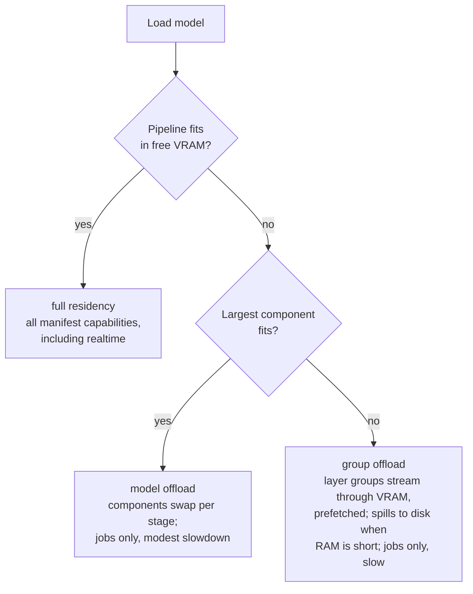
```mermaid
flowchart TD
    LOAD["Load model"] --> Q1{"Pipeline fits<br>in free VRAM?"}
    Q1 -->|yes| FULL["full residency<br>all manifest capabilities,<br>including realtime"]
    Q1 -->|no| Q2{"Largest component<br>fits?"}
    Q2 -->|yes| MO["model offload<br>components swap per stage;<br>jobs only, modest slowdown"]
    Q2 -->|no| GO["group offload<br>layer groups stream through VRAM,<br>prefetched; spills to disk when<br>RAM is short; jobs only, slow"]
```

- Full residency: the pipeline lives on the GPU. The only rung that meets the 2 to 4 fps realtime bar, so it is the only rung that advertises the `realtime` capability.
- Model offload: whole components (text encoder, UNet, VAE) move to the GPU only for their stage of the pipeline. VRAM drops to the largest single component; a generation gets slower by roughly the transfer time per stage.
- Group offload: layer groups stream through the GPU while the next group is prefetched on a parallel stream, the airLLM technique applied through `enable_group_offload`. VRAM drops to a few layers; when system RAM cannot hold the model either, groups spill to disk under the models directory. A generation takes several times longer, which a queued job tolerates and a drawing session does not.

The rung is per model, not per worker: an 8 GB card can hold sd-turbo fully resident for drawing sessions while running a much larger generation model on group offload beside it. Registration therefore advertises capabilities as measured, and the model registry's `available` flag reflects what each capability can actually be served with right now. The operator can pin a rung with the worker's `MEMORY_MODE` setting; `auto` is the default and the ladder above. This is primarily a self-hosted feature, which is where consumer GPUs live; the cloud fleet rents GPUs sized for full residency, and the scheduler's hot set logic is unchanged.

An automatically selected rung is also corrected after an out-of-memory error.
At load time the worker descends from full residency to model offload, then
from model offload to group offload. Generation can need more memory than
loading: if the existing eviction and retry still runs out of memory, the
worker descends one rung, reloads the pipeline and retries the job once.
The one-rung and one-retry limit keeps a bad job from walking the whole ladder.
An operator-selected `MEMORY_MODE` rung never descends.

### When the pool is full

A session request that finds no free slot waits in an admission queue. The user sees their position and an estimated wait; the autoscaler treats queue length as a scale up signal, so waits shrink as new machines boot (one to two minutes on rented GPU providers). Once billing exists, paid tiers move ahead in the queue; nothing ever preempts an active session. There is no time slice sharing and no hard reject.

> Shipped status (2026-07-30): **not yet implemented.** The current realtime handler closes a browser with code 4003 when no compatible slot is free. The queue described here remains the accepted design under "Full pool: admission queue with paid tier priority", issue #19, "Real-Time Generation Protocol", and "Redis-optional Queues and FrameBus contracts".

### Idle sessions

An open drawing session pins a slot and burns GPU money whether or not the user is drawing. After about 60 seconds without input the slot is released and credit metering stops; the canvas stays intact in the browser. The next stroke reacquires a slot transparently, usually instantly since the model is hot, with a brief resuming state if the pool is busy.

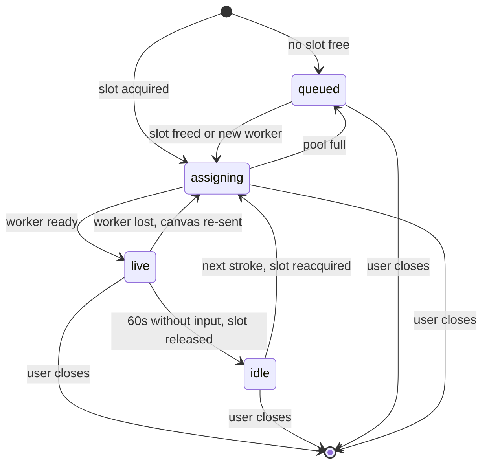
```mermaid
stateDiagram-v2
    [*] --> queued: no slot free
    [*] --> assigning: slot acquired
    queued --> assigning: slot freed or new worker
    assigning --> live: worker ready
    live --> idle: 60s without input, slot released
    idle --> assigning: next stroke, slot reacquired
    live --> assigning: worker lost, canvas re-sent
    assigning --> queued: pool full
    live --> [*]: user closes
    idle --> [*]: user closes
    queued --> [*]: user closes
    assigning --> [*]: user closes
```

Credits are metered only in the live state. These are the states of the one machine specified in [connection-handling.md](connection-handling.md), named the same way on purpose: this diagram is the scheduler's view of it, and `ending` and `ended` are collapsed into the terminal node here because admission has nothing to decide once a session is over.

> Shipped status (2026-07-30): **not yet implemented.** The browser handler does not track input idle time, release a slot after 60 seconds, or implement `idle` and `resuming` controls. Issue #19, "Real-Time Generation Protocol", owns the wire behavior and issue #20, "Multi-Worker Scheduling", owns release and reacquisition. The state diagram above is the designed policy.

### Frame relay across API replicas

In the cloud the browser's WebSocket and the assigned worker's persistent connection usually terminate on different API replicas, because the load balancer spreads connections. Frames hop between replicas through Redis pub/sub channels keyed by session id: whichever replica holds each socket publishes inbound traffic and subscribes to the other direction. The hop is sub millisecond inside the VPC and removes any need for sticky sessions. Self-hosted, one process holds both sockets and the relay is an in-process call through the same interface.

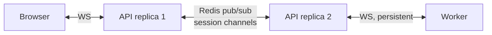
```mermaid
flowchart LR
    B["Browser"] <-->|"WS"| A1["API replica 1"]
    A1 <-->|"Redis pub/sub<br>session channels"| A2["API replica 2"]
    A2 <-->|"WS, persistent"| W["Worker"]
```

> Shipped status (2026-07-30): **not yet implemented.** The current relay works only inside one API process and has no FrameBus abstraction or Redis package. "Realtime and queue Redis seam: optional, behaviorally equivalent" and "Redis-optional Queues and FrameBus contracts" govern this designed path; "Realtime relay: Go gateway required for the 1000-active-session target" governs the eventual socket owner. The diagram above remains the pre-gateway form of the design.

## Workflows

### Job based generation

Issues #2 and #11. The result is stored through the storage adapter and recorded in the user's history.

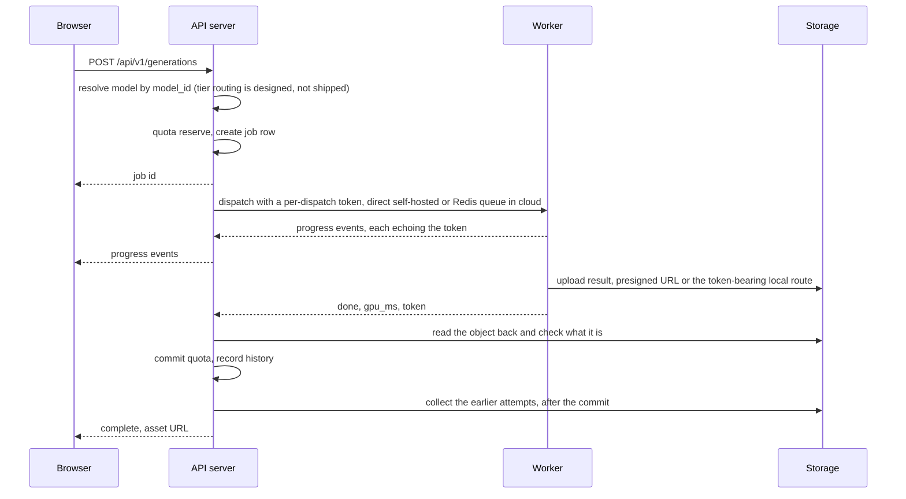
```mermaid
sequenceDiagram
    participant B as Browser
    participant A as API server
    participant W as Worker
    participant S as Storage
    B->>A: POST /api/v1/generations
    A->>A: resolve model by model_id (tier routing is designed, not shipped)
    A->>A: quota reserve, create job row
    A-->>B: job id
    A->>W: dispatch with a per-dispatch token, direct self-hosted or Redis queue in cloud
    W-->>A: progress events, each echoing the token
    A-->>B: progress events
    W->>S: upload result, presigned URL or the token-bearing local route
    W-->>A: done, gpu_ms, token
    A->>S: read the object back and check what it is
    A->>A: commit quota, record history
    A->>S: collect the earlier attempts, after the commit
    A-->>B: complete, asset URL
```

The job row in PostgreSQL is the source of truth, not the queue. If a worker dies mid job (spot reclaim, provider failure), the job is requeued once on another worker and the user only sees a longer wait. A second failure marks the job failed, refunds the reserved credits and surfaces a retry button. Nothing is retried more than once automatically, so an input that crashes workers cannot burn GPU money in a loop.

Three orderings in that diagram are load bearing, and each one was a defect before it was a rule. The API reads the uploaded object back before committing anything, because a worker that reports a result it never uploaded would otherwise get an asset row pointing at nothing. The job stays tracked in memory until its terminal transition is durable, because clearing it first meant a lock timeout could leave the row running with nothing left to recover it. And cleanup runs only after that commit, never before, because a cleanup failure must not be able to fail a job.

Every attempt writes to keys of its own, so nothing overwrites anything and every terminal path is responsible for collecting what the attempts left. Dispatch uploads sit under `dispatch/`; the winning object is copied into the library prefix on commit, so a replayed presigned PUT cannot recreate a durable asset (issue #278). A delete that fails is not lost: it is recorded and retried on a sweep, which is what keeps a denied permission from turning into an object nobody will ever name again. The token in the dispatch is what ties all of this to one attempt rather than to the job, so a worker still holding an old dispatch cannot speak for the attempt that replaced it, and cannot write to its keys.

### Upscale (post-generation)

Native generation stays at model training resolution (typically 512 or 1024). 2K and 4K output is a separate queued job that takes an existing asset and a factor (x2 or x4):

- **Pixel upscale** (`upscale` capability): Real-ESRGAN class weights, announced as their own manifests (`realesrgan` quality RRDBNet, `realesrgan-fast` compact SRVGG). A direct `.pth` `source` uses one weight for every factor; when the requested factor is below the network's native scale, the worker runs at native scale and Lanczos-downsamples (RealESRGANer outscale). `POST /api/v1/generations` with `source_asset_id` and `params.factor` routes here when the pinned model declares `upscale` and nothing else from `{text_to_image, image_to_image}`. Dispatch, retry, SSE progress, thumbnails, lineage (`parent_asset_id`), and `gpu_ms` metering all reuse the job path above. The studio playground exposes Upscale as a peer left-panel mode beside Generate (shared viewer and history); it defaults to `realesrgan-fast` and offers `realesrgan` as a Quality tier. Upscalers stay out of the diffusion model picker.
- **Refine upscale**: not a second engine path. It is the existing `image_to_image` job with `width`/`height` set to the scaled size and a low `strength` (about 0.2-0.35). Do not invent a parallel refine-upscale capability.

Operators can run a second worker whose `MODELS_DIR` holds only the upscaler manifest. Least-loaded job picking then routes upscales there automatically (zero downtime for the diffusion worker; the same pattern is a dedicated cheap upscale pool in the cloud). No scheduler changes are required.

### Browsing history as a derivation forest

Issues #129 through #132. The Images section is the gallery: one infinite pannable canvas that lays a user's history out as lineage trees, so alternative takes on the same base read as visible structure instead of adjacent squares in a grid. The in-flow history strip is unchanged.

How the images are pulled, and why it holds at scale:

- History is never fetched as one account-wide response. Roots come from cursor-paged `GET /api/v1/generations?roots_only=true`. A chain-free root is laid out from that response without another request. When a branched root first enters the viewport, one `GET /api/v1/generations/{job_id}/subtree` request returns its renderable nodes and generation data; at most four subtree requests run concurrently, and the browser does not request lineage and generation detail per node. Each root includes `has_derivatives`, so the client reserves a tree row or a chain-free grid cell before that subtree loads. Subtrees are cached per root id for the session. A derivative that completes during the session prompts one revalidation; cached retained nodes and newly observed derivatives still revalidate when they change; and a capped cache remembers known omitted history so it does not repeatedly request the same omitted frontier.
- The subtree endpoint executes one recursive database query. Its queue is bounded to 600 nodes, descendants stop at depth 100, visited job ids make it cycle safe, and all asset edges are user-owned non-thumbnail masters. A truncated response includes a conservative lower bound for omitted branches. The separate detail-view lineage endpoint remains: it uses a recursive ancestor query, a direct-child query, and a depth-100 recursive descendant count with an explicit truncation flag. The `jobs_source_asset` index serves both downward walks.
- Bandwidth follows the zoom band. The constellation and tree bands render the WebP thumbnail rendition; the full master loads only at the card band, and never below it. Tiles outside the viewport unmount on a world coordinate test, keeping the mounted count bounded rather than growing with history.
- Layout is deterministic from root ids, `created_at`, and `has_derivatives`. Derived trees receive separate rows and the chain-free grid occupies an independent fixed-height region, so loading a subtree cannot move a root between regions or re-index the grid. Older grid pages extend to the right. A loaded tree can increase its row height and push only later tree rows down. The viewport, its nearest root anchor and that anchor's world position, and additive per-root drag offsets are kept in browser local storage. On restore, the saved transform is translated by any change in the anchor's world position. Coordinates are clamped to plus or minus 1,000,000 world pixels, and offsets that do not match any root are discarded after root paging is exhausted. Default positions remain reproducible and nothing about the canvas is persisted server side. Root tiles are the drag handles, focused root tiles move with the arrow keys, and both one-tree and all-tree reset controls remove offsets.

The same code path serves every deployment profile:

- **Isolation.** Every generations route sits behind `current_user` and filters by `user_id`, so a multi-user self-host behaves exactly like the cloud: each user sees only their own forest. There is no shared or public canvas.
- **Storage.** Asset URLs come from the storage seam (local files self-hosted, S3 with short lived signed URLs in the cloud), so the canvas never knows which profile it is running under. An image that errors after loading once refetches its generation to mint fresh URLs, once, and then shows a placeholder rather than retrying forever.
- **Retention.** A purged or expired ancestor keeps its place in the tree as a ghost placeholder, which is why purging an asset drops its bytes and marks the row instead of deleting it (see decisions.md). Deleting the row would sever every descendant's lineage.

### Real time drawing session

Issues #3 and #11. The API relays frames so workers are never exposed publicly and authentication stays centralized. The worker always processes the latest input and drops stale frames.

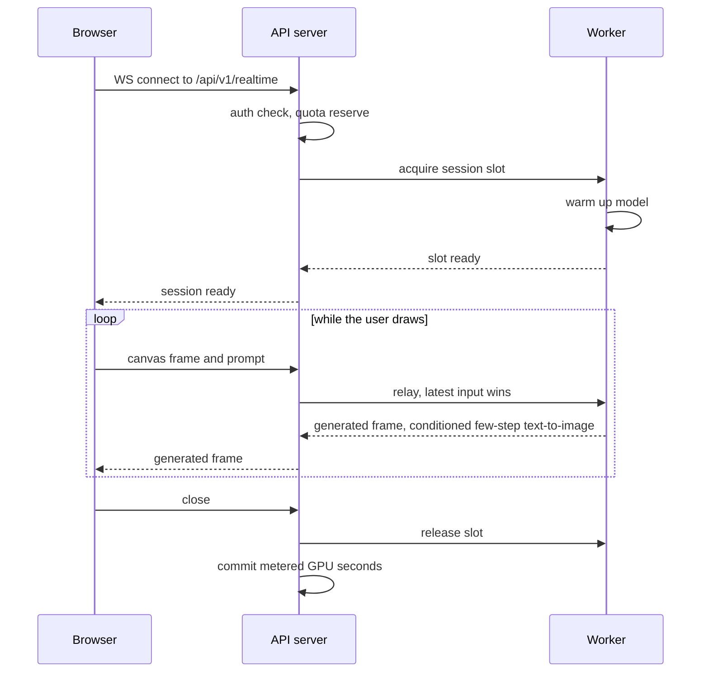
```mermaid
sequenceDiagram
    participant B as Browser
    participant A as API server
    participant W as Worker
    B->>A: WS connect to /api/v1/realtime
    A->>A: auth check, quota reserve
    A->>W: acquire session slot
    W->>W: warm up model
    W-->>A: slot ready
    A-->>B: session ready
    loop while the user draws
        B->>A: canvas frame and prompt
        A->>W: relay, latest input wins
        W-->>A: generated frame, conditioned few-step text-to-image
        A-->>B: generated frame
    end
    B->>A: close
    A->>W: release slot
    A->>A: commit metered GPU seconds
```

Slot acquisition, the admission queue, idle release and how frames cross API replicas in the cloud are specified in GPU scheduling above.

### Real time session recovery

Rented GPU machines can disappear at any time, so losing a worker mid session must be an expected event, not an error path.

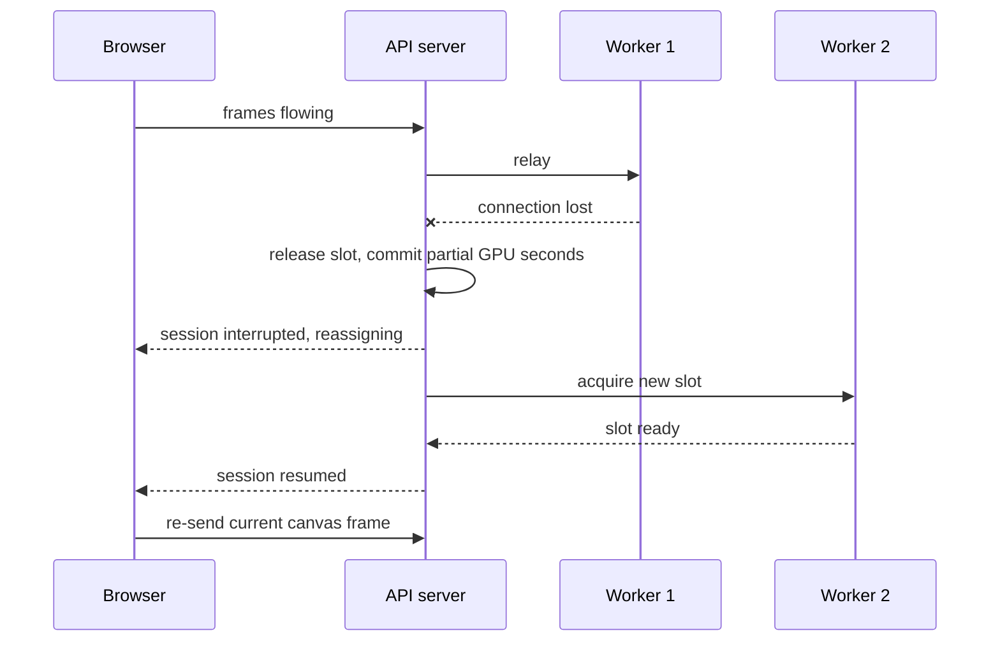
```mermaid
sequenceDiagram
    participant B as Browser
    participant A as API server
    participant W1 as Worker 1
    participant W2 as Worker 2
    B->>A: frames flowing
    A->>W1: relay
    W1--xA: connection lost
    A->>A: release slot, commit partial GPU seconds
    A-->>B: session interrupted, reassigning
    A->>W2: acquire new slot
    W2-->>A: slot ready
    A-->>B: session resumed
    B->>A: re-send current canvas frame
```

Self-hosted installs have a single worker, so there is no second candidate: the session waits in `queued` for that worker to come back rather than ending, and it ends only when the browser gives up or authorization lapses. Losing the only worker is not a different kind of failure from losing one of many, which is why the state machine treats worker loss as an attempt failure everywhere.

> Shipped status (2026-08-17): **not yet implemented.** The current handler ends the session with an error instead, which is what a single-worker install sees today; issue #295 owns the state machine that changes it.

### Authentication by deployment mode

Issues #5 and #9.

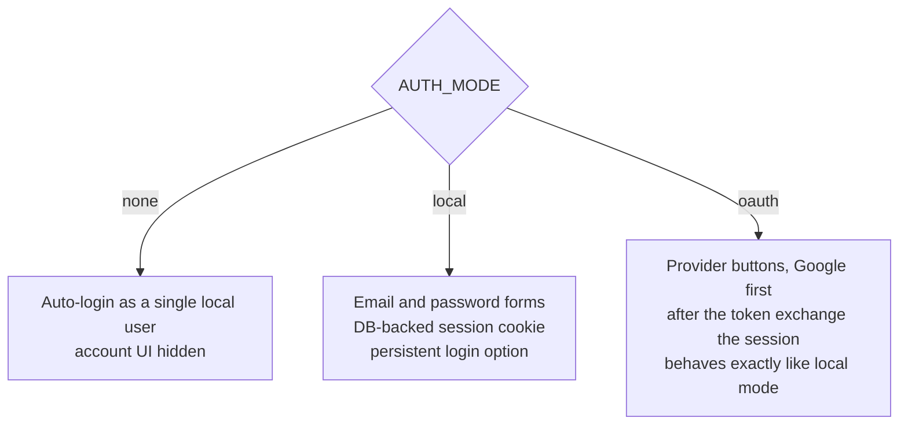
```mermaid
flowchart TB
    M{"AUTH_MODE"}
    M -->|"none"| N["Auto-login as a single local user<br>account UI hidden"]
    M -->|"local"| L["Email and password forms<br>DB-backed session cookie<br>persistent login option"]
    M -->|"oauth"| O["Provider buttons, Google first<br>after the token exchange the session<br>behaves exactly like local mode"]
```

The frontend never hardcodes this: it builds the login screen from the `auth_methods` field of `GET /api/v1/config`.

### Registration and login

Cloud deployments verify email addresses through the email service; self-hosted installs can disable verification. Both paths end in the same DB backed session cookie. Cloud signups attest to being 18 or older, which keeps the terms simple and avoids parental consent machinery entirely.

Local accounts launch with argon2 password hashing, rate limited login attempts and an email notification on new sign ins; the schema reserves room for TOTP two factor authentication as a fast follow, so adding it needs no migration. OAuth users carry their provider's two factor already.

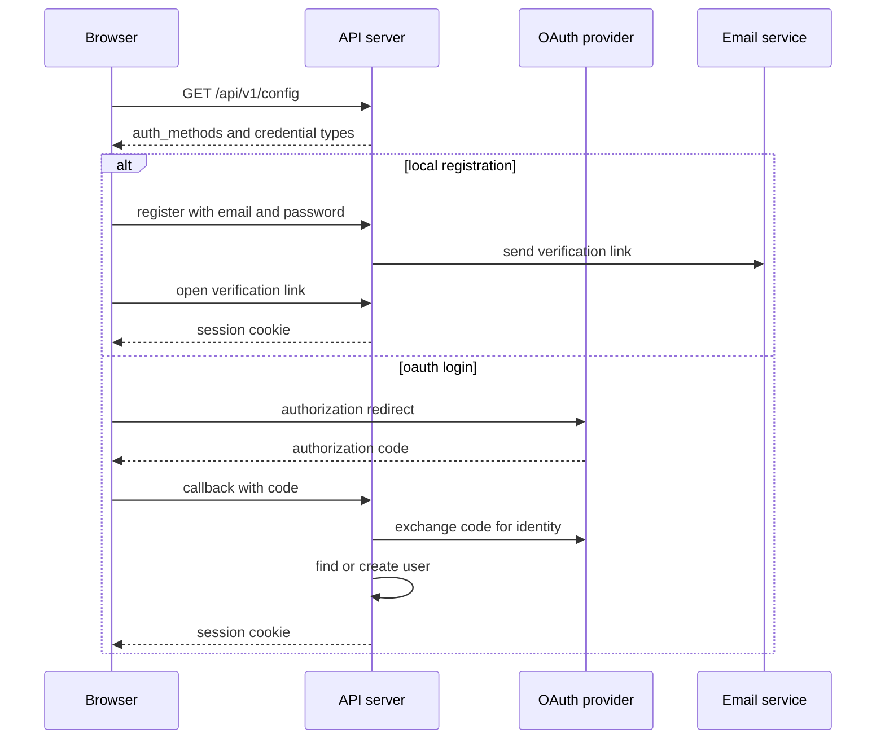
```mermaid
sequenceDiagram
    participant B as Browser
    participant A as API server
    participant G as OAuth provider
    participant E as Email service
    B->>A: GET /api/v1/config
    A-->>B: auth_methods and credential types
    alt local registration
        B->>A: register with email and password
        A->>E: send verification link
        B->>A: open verification link
        A-->>B: session cookie
    else oauth login
        B->>G: authorization redirect
        G-->>B: authorization code
        B->>A: callback with code
        A->>G: exchange code for identity
        A->>A: find or create user
        A-->>B: session cookie
    end
```

### Every request after login

There is no gateway or auth proxy: the gate is the `current_user` FastAPI dependency that every user-facing endpoint resolves. Replicas are stateless, so any replica serves any request with one cached session lookup; concurrency scales by adding replicas, and revocation is deleting the session row. The example below is a state-changing call (starring a generation); reads follow the same path without the UPDATE.

> Shipped status (2026-08-23): the dependency, the endpoint and the session half are all real. `AUTH_MODE=accounts` mints an opaque session held in a `__Host-` cookie and stored only as a hash, and revocation is a `revoked_at` on the row plus an explicit close of any realtime socket bound to it. What the diagram still describes ahead of the code is the Redis session cache, which arrives with the cloud profile, and the per-user rate limit counter (deferred by recorded decision).

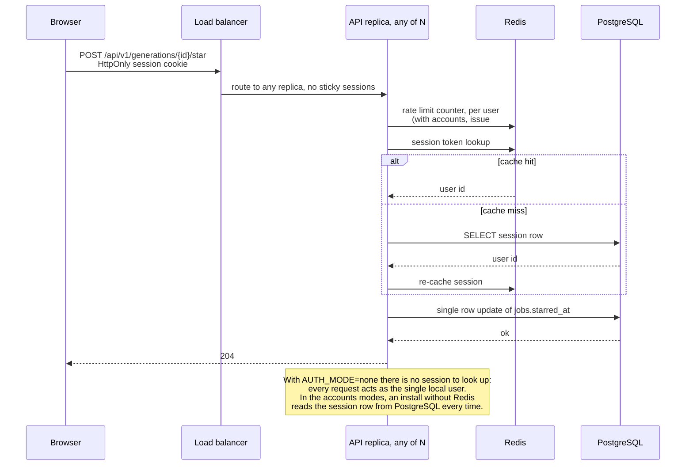
```mermaid
sequenceDiagram
    participant B as Browser
    participant LB as Load balancer
    participant A as API replica, any of N
    participant R as Redis
    participant P as PostgreSQL
    B->>LB: POST /api/v1/generations/{id}/star<br>HttpOnly session cookie
    LB->>A: route to any replica, no sticky sessions
    A->>R: rate limit counter, per user<br>(with accounts, issue #5)
    A->>R: session token lookup
    alt cache hit
        R-->>A: user id
    else cache miss
        A->>P: SELECT session row
        P-->>A: user id
        A->>R: re-cache session
    end
    A->>P: single row update of jobs.starred_at
    P-->>A: ok
    A-->>B: 204
    note over A: With AUTH_MODE=none there is no session to look up:<br>every request acts as the single local user.<br>In the accounts modes, an install without Redis<br>reads the session row from PostgreSQL every time.
```

### Adding a new model

The issue #11 goal: no frontend release needed.

```
1. Drop weights + manifest into the worker's models directory
2. Worker validates the manifest, measures free VRAM and picks a
   memory ladder rung (full residency, model offload, group offload)
3. Worker registers the model with capabilities as measured:
   realtime only at full residency
4. GET /api/v1/models now lists it: capabilities + parameter JSON Schema
5. Frontend renders generic controls from the schema
   -> usable before any model-specific frontend work exists
```

### Subscription and credits

Cloud only. The billing service lives in the private repository.

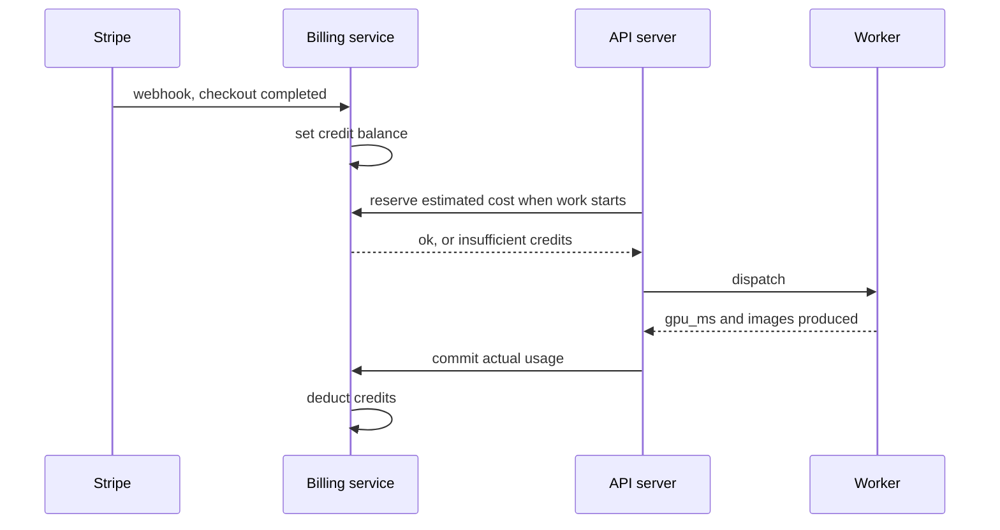
```mermaid
sequenceDiagram
    participant ST as Stripe
    participant BS as Billing service
    participant A as API server
    participant W as Worker
    ST->>BS: webhook, checkout completed
    BS->>BS: set credit balance
    A->>BS: reserve estimated cost when work starts
    BS-->>A: ok, or insufficient credits
    A->>W: dispatch
    W-->>A: gpu_ms and images produced
    A->>BS: commit actual usage
    BS->>BS: deduct credits
```

Every step above tolerates replay: webhooks deduplicate on the Stripe event id, the credit ledger is append-only with unique source keys, and reserve, commit and refund are idempotent on a caller-supplied reservation id with a TTL that returns stranded credits. Balances reset to the tier grant each paid period; realtime sessions meter through the same reserve and commit calls in chunks. When the billing service is unreachable, reserve fails closed and settlement retries through an outbox. The mechanisms are specified under Quota contract semantics in [blueprint.md](blueprint.md) and the rationale in [decisions.md](decisions.md).

## Model manifests

Every model the worker can serve is described by a manifest. Example:

```json
{
  "id": "sdxl-turbo",
  "name": "SDXL Turbo",
  "capabilities": ["text_to_image", "image_to_image", "realtime"],
  "studio_capabilities": ["realtime"],
  "default": true,
  "benchmark_only": false,
  "min_vram_gb": 10,
  "prompt_token_limit": 77,
  "license_id": "stability-ai-community",
  "license_url": "https://huggingface.co/stabilityai/sdxl-turbo/blob/main/LICENSE.md",
  "commercial_max_revenue_usd": 1000000,
  "license_registration_url": "https://stability.ai/community-license",
  "requires_attribution": "Powered by Stability AI",
  "parameters": {
    "type": "object",
    "properties": {
      "prompt": { "type": "string" },
      "structure_strength": { "type": "number", "minimum": 0, "maximum": 1.5, "default": 1.0 },
      "steps": { "type": "integer", "minimum": 1, "maximum": 4, "default": 1 },
      "seed": { "type": "integer" },
      "width": { "type": "integer", "enum": [512], "default": 512 },
      "height": { "type": "integer", "enum": [512], "default": 512 }
    },
    "required": ["prompt"]
  }
}
```

`min_vram_gb` is the full residency requirement; a worker with less VRAM can still serve the model through the memory ladder (see Low VRAM operation under GPU scheduling), just without the `realtime` capability. A request that pins a `model_id` gets that model; one that does not is resolved by the API.

> Shipped status (2026-08-14): **not yet implemented.** The wire `Manifest` has no `tier` field in either the worker's or the API's model, so tier-based routing is a recorded design and not behavior today (see Model routing under GPU scheduling and [decisions.md](decisions.md)).

`prompt_token_limit` is the model's native text encoder window in tokens, so the studio warns when a prompt runs past it (issue #148). The shipped CLIP based manifests declare 77. For those models, the worker encodes longer prompts in successive native-size chunks and concatenates their embeddings instead of letting diffusers truncate the prompt. Positive and negative embeddings are padded to the same number of chunks; SDXL applies the same strategy to both text encoders and takes its pooled embedding from the first chunk. This does not make the weights native to a larger window: text in later chunks influences the image more weakly. A model with a different encoder declares its own figure, which is why the field is not a constant in the frontend. Omitting it means the window is unknown and the studio says nothing, so a manifest that forgets the field stays quiet rather than claiming a limit its encoder does not have. Upscale manifests take no prompt and leave it unset.

The parameters field is JSON Schema. `GET /api/v1/models` exposes the manifests to the frontend, which renders generic controls from the schema. This is what keeps newly added models usable before any model specific frontend work exists (issue #11). Not every model needs to offer every capability.

Loading fields such as `source`, `vae`, `preview_decoder`, `scheduler`,
`lora`, `quantize` and `t2i_adapter` stay inside the worker and never cross the wire. `quantize` names
exactly one pipeline component and scheme as `component:scheme`; the only
shipped use is `text_encoder_3:int8` on `sd35-medium`. Two manifest fields do
cross the wire: `studio_capabilities`, which narrows what the studio offers
per capability, and `realtime_p95_ms`, the worker's measured single-frame p95
on its own card, refreshed from live heartbeat timings as sessions render.

Manifests are operator controlled. User uploaded models (fine tunes, LoRAs) are explicitly out of scope for this architecture: nothing in the registry, storage or scheduler accommodates them, deliberately, so a future decision to support them starts from a clean sheet instead of leftover seams.

### Per-model time estimates

`GET /api/v1/models` includes `estimated_gpu_ms_default` per model, scaled linearly with the request's steps and pixel count (issue #47). Upscale models additionally expose an `estimated_gpu_ms_by_factor` map (one estimate per scale factor). The studio shows the estimate in the model picker and updates it as the user changes width, height and steps. A new install starts with the measured baselines in `backend/app/model_timings.json`; once five recent succeeded jobs provide valid GPU timings for a model, the per-install median observed speed supersedes the reference-card speed. The latest 50 jobs per model form the rolling window, and the existing maintenance loop refreshes the in-memory cache. `load_ms` remains separate pipeline telemetry and is not added to the API's GPU-time estimate. Credit estimates are a cloud concern and arrive with billing (issue #11); the open source side only exposes GPU time. <!-- corrected 2026-07-23: #47 is closed (was "the open half of #47"); added estimated_gpu_ms_by_factor. -->

## Asset storage and access

Generated images land in object storage through the storage adapter (local filesystem self-hosted, S3 compatible in the cloud). Workers upload via a presigned PUT target issued by the API; they never hold bucket credentials.

**Cloud layout** (one private bucket, for example `potocolom-images`):

| Prefix | Who | Lifecycle |
| --- | --- | --- |
| `users/{user_id}/` | Paying subscribers | Indefinite retention |
| `trial/{user_id}/` | Trial accounts | `expires_at` on the asset row plus an S3 lifecycle rule expiring the prefix after 30 days |

Object keys are `{prefix}{asset_id}.png` for PNG masters with a sibling `{asset_id}-thumb.webp` WebP thumbnail. History is the `assets` table, never a bucket listing.

**Access:** objects are private by default. The API mints short-lived CloudFront signed GET URLs after session or API-key auth, only for rows the principal owns. Share links expose one asset under an unguessable token carried in the `/shared#<token>` fragment and resolved by `POST /api/v1/shared`, which answers with a 60-second signed URL for the picture; no share is cached at the edge, so a revoked link stops working at once. Payment flips quota in the billing service; it never creates AWS IAM principals, buckets or access points for users.

**Self-hosted:** master keys are `{user_id}/{job_id}.png` with `{user_id}/{job_id}-thumb.webp` thumbnails under `STORAGE_LOCAL_PATH`, served through the API's file route. There is no tier prefix because installs are single-tenant.

How the pieces reference each other - bytes live once in object storage, every relationship (thumbnail, lineage, favorite per issue #124, category per issue #95) is a column or foreign key on the PostgreSQL rows, and the browser only ever reaches bytes through URLs the API minted from those rows:

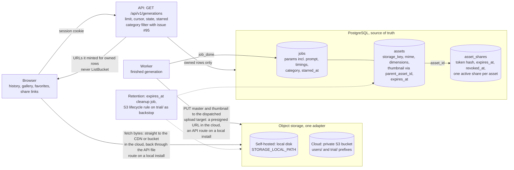
```mermaid
flowchart LR
    W["Worker<br>finished generation"]
    subgraph STORE["Object storage, one adapter"]
        LD[("Self-hosted: local disk<br>STORAGE_LOCAL_PATH")]
        S3[("Cloud: private S3 bucket<br>users/ and trial/ prefixes")]
    end
    subgraph PG["PostgreSQL, source of truth"]
        J[("jobs<br>params incl. prompt, timings,<br>category, starred_at")]
        AS[("assets<br>storage_key, mime, dimensions,<br>thumbnail via parent_asset_id,<br>expires_at")]
        SH[("asset_shares<br>token hash, expires_at, revoked_at,<br>one active share per asset")]
        AS -->|"asset_id"| SH
    end
    B["Browser<br>history, gallery, favorites,<br>share links"]
    API["API: GET /api/v1/generations<br>limit, cursor, state, starred<br>category filter with issue #95"]
    CLEAN["Retention: expires_at cleanup job,<br>S3 lifecycle rule on trial/ as backstop"]
    W -->|"PUT master and thumbnail to the dispatched<br>upload target: a presigned URL in the cloud,<br>an API route on a local install"| STORE
    W -->|"job_done"| J
    J --- AS
    B -->|"session cookie"| API
    API -->|"owned rows only"| PG
    API -->|"URLs it minted for owned rows<br>never ListBucket"| B
    B -->|"fetch bytes: straight to the CDN or bucket<br>in the cloud, back through the API file<br>route on a local install"| STORE
    CLEAN -.-> AS
    CLEAN -.-> STORE
```

**Today versus target:** the S3 backend currently uses the same `{user_id}/{job_id}.png` master key shape and returns presigned S3 GET URLs (backend/app/storage.py); the tier prefixes, `{asset_id}` keys and CloudFront signed URLs above are the cloud-profile target and land with billing tiers and the CDN.

**Account purge and export:** deletion removes the user's database rows and deletes their prefix in storage. GDPR export streams the same prefix as a zip alongside account JSON.

Videos are out of scope at launch; the generic `mime` and `storage_key` columns make them additive later.

## Content safety and privacy

Two checks run in the cloud profile; self-hosted installs have both disabled by default, as profile flags rather than forks:

- Prompt screening in the API before dispatch: normalization (unicode folding, homoglyph mapping), curated combination rules, then a lightweight CPU classifier. A refused prompt never consumes GPU time or credits, and the screen also gates every realtime prompt update. Hard-category attempts - above all, any sexualization of minors - are refused generically and counted as strikes; repeated strikes suspend the account for review. Enforcement retains category and timestamp, never prompt text. Pipeline in [blueprint.md](blueprint.md), posture in [decisions.md](decisions.md).
- The standard diffusers safety checker on the worker's outputs: flagged images are blocked, never stored, and the event is logged.

Both exist because a public service that turns prompts into images answers to GPU providers' terms of service and to payment processors, not only to its own policy.

Privacy: assets are private to their owner by default and served through short lived signed URLs in the cloud. A user can mint a share link, which makes one asset publicly reachable under an unguessable token, and revoke it later. There is no public gallery.

Account deletion and data export are self serve, since GDPR makes both obligations rather than features. Deletion deactivates the account immediately and hard deletes its rows and assets within 30 days; the window also absorbs accidental or malicious deletions of a paying user's library. Export produces the account's data as JSON plus an archive of images. Self-hosted installs get both for free.

## Usage metrics and telemetry

Two streams, specified in [metrics.md](metrics.md). Usage events: every completed
job and closed realtime session writes one user-linked row (action, model, tier,
output category from a CLIP zero-shot pass on the worker, gpu_ms, duration) to the
deployment's own `usage_events` table. Raw rows are kept for 90 days, then become
daily per-user and per-dimension `usage_event_rollups` before pruning. Both
tables run in both modes, never cross the network, die with the account purge,
and store no prompts or images. Telemetry: self-hosted installs additionally
send anonymous daily aggregates to project infrastructure, on by default with
`TELEMETRY=false` to disable; the payload is documented, previewable and contains
nothing joinable to a person. There are no cookies beyond the session cookie and
no client side analytics anywhere.

## Data model

The tables owned by the open source backend. Credit balances and invoices belong to the private billing service and are never stored here; the backend only emits metering events. Assets carry an optional share token (private otherwise) and an optional expiry, which the cloud sets for trial accounts (subscribers keep their library indefinitely, trial assets expire after 30 days).

Thirteen of these tables exist at migration head 0013. Six are designed and not yet created: `auth_identities` and `sessions` arrive with accounts (issue #5), `realtime_sessions` and `realtime_session_attempts` with the drawing loop's own history and its per-attempt settlement, `settlement_outbox` with the exactly-once usage event that commits alongside a session's terminal state, and `metering_events` with billing. The outbox is keyed by its source key rather than by a surrogate id, because that key is what makes a retried delivery a no-op instead of a second charge: the session's settlement key for the aggregate event, and that key plus a generation for a late attempt's correction.

One shipped table is a work list rather than a record of anything: `pending_deletes` holds the storage keys a terminal path tried to delete and could not. The terminal paths swallow per-key failures so one bad key does not stop the rest, and without this the failure was visible only in a log line, so a denied permission left the object forever. A sweep retries them, backing off to an hour, and a row leaves only when its object is gone. It has no foreign key to `jobs`, because the object outlives the row that named it and the whole point is to collect a key nothing else references any more.

Two of the shipped tables are measurement streams rather than records, and both are stored the same way: raw rows for recent detail, a rollup table for history, and a retention window on each so neither grows without bound. GPU samples arrive on the heartbeat and keep 48 hours raw against 30 days of five-minute buckets; usage events keep 90 days raw against daily per-dimension rollups that outlive them. The maintenance loop that builds the rollups and prunes the raw rows is described in [metrics.md](metrics.md). Neither GPU table takes a foreign key to `workers`, because a worker row is pruned on its own 30 day schedule and a departed machine's samples should neither block that nor vanish with it.


```mermaid
erDiagram
    users ||--o{ auth_identities : has
    users ||--o{ sessions : has
    users ||--o{ jobs : creates
    users ||--o{ assets : owns
    users ||--o{ realtime_sessions : opens
    users ||--o{ metering_events : accrues
    users ||--o{ usage_events : generates
    users ||--o{ usage_event_rollups : aggregates
    users ||--o{ benchmark_sessions : runs
    benchmark_sessions ||--o{ benchmark_measurements : contains
    models ||--o{ jobs : runs
    models ||--o{ realtime_sessions : powers
    workers ||--o{ realtime_sessions : hosts
    workers ||--o{ gpu_samples : reports
    workers ||--o{ gpu_sample_rollups : summarized_by
    gpu_sample_rollups ||--o{ gpu_samples : condenses
    jobs |o--o{ assets : produces
    assets ||--o{ asset_shares : shared_by

    users {
        uuid id PK
        text email
        text role "viewer, user (member), or admin"
        timestamptz deleted_at "starts 30 day purge"
        timestamptz created_at
    }
    auth_identities {
        uuid id PK
        uuid user_id FK
        text provider "local, google, github, ..."
        text subject "provider user id"
        text password_hash "local only, argon2"
        text totp_secret "reserved for 2FA"
    }
    sessions {
        uuid id PK
        uuid user_id FK
        text token_hash
        boolean persistent
        timestamptz expires_at
    }
    models {
        text id PK
        text name
        jsonb capabilities
        jsonb parameters_schema
        int min_vram_gb
    }
    workers {
        text worker_id PK
        text device
        text memory_mode
        timestamptz last_seen
    }
    gpu_samples {
        uuid id PK
        text worker_id "matches workers, deliberately no FK"
        timestamptz sampled_at
        smallint util_pct
        bigint vram_used_bytes
        bigint vram_total_bytes
        float temperature_c
        float power_w
        jsonb loaded_models
    }
    gpu_sample_rollups {
        text worker_id PK "matches workers, deliberately no FK"
        timestamptz bucket_start PK "five-minute bucket"
        int sample_count
        float util_mean "with min and max"
        float vram_used_pct_mean "with min and max"
        float temperature_mean
        float power_mean
    }
    jobs {
        uuid id PK
        uuid user_id FK
        text model_id FK
        jsonb params
        text state "queued, running, succeeded, failed"
        int gpu_ms
        timestamptz starred_at "null unless favorited"
        timestamptz created_at
    }
    assets {
        uuid id PK
        uuid user_id FK
        uuid job_id FK
        text storage_key
        text mime
        int width
        int height
        text share_token "retired, removed by the R18 cleanup"
        timestamptz expires_at "set for trial accounts"
    }
    asset_shares {
        uuid id PK
        uuid asset_id FK
        bytea token_hash UK "sha256 of the token in the link fragment"
        timestamptz expires_at "1, 7 or 30 days"
        timestamptz revoked_at "null while the link works"
    }
    realtime_sessions {
        uuid id PK
        uuid user_id FK
        text model_id FK
        text worker_id FK
        text state "queued, assigning, live, idle, ending, ended"
        int control_generation "current attempt"
        int gpu_ms
        int frames
        timestamptz started_at
        timestamptz ended_at
    }
    realtime_session_attempts {
        uuid session_id PK "with control_generation and worker_incarnation"
        int control_generation PK
        text worker_incarnation PK
        text worker_id FK
        int gpu_ms "largest reported cumulative total"
        int frames "largest reported cumulative total"
        int duration_ms "largest reported cumulative total"
        text category "from this attempt's close, null while live"
        float category_score "null unless classified"
        timestamptz settled_at
    }
    settlement_outbox {
        text source_key PK "session settlement, or that plus a generation for a correction"
        uuid session_id FK
        jsonb payload "the aggregated event, or one attempt's correction"
        int attempts "delivery attempts, not session attempts"
        timestamptz created_at
        timestamptz delivered_at "null until acknowledged"
    }
    metering_events {
        uuid id PK
        uuid user_id FK
        text source_key UK "the outbox key this row settled; a repeat is discarded"
        text kind "job or realtime"
        int gpu_ms
        int images
        timestamptz created_at
    }
    usage_events {
        uuid id PK
        uuid user_id FK "deleted with the account"
        text kind "job or realtime"
        text action "generate, draw, edit, enhance"
        text model_id
        text tier
        text category "CLIP zero-shot on the output"
        float category_score
        int gpu_ms
        int duration_ms
        int frames
        timestamptz created_at
    }
    usage_event_rollups {
        uuid id PK
        uuid user_id FK "deleted with the account"
        date bucket_date "UTC day"
        text kind
        text action
        text model_id
        text tier
        text category
        bigint event_count
        float category_score_sum
        bigint category_score_count
        bigint gpu_ms_sum
        bigint duration_ms_sum
        bigint frames_sum
    }
    benchmark_sessions {
        uuid id PK
        uuid user_id FK
        timestamptz created_at
        jsonb models
        int total_jobs
        int succeeded
        int failed
    }
    benchmark_measurements {
        uuid session_id PK,FK
        int position PK
        int prompt_id
        text model_id
        text variant
        jsonb params
        int model_load_ms
        int gpu_ms
        float wall_s
        text state
    }
    telemetry_state {
        int id PK
        uuid install_id
        date last_report_day
    }
    pending_deletes {
        text storage_key PK "the object a terminal path could not delete"
        int attempts
        text last_error
        timestamptz first_failed_at
        timestamptz next_attempt_at "due time; the sweep reads by this"
    }
```

## UI structure

Illustrative sketches only, to anchor issues #1, #3, #4 and #10. The drawing sketch follows "Drawing surface: bitmap canvas" in [decisions.md](decisions.md); issue #54, "stroke-op replay log", owns its replayable operation journal. The final design happens inside those issues.

App shell with the drawing tool active (issues #3, #4):

```
+---------------------------------------------------------------------------+
| potocolom   [ Draw ] [ Generate ] [ Edit ] [ Enhance ]          account   |
+----------------+--------------------------+-------------------------------+
| tools          |                          |                               |
|  pen           |                          |                               |
|  shapes        |     bitmap drawing       |     live result               |
|  eraser        |     canvas               |     (frames stream in         |
|  color         |                          |      while you draw)          |
|                |                          |                               |
| model  [v]     |                          |                               |
| strength --o-- |                          |                               |
+----------------+--------------------------+-------------------------------+
| prompt [ a castle on a hill at sunset                                 ]   |
+---------------------------------------------------------------------------+
```

Generate tool, with controls rendered from the model's parameter schema (issues #2, #11):

```
+---------------------------------------------------------------------------+
| model [v]  size [v]  steps [ ]  seed [    ]                 [ Generate ]  |
| prompt [                                                              ]   |
+--------------------------------------+------------------------------------+
| history                              | selected result                    |
|  [img] [img] [img]                   |  [         image          ]        |
|  [img] [img] [img]                   |  params used  [reuse] [download]   |
+--------------------------------------+------------------------------------+
```

Account view (issue #10):

```
+---------------------------------------------+
| Account                                     |
|  email      user@example.com     [change]   |
|  password   ********             [change]   |
|  sessions   2 active             [manage]   |
|  plan       Creator, 512 credits [manage]   |  <- cloud only, hidden
+---------------------------------------------+     when self-hosted
```

## Scaling

- REST capacity is designed to grow by adding API replicas. Realtime socket ownership cannot scale that way today: the shipped relay is process-local, and the accepted 1000-active-session design moves sockets to the gateway under "Realtime relay: Go gateway required for the 1000-active-session target".
- Job throughput grows with the number of workers. Queue depth drives the fleet autoscaler.
- A real time session pins GPU capacity for its whole duration, which makes it the most expensive resource in the system. One GPU currently carries one or two sessions at the 2 to 4 fps, 512 px bar. Admission queueing, tier priority, and idle release are designed but not shipped; issue #19, "Real-Time Generation Protocol", and issue #20, "Multi-Worker Scheduling", govern them.
- No Redis topology is predeclared sufficient for the target. Adding an availability replica does not split frame publication ingress. The cloud-sim profile already runs Redis 7, whose [sharded Pub/Sub](https://redis.io/docs/latest/develop/pubsub/#sharded-pubsub) in cluster mode uses `SSUBSCRIBE` and `SPUBLISH` to confine propagation to one cluster shard. Whether the FrameBus needs a dedicated endpoint or sharding remains measurement-driven under issue #48, "Gateway load harness: 1000 active sessions at 2 and 4 fps", and "Split FrameBus pub/sub onto its own endpoint".
- The practical scaling constraint is GPU fleet cost, not the web tier.

## Open source and commercial boundary

This repository is licensed under AGPL 3.0 (commercial licenses available, see COMMERCIAL.md at the repository root) and contains everything needed to self-host the full product. The commercial cloud service adds two private services, kept in a separate repository:

- Billing service: Stripe integration, subscriptions and the credit ledger.
- Fleet orchestrator: rents and scales the GPU machines that run the worker pool.

They integrate over HTTP through interfaces defined in this repository (QuotaService, metering events, worker registration). Nothing here depends on them: the default implementations allow everything, and the platform is fully functional without them. The full boundary, including the licensing analysis, the repository split and the delivery pipeline handoff, is specified in [repository-boundary.md](repository-boundary.md).

## Technology summary

| Area | Choice |
|---|---|
| Frontend | SvelteKit, static SPA build |
| API server | FastAPI (Python) |
| Inference worker | Hugging Face diffusers + PyTorch |
| Database | PostgreSQL (SQLAlchemy + Alembic) |
| Queue and cache | Redis, cloud profile only |
| Object storage | Local filesystem or S3 compatible |
| Packaging | Docker images, docker compose for self-hosting |
| GPU targets | NVIDIA CUDA and AMD ROCm; CPU mode for CI and development |
| Observability | CloudWatch and Sentry in the cloud; plain logs self-hosted |
| Cloud reference | AWS, detailed in [cloud-infrastructure.md](cloud-infrastructure.md) |

See [decisions.md](decisions.md) for why each was chosen.
