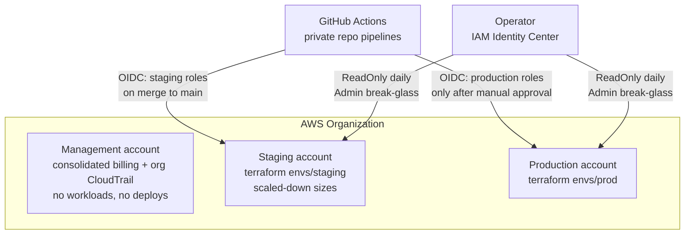

# Cloud delivery and access model

How a change travels from a pull request to production, and what every principal - human, pipeline or running service - is allowed to do along the way. [aws-setup.md](aws-setup.md) is the runbook for creating the pieces; [repository-boundary.md](repository-boundary.md) defines which repository does what; the decisions behind this document are recorded in [decisions.md](decisions.md) ("Cloud delivery", "AWS accounts").

## Accounts

An AWS Organization with two workload accounts. The management account carries consolidated billing and the organization CloudTrail, and runs nothing.

Each workload account is self-contained: its own Terraform state bucket and lock table, its own OIDC deploy roles, its own `/potocolom/<env>/*` secrets prefix. A staging mistake cannot touch production because no credential that works in staging means anything in production.

## Identity: three kinds of principals

**Humans.** One operator today, through IAM Identity Center (SSO short-lived credentials, no long-lived access keys anywhere). Two permission sets: `ReadOnlyAccess` for daily inspection and `AdministratorAccess` as break-glass. Break-glass use is exceptional by definition and is followed by codifying whatever was changed into Terraform. Root credentials have MFA and are never used operationally.

**Pipelines.** GitHub OIDC federation, no stored AWS secrets. The public repository has no AWS access at all - its release pipeline ends at GHCR. The private repository's workflows assume two roles per account:

| Role | Assumable from | Can | Cannot |
|---|---|---|---|
| `infra` | private repo, main branch (staging) or the `production` environment | `terraform plan` and `apply` for its account | touch the other account; read secret values it does not manage |
| `deploy` | same gating | ECR push, ECS register/update on the project cluster, SPA bucket sync, CloudFront invalidation, `iam:PassRole` on the two task roles only | IAM changes, network changes, anything Terraform owns |

**Workloads.** Every ECS service runs with two roles, both defined in [aws-setup.md](aws-setup.md): an execution role that can pull its image and read its own SSM prefix, and a task role limited to what the code actually does (the API: S3 images, SES send, CloudWatch metrics in the project namespace; the billing service and autoscaler: nothing in AWS beyond their database access - Stripe and RunPod keys arrive as SSM parameters). Workers are not AWS principals at all: they run on rented machines outside AWS and authenticate to the API with short-lived fleet tokens.

## From commit to production

Git is the promotion primitive end to end: the deployed state of production is always the pair (pinned public release digests, private repo main), and both are changed only by merged pull requests.

```mermaid
flowchart LR
    subgraph PUB["Public repository"]
        PR["PR + CI ladder<br>lint, unit, tiny-model CPU,<br>connection simulation"] --> M["merge to main"]
        M --> TAG["tag vX.Y.Z<br>release.yml builds<br>api + worker + frontend"]
        TAG --> GHCR["GHCR images<br>by digest"]
    end
    subgraph PRIV["Private repository"]
        PIN["promotion PR:<br>bump the pinned release digest"] --> PLAN["terraform plan posts on the PR"]
        PLAN --> MERGE["merge"]
    end
    subgraph STG["Staging account"]
        MIRROR["mirror GHCR to ECR<br>by digest"] --> SIM["contract simulation vs<br>the real billing service"]
        SIM --> MIG["gated migration task<br>expand-contract, N-1 safe"]
        MIG --> ROLL["ECS rolling deploy<br>circuit breaker + alarms"]
        ROLL --> SMOKE["smoke: health, config,<br>one realtime session"]
    end
    subgraph PRD["Production account"]
        PROLL["same steps,<br>same digests"]
    end
    GHCR --> PIN
    MERGE --> MIRROR
    SMOKE --> GATE{"manual approval<br>GitHub environment<br>protection"}
    GATE --> PROLL
```

Stage by stage:

1. Public repository: the normal CI ladder gates every PR; main stays deployable; a tag builds all three images and the compose file together (the trunk-based release decision).
2. Promotion into the cloud is one small private-repo PR that bumps the pinned public release digest. `terraform plan` posts on that PR, so infrastructure changes and version bumps are reviewed the same way.
3. Merging deploys staging: images mirrored from GHCR to ECR by digest (never by mutable tag), the public contract simulation runs against the real billing service, the Alembic migration task runs as a gated one-off before any task rolls, then the ECS services roll behind the deployment circuit breaker, then smoke checks.
4. A human approves the `production` environment. The same pipeline replays against the production account with the same digests. Nothing is rebuilt between staging and production.

## Rollback

- Application: revert the promotion PR; the pipeline redeploys the previous digests. A deploy that fails its health checks never needs this - the ECS circuit breaker rolls it back on its own.
- Schema: never rolled back. Migrations are expand-contract, so release N-1 code runs against schema N - the same discipline as the worker protocol's N-1 promise.
- Infrastructure: `git revert` plus apply, reviewed like any other change.

## Secrets

SecureString parameters under one prefix per account ([aws-setup.md](aws-setup.md) section 7). Execution roles are scoped to their prefix; pipelines pass parameter references and never read values; provider credentials exist only in the account that uses them (Stripe and RunPod keys have no staging copy unless staging exercises them in test mode). Rotation is a parameter update plus a service redeploy.

## Drift and audit

A scheduled nightly `terraform plan` runs per account and fails loudly on any drift, which is the reconciliation half of GitOps done as a check rather than a resident controller. The organization CloudTrail records every API call in every account into the management account. Console changes happen only under break-glass and end up back in Terraform.

## What this deliberately is not

No Kubernetes and no ArgoCD or Flux (nothing here is a cluster, and the GPU fleet lives outside AWS entirely), no CodePipeline, no blue/green CodeDeploy, no Control Tower, no multi-region. Each of these has its rejection and its revisit trigger recorded in [decisions.md](decisions.md).
