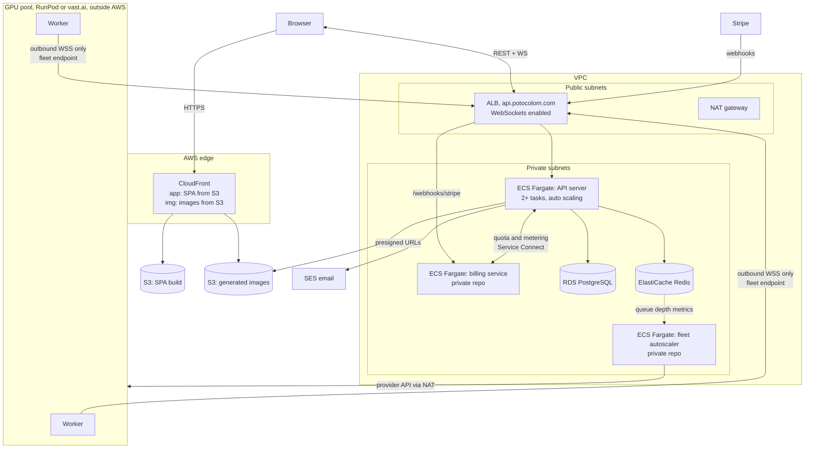
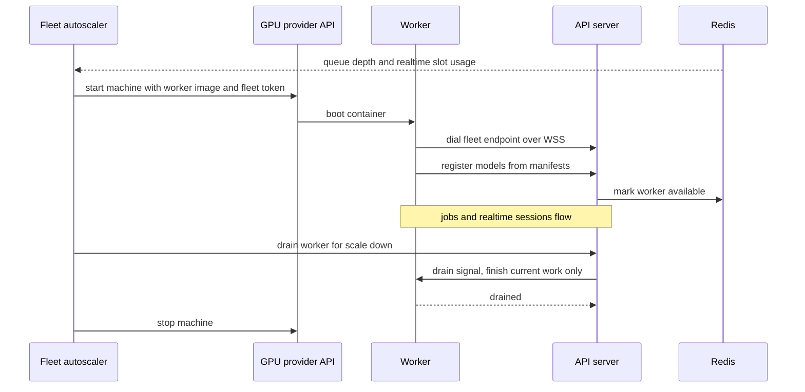
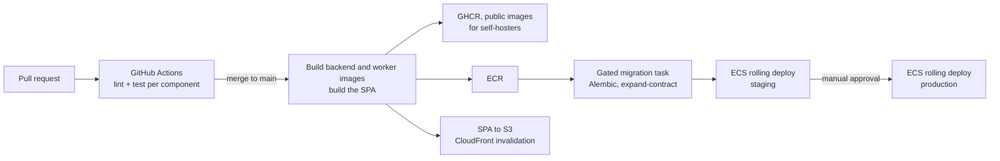

# Cloud infrastructure

This document makes the cloud profile from [architecture.md](architecture.md) concrete: which AWS services host each component, how the network is laid out, how the GPU fleet connects, how deployments happen, and what it roughly costs. It applies only to the cloud deployment operated by the project. Self-hosted installs are unaffected: they remain a docker compose file on one machine.

AWS is the reference provider (see [decisions.md](decisions.md)). GPU workers deliberately do not run on AWS: rented GPU providers such as RunPod and vast.ai are several times cheaper per GPU hour, and the fleet connects outbound so it never needs to live inside the VPC.

## Service mapping

| Role | AWS service | Notes |
|---|---|---|
| DNS | Route 53 | potocolom.com zone |
| TLS certificates | ACM | Free, auto renewed, attached to CloudFront and the ALB |
| SPA hosting | S3 + CloudFront | Static SvelteKit build; CloudFront serves index.html as the SPA fallback |
| Generated images | S3 + CloudFront | Separate bucket and distribution with long cache lifetimes |
| Load balancer | Application Load Balancer | WebSocket capable; idle timeout raised well above the heartbeat interval |
| API runtime | ECS Fargate | The backend image, 2 or more tasks in private subnets, auto scaling on CPU and connection count |
| Billing service (private repo) | ECS Fargate | Small service; reachable by the API through ECS Service Connect, by Stripe through an ALB path |
| Fleet autoscaler (private repo) | ECS Fargate | Watches queue depth and slot usage, calls the GPU provider API |
| Database | RDS PostgreSQL | Start on db.t4g.small single AZ; Multi-AZ when revenue justifies it |
| Queue, sessions, rate limits | ElastiCache Redis | Start on cache.t4g.micro |
| Container registry | ECR + GHCR | ECR for cloud deploys; GHCR publishes the same images publicly for self-hosters |
| Auth emails | SES | Verification and password reset; requires leaving SES sandbox before launch |
| Secrets | SSM Parameter Store | Database credentials, OAuth client secrets, worker fleet token signing key |
| Logs, metrics, alarms | CloudWatch | API publishes queue depth and realtime slot metrics for the autoscaler |
| Error tracking | Sentry (not AWS) | Free tier; exceptions with stack traces from API, worker and frontend |
| Outbound internet for private subnets | NAT gateway | A fixed cost worth knowing about, see the cost sketch |
| GPU workers | Not AWS | RunPod or vast.ai machines running the public worker image |
| Model weights | Cloudflare R2 (not AWS) | Zero egress mirror of vetted weights that workers pull and checksum at boot |

Region: eu-west-1 (Ireland) as the default, since every service above is available there. eu-south-2 (Spain) is the latency-optimal alternative for a Spanish user base once its service coverage is confirmed.

## Network layout

## Load balancer configuration

One Application Load Balancer carries every request from browsers, workers and Stripe. The settings that matter:

- Listeners: HTTPS on 443 with the ACM certificate; HTTP on 80 only redirects to 443.
- Listener rules: paths under `/webhooks/stripe` route to the billing service's target group; everything else, including the REST API, the browser realtime WebSocket and the worker fleet WebSocket endpoint, routes to the API target group.
- Target groups use IP targets (required for Fargate) with health checks against `GET /api/v1/health` every 15 seconds, 2 checks to change state.
- Idle timeout 120 seconds. Both socket kinds send traffic at least every 30 seconds (worker heartbeats, browser pings), so long lived WebSockets survive with a 4x margin.
- No sticky sessions. The API is stateless and realtime frames cross replicas through Redis pub/sub, so round robin over healthy targets is correct and nothing depends on connection placement.
- Deploys: ECS takes a task out of the target group (deregistration delay 120 seconds), the app closes its WebSockets cleanly, browsers reconnect through the session recovery flow and workers redial, landing on a new task.

### How a request flows

- Static assets never touch the ALB: the SPA and images come from CloudFront.
- Every API call arrives with the session cookie; a middleware resolves it against Redis (falling back to PostgreSQL) before any handler runs. Auth lives entirely in the API layer; the ALB does not authenticate.
- A generation request then passes rate limiting, prompt screening and quota reserve, in that order, before a job row is created and dispatched. Each step rejects as early and cheaply as possible: a rate limited request costs one Redis lookup, a refused prompt costs no GPU time, an over-quota request never reaches the queue.

## Rate limiting and abuse

- Application level token buckets in Redis, per user and per IP: separate budgets for auth attempts, job submissions and realtime session opens. Limits are configuration, enforced in API middleware.
- Signup protections, because trial credits are free GPU money: one trial grant per verified email, a disposable email domain blocklist, and per IP signup caps.
- AWS WAF with managed rule sets can attach to the ALB and CloudFront later (roughly 10 to 20 USD per month); it is not part of the launch baseline because the application level limits cover the realistic threat at this scale.

## GPU fleet connectivity

Rented GPU machines sit on untrusted networks outside the VPC. The rules:

- Workers accept no inbound connections and open no ports. On start, a worker dials one persistent WSS connection to the fleet endpoint (the api hostname behind the ALB), authenticated with a short lived worker token issued by the fleet autoscaler at machine start.
- Everything multiplexes over that single connection: model registration, job dispatch, real time frame streams, heartbeats and drain signals. Heartbeats every 30 seconds keep the connection alive through the ALB.
- Result images do not pass through the API containers: the API hands the worker a presigned S3 URL and the worker uploads directly.
- At boot a worker pulls its assigned models from a Cloudflare R2 mirror of vetted weights, verified against manifest checksums. R2 charges no egress, so a 5 to 10 GB pull over datacenter links keeps scale up inside the one to three minutes the admission queue promises, with no Hugging Face rate limits or disappearing repositories in the critical path. Self-hosters pull from Hugging Face directly.
- Prompts and canvas frames are necessarily processed in plaintext on rented hardware during inference. TLS covers transit, nothing persists on the machine beyond the weights cache, results upload straight to S3, and the privacy policy names the GPU providers as subprocessors. This is stated plainly rather than implied.
- The self-hosted worker uses the exact same code path, dialing the API service on the compose network instead of a public hostname.

## Image delivery and retention

- The images bucket is private. The API mints short lived CloudFront signed URLs when it lists a user's history or completes a job, so an asset URL leaking does not leak the asset for long.
- Share links are served from a `/shared/{token}` behavior on the images distribution with a short cache lifetime; revoking a share deletes the token, and the short TTL bounds how long a revoked link keeps working at the edge.
- Retention: subscribers keep their library indefinitely. Trial assets carry an `expires_at` 30 days out; a nightly job deletes expired database rows and their objects, with an S3 lifecycle rule on the trial prefix as a backstop.

## Worker lifecycle and autoscaling

Scale up triggers: queued jobs above a threshold, or free real time slots below one. Scale down happens only through draining, so no user visible work is killed. A small floor of always-on workers keeps real time latency acceptable; everything above the floor follows demand.

The autoscaler also enforces spend rails: an absolute machine ceiling and a monthly budget. Approaching either, it stops scaling up and the admission queues simply grow behind a high demand banner; raising the cap is a deliberate configuration change, never automatic. No bug, abuse wave or viral day can produce an unbounded GPU bill.

## Deployment pipeline

The same built images go to GHCR for self-hosters and to ECR for the cloud, so a cloud deployment is always a version any self-hoster can also run. Releases are trunk based with a single project version: a tag cuts all three images plus the compose file together, and the worker protocol's N-1 promise reads as "this tag talks to the previous tag".

Database migrations run as a gated one-off task before tasks roll, in each environment. Every migration must stay compatible with the previous release's code (expand, backfill, contract in a later release), so old and new tasks can coexist mid deploy; this mirrors the N-1 discipline of the worker protocol. Self-hosted installs instead migrate automatically on API startup, which is safe with a single instance and saves self-hosters a manual step they would forget.

## Resilience and backups

The stated tolerance at launch: an availability zone failure may cost up to five minutes of writes and about an hour of manual recovery; nothing worse is acceptable.

- RDS runs single AZ with point in time recovery and automated snapshots (14 day window). Multi-AZ is a checkbox to enable when revenue justifies roughly 30 USD per month of insurance.
- Redis is a cache and a queue, never a source of truth. If it fails, sessions fall back to PostgreSQL (nobody gets logged out), generation and realtime features degrade behind a status banner, and the queue is rebuilt from job rows in the `queued` state when Redis returns.
- The images bucket has versioning enabled, so an application bug that deletes objects is recoverable; S3 durability covers the hardware side.
- Worker machines are expected to vanish: queued jobs retry once on another worker, realtime sessions reattach through the recovery flow, both specified in [architecture.md](architecture.md).

## Observability

- CloudWatch holds structured JSON logs from every service and the metrics that matter: queue depth, realtime slot utilization, admission queue wait, 5xx rate, request latency, worker heartbeat gaps, plus the RDS and ElastiCache basics.
- Alarms on queue depth, error rate, missing worker heartbeats and database capacity notify through SNS.
- Sentry (free tier) captures exceptions with stack traces from the API, the worker and the frontend. This is where the 3am Python traceback is found; CloudWatch is where the capacity trend is found.

## Environments and infrastructure as code

Two environments, staging and production, in separate VPCs with their own state. Staging is deliberately scaled down, not a mirror: the same Terraform modules with minimum sizes, one API task, the smallest RDS instance, no always-on GPU (a worker is borrowed from the pool or run on a development machine when testing). That is roughly 60 to 80 USD per month and still exercises the real deploy pipeline end to end. Everything in the service mapping is managed with Terraform, state stored in S3. The GPU fleet is the exception: machines are rented and released at runtime by the autoscaler, so they are never described in Terraform.

## Cost sketch

Rough monthly figures to size the commitment, not quotes. Verify current prices before purchasing.

| Item | USD per month |
|---|---|
| ALB | 20 |
| ECS Fargate, 2 API tasks (0.5 vCPU, 1 GB each) | 35 |
| ECS Fargate, billing service and autoscaler | 20 |
| RDS PostgreSQL db.t4g.small | 30 |
| ElastiCache cache.t4g.micro | 12 |
| NAT gateway | 35 plus data |
| S3 + CloudFront | 5 to 20 |
| Route 53, SES, ECR, CloudWatch | 10 |
| Cloudflare R2 weights mirror | 1 to 5 |
| Baseline before GPUs | roughly 170 |
| Scaled-down staging | 60 to 80 |

Sentry stays on its free tier at this scale, and AWS WAF is deferred, so neither appears above.

GPU economics dominate everything above. A single RTX 4090 class machine on RunPod runs roughly 0.35 to 0.70 USD per hour, so one always-on worker costs 250 to 500 USD per month. A real time drawing session occupies a worker slot continuously while the user draws, which is exactly why the billing model meters credits against GPU seconds: subscription prices must cover the GPU seconds a typical subscriber consumes. At hundreds of active users, GPU spend exceeds the entire AWS baseline several times over.

## Scaling stages

- Stage 1, launch, hundreds of users: everything above in one region, one or two always-on workers plus demand scaling.
- Stage 2, thousands of users: API task count scales on load, RDS goes Multi-AZ with a read replica if needed, Redis gains a replica, and the worker pool splits by model family so heavy models do not starve real time capacity.
- Stage 3, far beyond: CloudFront is already global; the change is regional worker pools close to users to cut real time latency, which touches the session scheduler and nothing else.
