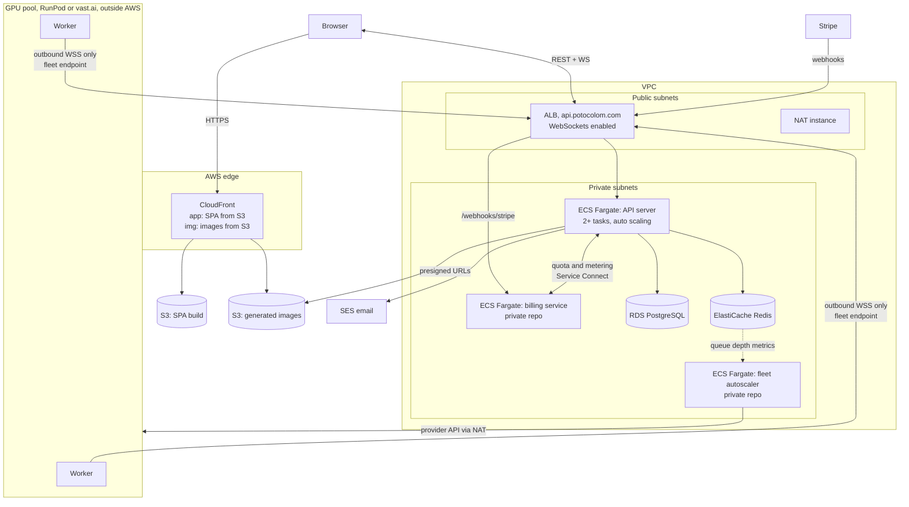
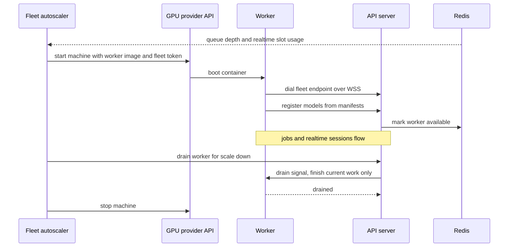
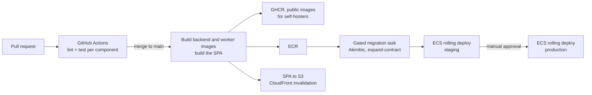

# Cloud infrastructure

This document makes the cloud profile from [architecture.md](architecture.md) concrete: which AWS services host each component, how the network is laid out, how the GPU fleet connects, how deployments happen, and what it roughly costs. The step-by-step provisioning runbook, with parameters, IAM policies and the go-live checklist, is [aws-setup.md](aws-setup.md). It applies only to the cloud deployment operated by the project. Self-hosted installs are unaffected: they remain a docker compose file on one machine.

AWS is the reference provider (see [decisions.md](decisions.md)). GPU workers deliberately do not run on AWS: rented GPU providers such as RunPod and vast.ai are several times cheaper per GPU hour, and the fleet connects outbound so it never needs to live inside the VPC.

## Service mapping

| Role | AWS service | Notes |
|---|---|---|
| DNS | Route 53 | potocolom.com zone |
| TLS certificates | ACM | Free, auto renewed, attached to CloudFront and the ALB |
| SPA hosting | S3 + CloudFront | Static SvelteKit build; CloudFront serves index.html as the SPA fallback |
| Generated images | S3 + CloudFront | Separate bucket and distribution with long cache lifetimes |
| Load balancer | Application Load Balancer | WebSocket capable; idle timeout raised well above the heartbeat interval |
| API runtime | ECS Fargate | The backend image on Graviton (ARM64), 2 or more tasks in private subnets, auto scaling on CPU and connection count |
| Billing service (private repo) | ECS Fargate | Small service; reachable by the API through ECS Service Connect, by Stripe through an ALB path |
| Fleet autoscaler (private repo) | ECS Fargate | Watches queue depth and slot usage, calls the GPU provider API |
| Database | RDS PostgreSQL | Start on db.t4g.small single AZ; Multi-AZ when revenue justifies it |
| Queue, sessions, rate limits | ElastiCache (Valkey engine) | Redis protocol compatible, 20 to 30 percent cheaper; start on cache.t4g.micro |
| Container registry | ECR + GHCR | ECR for cloud deploys; GHCR publishes the same images publicly for self-hosters |
| Auth emails | SES | Invitations and password reset today; address verification is not implemented yet. `EMAIL_BACKEND=ses` with `MAIL_FROM` and `SES_REGION`; the API refuses to start if either is missing. Capabilities are written to the `mail_outbox` table in the transaction that mints them and delivered by a sweep, so a send outage queues rather than failing the request. An address SES rejects outright is suppressed and never queued again. `MAIL_FROM` must equal the address the API task role's `ses:FromAddress` condition allows, or every send fails at runtime with AccessDenied and rows retry to the attempt limit; startup only checks that it is set, not what it is. Requires leaving the SES sandbox before launch, and an SNS subscription for asynchronous bounce and complaint feedback, which is not wired yet |
| Secrets | SSM Parameter Store | Database credentials, OAuth client secrets, worker fleet token signing key |
| Logs, metrics, alarms | CloudWatch | API publishes queue depth and realtime slot metrics for the autoscaler |
| Error tracking | Sentry (not AWS) | Free tier; exceptions with stack traces from API, worker and frontend |
| Outbound internet for private subnets | NAT instance | fck-nat pattern on t4g.nano, the one accepted pet; an S3 gateway endpoint keeps S3 traffic off it entirely ([decisions.md](decisions.md), "AWS baseline") |
| GPU workers | Not AWS | RunPod or vast.ai machines running the public worker image |
| Model weights | Cloudflare R2 (not AWS) | Zero egress mirror of vetted weights that workers pull and checksum at boot |

Region: eu-west-1 (Ireland) as the default, since every service above is available there. eu-south-2 (Spain) is the latency-optimal alternative for a Spanish user base once its service coverage is confirmed.

## Network layout

```mermaid
flowchart TB
    U["Browser"]
    STRIPE["Stripe"]
    subgraph EDGE["AWS edge"]
        CF["CloudFront<br>app: SPA from S3<br>img: images from S3"]
    end
    SPA[("S3: SPA build")]
    IMG[("S3: generated images")]
    SES["SES email"]
    subgraph VPC["VPC"]
        subgraph PUB["Public subnets"]
            ALB["ALB, api.potocolom.com<br>WebSockets enabled"]
            NAT["NAT instance"]
        end
        subgraph PRV["Private subnets"]
            API["ECS Fargate: API server<br>2+ tasks, auto scaling"]
            BILL["ECS Fargate: billing service<br>private repo"]
            FLEET["ECS Fargate: fleet autoscaler<br>private repo"]
            RDS[("RDS PostgreSQL")]
            EC[("ElastiCache Redis")]
        end
    end
    subgraph GPUS["GPU pool, RunPod or vast.ai, outside AWS"]
        W1["Worker"]
        W2["Worker"]
    end
    U -->|"HTTPS"| CF
    CF --> SPA
    CF --> IMG
    U <-->|"REST + WS"| ALB
    STRIPE -->|"webhooks"| ALB
    ALB --> API
    ALB -->|"/webhooks/stripe"| BILL
    API --> RDS
    API --> EC
    API -->|"presigned URLs"| IMG
    API --> SES
    API <-->|"quota and metering<br>Service Connect"| BILL
    EC -.->|"queue depth metrics"| FLEET
    FLEET -->|"provider API via NAT"| GPUS
    W1 -->|"outbound WSS only<br>fleet endpoint"| ALB
    W2 -->|"outbound WSS only<br>fleet endpoint"| ALB
```

## Load balancer configuration

One Application Load Balancer carries every request from browsers, workers and Stripe. The settings that matter:

- Listeners: HTTPS on 443 with the ACM certificate; HTTP on 80 only redirects to 443.
- Listener rules: paths under `/webhooks/stripe` route to the billing service's target group; everything else, including the REST API, the browser realtime WebSocket and the worker fleet WebSocket endpoint, routes to the API target group.
- Target groups use IP targets (required for Fargate) with health checks against `GET /api/v1/health` every 15 seconds, 2 checks to change state.
- Idle timeout 120 seconds. Both socket kinds send traffic at least every 30 seconds (worker heartbeats, browser pings), so long lived WebSockets survive with a 4x margin.
- No sticky sessions. The API is stateless and realtime frames cross replicas through Redis pub/sub, so round robin over healthy targets is correct and nothing depends on connection placement.
- Deploys: ECS takes a task out of the target group (deregistration delay 120 seconds), the app closes its WebSockets cleanly, browsers reconnect through the session recovery flow and workers redial, landing on a new task.

> Shipped status (2026-07-30): **partially implemented.** Worker heartbeats ship, but the browser application ping, Redis FrameBus, cross-replica recovery, and clean realtime drain do not. Issue #19, "Real-Time Generation Protocol", governs browser keepalive and resume; "Redis-optional Queues and FrameBus contracts" governs cross-replica routing; "Go realtime gateway and API control bridge" governs the accepted target socket tier.

### How a request flows

- Static assets never touch the ALB: the SPA and images come from CloudFront.
- Every API call arrives with the session cookie; a middleware resolves it against Redis (falling back to PostgreSQL) before any handler runs. Auth lives entirely in the API layer; the ALB does not authenticate.
- A generation request then passes rate limiting, prompt screening and quota reserve, in that order, before a job row is created and dispatched. Each step rejects as early and cheaply as possible: a rate limited request costs one Redis lookup, a refused prompt costs no GPU time, an over-quota request never reaches the queue.

## Rate limiting and abuse

- Application level token buckets in Redis, per user and per IP: separate budgets for auth attempts, job submissions and realtime session opens. Limits are configuration, enforced in API middleware.
- Signup protections, because trial credits are free GPU money: one trial grant per verified email, a disposable email domain blocklist, and per IP signup caps.
- AWS WAF with managed rule sets can attach to the ALB and CloudFront later (roughly 10 to 20 USD per month); it is not part of the launch baseline because the application level limits cover the realistic threat at this scale.

## GPU fleet connectivity

Rented GPU machines sit on untrusted networks outside the VPC. The rules:

- Workers accept no inbound connections and open no ports. On start, a worker dials one persistent WSS connection to the fleet endpoint (the api hostname behind the ALB), authenticated with a short lived worker token issued by the fleet autoscaler at machine start.
- Everything multiplexes over that single connection: model registration, job dispatch, real time frame streams, heartbeats and drain signals. Heartbeats every 30 seconds keep the connection alive through the ALB.
- Result images do not pass through the API containers: the API hands the worker a presigned S3 URL and the worker uploads directly.
- At boot a worker pulls its assigned models from a Cloudflare R2 mirror of vetted weights, verified against manifest checksums. R2 charges no egress, so a 5 to 10 GB pull over datacenter links keeps scale up inside the one to three minutes the admission queue promises, with no Hugging Face rate limits or disappearing repositories in the critical path. Self-hosters pull from Hugging Face directly.
- Prompts and canvas frames are necessarily processed in plaintext on rented hardware during inference. TLS covers transit, nothing persists on the machine beyond the weights cache, results upload straight to S3, and the privacy policy names the GPU providers as subprocessors. This is stated plainly rather than implied.
- The self-hosted worker uses the exact same code path, dialing the API service on the compose network instead of a public hostname.

## Cloud contracts

Nothing in this document is running. No AWS account holds these resources, no Terraform in the private repository has been applied, and none of the hostnames resolve. The contracts below are written down so the code that will meet them is not invented twice at the moment it is needed, and each one says whether it exists today.

**Private calls between services** are authenticated with VPC Lattice IAM and SigV4, never by network position. The API reaching the billing service, and the autoscaler reaching the API, both sign their requests, and each service's auth policy names the actions and resources a caller may reach rather than allowing the caller wholesale. A private subnet is not a credential: without this, anything that lands in the subnet can call the billing service as the API. Designed; there is no service network.

**Fleet tokens.** Shipped: a worker presents `X-Fleet-Token` on the upgrade and the API compares it against `FLEET_TOKEN_KEY` in constant time, one secret, no rotation window. The cloud shape is an Ed25519 JWS carrying a lease, with the machine's identity, an expiry short enough that a stolen token dies with the machine, and a `jti` the API revokes when the autoscaler releases it; `FLEET_AUTH` selects which is in force, and a self-hosted rotation window accepting the current and previous secret belongs with it. Deferred by recorded decision ("Fleet token verification: static shared secret first, signed tokens with the cloud"): verification lands with the autoscaler that mints these tokens, because before that the open repository would carry a verifier with no producer and a token format fixed before anything writes one. Issue #225.

**Gateway realtime tickets.** A browser asks the API for a ticket, spends it as the first message on the gateway socket, and the gateway trades it for a principal binding. Thirty seconds, one use, first message only, in regional Redis. Minting fails closed: no Redis, no ticket, and the socket is refused rather than opened unauthenticated. Designed; there is no gateway, and the backend has no Redis dependency to mint against. Issue #193.

**CloudFront and the API.** The API is not behind CloudFront. `api.potocolom.com` aliases the ALB, so no cache sits between a browser and an authenticated response, and `Cache-Control: no-store` on sensitive responses is the whole of the contract. The two distributions carry static things only: the SPA distribution caches the build and rewrites 403 and 404 to `/index.html`, and the images distribution serves signed private objects with no cached share behavior, because an edge TTL on a share path would decide how long a revoked link keeps working. Designed.

**SES feedback.** Shipped. `POST /api/v1/mail/feedback` accepts SNS bounce and complaint notifications, verifies the signature against the regional SNS key, and honours only the topic named by `SES_FEEDBACK_TOPIC_ARN`. The signature says an AWS customer sent the message; the topic is what says it was ours. Setup is step 8 of [aws-setup.md](aws-setup.md).

**Operator recovery.** Shipped: `python -m app.recovery EMAIL` prints a one-use ten-minute link at the machine, which in the cloud means an ECS Exec session with session logging deliberately off, because the command prints a live credential. The designed alternative writes that link to a short-lived Secrets Manager secret and logs only its ARN, which keeps the credential out of a terminal transcript entirely. Both keep the property that matters: no route mints a way back in, so there is nothing to steal a session for.

**Billing.** The API never talks to Stripe. It calls a QuotaService over HTTP with reserve, commit and refund, and emits metering events; the credit ledger, the subscriptions and the Stripe webhooks all live in the private repository behind that boundary, which is also the license boundary. Designed: no QuotaService implementation ships in this repository yet, fake or real, and the interface arrives with its first caller rather than ahead of one.

## Image delivery and retention

- The images bucket is private. The API mints short lived CloudFront signed URLs when it lists a user's history or completes a job, so an asset URL leaking does not leak the asset for long. The images distribution is a different CloudFront domain from the API, so a browser that sniffed those bytes could not steal API cookies.
- That images distribution must attach a response-headers policy sending `X-Content-Type-Options: nosniff`. S3 and MinIO GET do not emit that header; object `Content-Type` (signed on PUT, and repeated as `ResponseContentType` on the presigned GET) is what the store itself can promise.
- A share link is `/shared#<token>` on the studio domain, where the SPA serves the page, and the fragment never reaches a server: the page posts the token to `POST /api/v1/shared`, which answers from PostgreSQL and mints a 60-second signed URL on the images distribution for the picture itself. There is no cached share behavior and no token in any path, so a revoked share stops resolving at once rather than at the end of an edge TTL, and no token is ever written to an access log.
- Retention: subscribers keep their library indefinitely. Trial assets carry an `expires_at` 30 days out; a nightly job deletes expired database rows and their objects, with an S3 lifecycle rule on the trial prefix as a backstop.
- A deleted account is purged 30 days after it asked, by a sweep that takes the objects first, then the rows that named them, then the user row. Until then a restore puts the account back where it was. The objects go through the same bounded delete as every other cleanup path, so one that will not go is recorded in `pending_deletes` and retried rather than stopping the account from being finished.
- Dispatch uploads land under `dispatch/{user_id}/` and are promoted into the durable `{user_id}/` library prefix on commit. An S3 lifecycle rule expires the `dispatch/` prefix after 24 hours as a backstop when a presigned PUT is replayed after cleanup (issue #278). The images bucket has versioning on, so that rule must expire current objects, expire noncurrent versions, and drop expired delete markers. A current-only expiry leaves the replay as a noncurrent version and keeps billing for it.

## Worker lifecycle and autoscaling

```mermaid
sequenceDiagram
    participant F as Fleet autoscaler
    participant RP as GPU provider API
    participant W as Worker
    participant A as API server
    participant R as Redis
    R-->>F: queue depth and realtime slot usage
    F->>RP: start machine with worker image and fleet token
    RP->>W: boot container
    W->>A: dial fleet endpoint over WSS
    W->>A: register models from manifests
    A->>R: mark worker available
    Note over W,A: jobs and realtime sessions flow
    F->>A: drain worker for scale down
    A->>W: drain signal, finish current work only
    W-->>A: drained
    F->>RP: stop machine
```

Scale up triggers: queued jobs above a threshold, or free real time slots below one. Scale down happens only through draining, so no user visible work is killed. The always-on worker floor follows a schedule (floor 1 during European waking hours, floor 0 overnight at launch; a quiet-hour first session sees the waiting room while a machine boots); everything above the floor follows demand.

The autoscaler also enforces spend rails: an absolute machine ceiling and a monthly budget. Approaching either, it stops scaling up and the admission queues simply grow behind a high demand banner; raising the cap is a deliberate configuration change, never automatic. No bug, abuse wave or viral day can produce an unbounded GPU bill.

## Deployment pipeline

```mermaid
flowchart LR
    PR["Pull request"] --> CI["GitHub Actions<br>lint + test per component"]
    CI -->|"merge to main"| BUILD["Build backend and worker images<br>build the SPA"]
    BUILD --> GHCR["GHCR, public images<br>for self-hosters"]
    BUILD --> ECR["ECR"]
    BUILD --> S3D["SPA to S3<br>CloudFront invalidation"]
    ECR --> MIG["Gated migration task<br>Alembic, expand-contract"]
    MIG --> STG["ECS rolling deploy<br>staging"]
    STG -->|"manual approval"| PROD["ECS rolling deploy<br>production"]
```

The same built images go to GHCR for self-hosters and to ECR for the cloud, so a cloud deployment is always a version any self-hoster can also run. Releases are trunk based with a single project version: a tag cuts all three images plus the compose file together, and the worker protocol's N-1 promise reads as "this tag talks to the previous tag".

Database migrations run as a gated one-off task before tasks roll, in each environment. Every migration must stay compatible with the previous release's code (expand, backfill, contract in a later release), so old and new tasks can coexist mid deploy; this mirrors the N-1 discipline of the worker protocol. Self-hosted installs instead migrate automatically on API startup, which is safe with a single instance and saves self-hosters a manual step they would forget.

## Resilience and backups

The stated tolerance at launch: an availability zone failure may cost up to five minutes of writes and about an hour of manual recovery; nothing worse is acceptable.

- RDS runs single AZ with point in time recovery and automated snapshots (14 day window). Multi-AZ is a checkbox to enable when revenue justifies roughly 30 USD per month of insurance.
- Redis is a cache and a queue, never a source of truth. If it fails, sessions fall back to PostgreSQL (nobody gets logged out), generation and realtime features degrade behind a status banner, and the queue is rebuilt from job rows in the `queued` state when Redis returns.
- The images bucket has versioning enabled, so an ordinary delete writes a marker and an application bug that removes an object is recoverable; S3 durability covers the hardware side. The exception is terminal job cleanup, which purges by version id on purpose: it exists to reclaim storage from a worker that uploaded something the API rejected, and a delete marker would keep paying for those bytes. A bug in that path is therefore not recoverable from S3, which is the trade for not letting an untrusted peer bill the install indefinitely.
- Worker machines are expected to vanish: queued jobs retry once on another worker, realtime sessions reattach through the recovery flow, both specified in [architecture.md](architecture.md).

## Observability

- CloudWatch holds structured JSON logs from every service and the metrics that matter: queue depth, realtime slot utilization, admission queue wait, 5xx rate, request latency, worker heartbeat gaps, fleet GPU aggregates from worker heartbeats, per-model frame-time p95, settlement outbox depth and autoscaler spend pace, plus the RDS and ElastiCache basics. Export paths and the aggregate-versus-detail rule are specified in [metrics.md](metrics.md).
- Alarms on queue depth, error rate, missing worker heartbeats, database capacity, a non-empty settlement outbox that persists, webhook signature failures, frame-time p95 over the realtime bar, log ingestion volume, and fleet utilization sustained below the pricing floor - all notify through SNS.
- Three CloudWatch dashboards: fleet (workers, slots, GPU aggregates, frame times), product operations (queues, latency, errors), money (outbox, spend pace, utilization).
- Sentry (free tier) captures exceptions with stack traces from the API, the worker and the frontend. This is where the 3am Python traceback is found; CloudWatch is where the capacity trend is found.

## Environments and infrastructure as code

Two environments, staging and production, in separate VPCs with their own state. Staging is deliberately scaled down, not a mirror: the same Terraform modules with minimum sizes, one API task, the smallest RDS instance, no always-on GPU (a worker is borrowed from the pool or run on a development machine when testing). That is roughly 60 to 80 USD per month and still exercises the real deploy pipeline end to end. Everything in the service mapping is managed with Terraform, state stored in S3. The GPU fleet is the exception: machines are rented and released at runtime by the autoscaler, so they are never described in Terraform.

## Cost sketch

Rough monthly figures to size the commitment, not quotes. Verify current prices before purchasing.

| Item | USD per month |
|---|---|
| ALB | 20 |
| ECS Fargate on Graviton, 2 API tasks (0.5 vCPU, 1 GB each) | 28 |
| ECS Fargate on Graviton, billing service and autoscaler | 16 |
| RDS PostgreSQL db.t4g.small | 30 |
| ElastiCache cache.t4g.micro (Valkey engine) | 9 |
| NAT instance (t4g.nano) | 4 plus data; S3 traffic bypasses it via the free gateway endpoint |
| S3 + CloudFront | 5 to 20 |
| Route 53, SES, ECR, CloudWatch | 10 |
| Cloudflare R2 weights mirror | 1 to 5 |
| Baseline before GPUs | roughly 130 |
| Scaled-down staging | 50 to 70 |

Sentry stays on its free tier at this scale, and AWS WAF is deferred, so neither appears above.

GPU economics dominate everything above. A single RTX 4090 class machine on RunPod runs roughly 0.35 to 0.70 USD per hour, so one always-on worker costs 250 to 500 USD per month - the scheduled floor cuts roughly a third of that at launch, and the launch card itself is chosen by a measured bake-off rather than assumption ([decisions.md](decisions.md), "Fleet card"). A real time drawing session occupies a worker slot continuously while the user draws, which is exactly why the billing model meters credits against GPU seconds, and why slots per GPU are calibrated rather than guessed: every additional session a card holds at the bar cuts realtime cost per user proportionally. At hundreds of active users, GPU spend exceeds the entire AWS baseline several times over.

## Scaling stages

- Stage 1, launch, hundreds of users: everything above in one region, one or two always-on workers plus demand scaling.
- Stage 2, the accepted 1000-active-session target: each active region has its own gateway, FrameBus, admission queue, scheduler lease, ready warm capacity, and pool partitioning for realtime and other model families. RDS may move to Multi-AZ with a read replica for measured database needs. This stage is governed by "Realtime fleet: regional, pool-partitioned, and warm", "Realtime relay: Go gateway required for the 1000-active-session target", and "Regional scheduler and ready-slot warm pools".
- Redis availability replication is independent of frame throughput. An added replica does not split publish ingress. The compose profile's Redis 7 image supports [sharded Pub/Sub](https://redis.io/docs/latest/develop/pubsub/#sharded-pubsub) in cluster mode through `SSUBSCRIBE` and `SPUBLISH`, but endpoint isolation or sharding is adopted only from issue #48, "Gateway load harness: 1000 active sessions at 2 and 4 fps", and "Split FrameBus pub/sub onto its own endpoint".
- Stage 3, beyond the accepted target: add capacity within the regional design and introduce new regions only from measured locality, headroom, and failure data; do not reintroduce a global live FrameBus.
