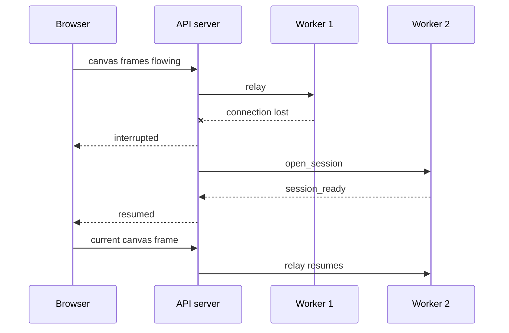
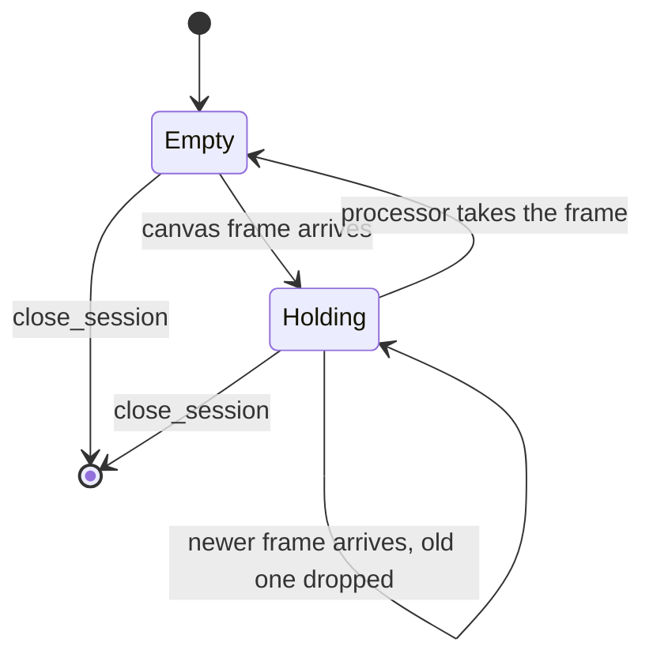

# Connection handling

The normative specification for every long lived connection in the system: the worker's fleet connection and the browser's realtime connection. Issues #15 and #19 implement against this document; the runnable simulation (see The simulation, below) exercises it end to end. [blueprint.md](blueprint.md) covers what surrounds these connections (scheduler, Redis relay, load balancer); this document covers the wire.

## Endpoints and transport

| Connection | Endpoint | Who dials | Carries |
|---|---|---|---|
| Fleet | `WS /api/v1/fleet` | worker, always outbound | registration, heartbeats, session control, frames |
| Realtime | `WS /api/v1/realtime` | browser | session control, canvas frames up, generated frames down |

Both connections mix two WebSocket message kinds:

- Text messages: JSON control, one object per message, `type` field mandatory. Readable in browser devtools by design.
- Binary messages: image frames. Fixed 17 byte header, then payload:

```
byte  0      frame kind: 0x01 canvas (browser to worker), 0x02 generated (worker to browser)
bytes 1-16   session id, UUID big endian
bytes 17-    image payload (WebP in production; the simulation carries opaque bytes)
```

Frames never contain JSON and control messages never contain image bytes; the two kinds are routable without parsing payloads.

## Message catalogue

Fleet connection, worker to API:

| type | Fields | Notes |
|---|---|---|
| `hello` | `protocol_version`, `worker_id`, `models`, `realtime_slots` | first message after connect; `models` is the manifest list with capabilities as measured (the memory ladder in [architecture.md](architecture.md) may drop `realtime` on low VRAM workers) |
| `heartbeat` | `slots_in_use` | every 30 seconds |
| `session_ready` | `session_id` | slot acquired, model warm |
| `session_closed` | `session_id`, `frames` | worker side accounting |

Fleet connection, API to worker:

| type | Fields | Notes |
|---|---|---|
| `registered` | | hello accepted |
| `rejected` | `reason`, `min_supported_version` | hello refused; the API closes after sending |
| `open_session` | `session_id`, `model_id` | acquire a slot and warm the model |
| `close_session` | `session_id` | release the slot |

Realtime connection, browser to API:

| type | Fields | Notes |
|---|---|---|
| `open` | `model_id` | first message after connect |
| `close` | | end the session cleanly |

Realtime connection, API to browser:

| type | Fields | Notes |
|---|---|---|
| `ready` | `session_id` | frames may flow |
| `interrupted` | | worker lost; hold frames, reassignment in progress |
| `resumed` | | new worker ready; re-send the current canvas |
| `error` | `code`, `message` | terminal; the API closes after sending |

Messages later issues add to this catalogue (queued position, prompt updates, credits ticks, drain) extend these tables; nothing here is expected to change shape.

## Connection establishment

```mermaid
sequenceDiagram
    participant W as Worker
    participant A as API server
    W->>A: WS connect /api/v1/fleet
    W->>A: hello (protocol_version, worker_id, models, realtime_slots)
    alt version supported
        A-->>W: registered
        Note over W,A: worker is dispatchable; heartbeats begin
    else version too old
        A-->>W: rejected (min_supported_version)
        A->>W: close 4002
    end
```

The version gate implements the N-1 promise: with current protocol version N, versions N and N-1 register, anything older is rejected. The browser side is symmetric but simpler: connect, `open`, then either `ready` or `error`.

## Timeouts and intervals

| What | Value | Why |
|---|---|---|
| Worker heartbeat interval | 30 s | keeps the connection alive through the ALB (120 s idle timeout, 4x margin) |
| Worker declared dead | 90 s without heartbeat | 3 missed heartbeats; sessions on it are reassigned, jobs requeued |
| Browser ping interval | 20 s | browsers on quiet canvases still traverse the ALB |
| Idle slot release | 60 s without canvas input | credit metering stops; canvas stays in the browser |
| Simulated inference time | configurable | the prototype sleeps instead of denoising |

TCP-level disconnects are acted on immediately; the heartbeat timeout only matters when a connection dies silently, which load balancers make possible. Two rows ship with the realtime protocol issue (#19) rather than the prototype: the idle slot release (until then a slot stays pinned from `ready` to close) and the browser keepalive, which will be an application level control message because browser WebSocket APIs cannot send protocol pings. Everything else in the table is implemented.

## Reconnection and resume

Both dialers reconnect with exponential backoff: 1 s doubling to a 30 s cap, with up to 25 percent random jitter so a restarted API is not hit by the whole fleet in the same second. Reconnection is a fresh `hello`; the API holds no memory of previous incarnations of a worker.

Session recovery is asymmetric by design:

- Worker lost: the API keeps the browser connection, sends `interrupted`, picks another worker with a free slot, sends it `open_session`, and on `session_ready` tells the browser `resumed`. The browser re-sends its current canvas; at most the frames in flight are lost.
- Browser lost: the API closes the worker side of the session (`close_session`) and releases the slot. The canvas lives in the browser, so there is nothing to recover server side; a returning browser opens a new session.



## Latest input wins

The worker never queues canvas frames. Per session it holds exactly one pending frame; a newer arrival overwrites an unprocessed older one, which is then counted as dropped. The processing loop takes the pending frame, runs inference, sends the generated frame, and looks again. Under load the user sees fewer, fresher frames instead of a growing delay, which is the correct failure mode for drawing.



## Close codes

| Code | Meaning | Sent to |
|---|---|---|
| 1000 | normal close | either |
| 4000 | protocol violation (first message was not hello or open, malformed JSON) | either |
| 4002 | unsupported protocol version | worker |
| 4003 | no worker capacity for the requested model | browser |
| 4004 | unknown model | browser |

Codes 4005 and up are reserved for the messages later issues add (unauthorized, drained, quota exhausted).

## Delivery semantics

- Frames are at most once. A dropped frame is never retransmitted; the next canvas state supersedes it.
- Control messages are exactly once per connection: WebSocket ordering is relied upon, and a lost connection re-establishes state from scratch (hello, open) rather than replaying.
- Nothing about a session survives the API process in this prototype. Durable session records and the cross-replica relay are the cloud profile's concern (docs/blueprint.md); the interfaces here do not change when they arrive.

## The simulation

`scripts/simulate.py` runs the whole story against real TCP connections on localhost: it starts the API server, connects two workers, opens a browser session, streams canvas frames faster than the simulated inference can render (demonstrating latest input wins), kills a worker mid session (demonstrating interrupted and resumed), and prints a timestamped timeline with final counts.

```
docker not required
backend/.venv/bin/python scripts/simulate.py
```

The simulation is not test scaffolding kept apart from the product: it drives the same `/api/v1/fleet` and `/api/v1/realtime` endpoints and the same worker client that self-hosted installs run.
