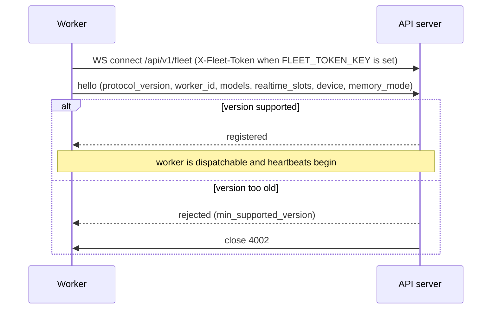
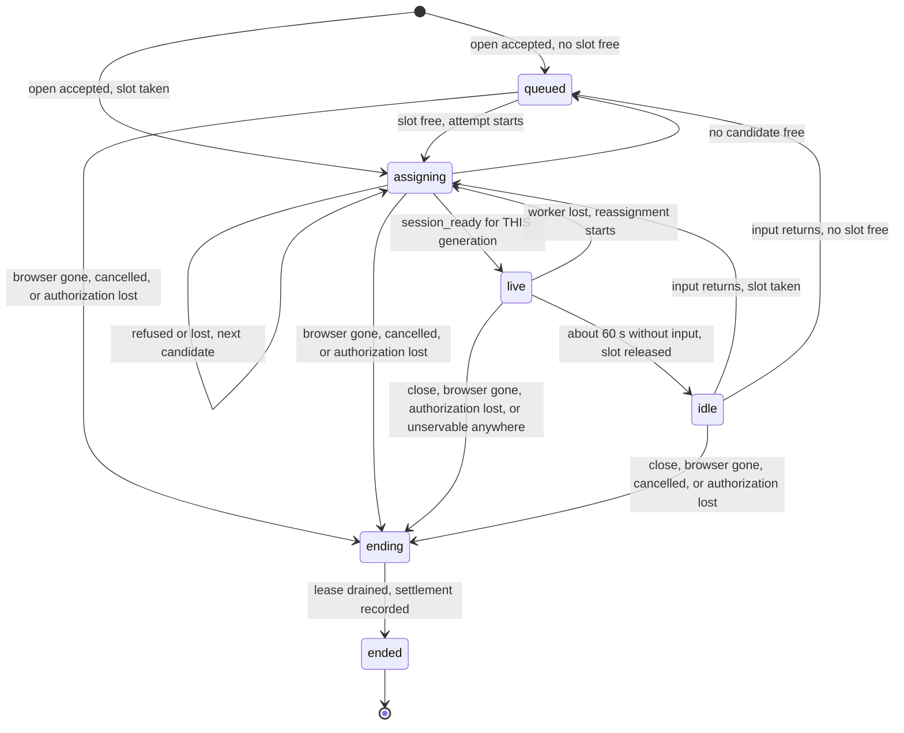
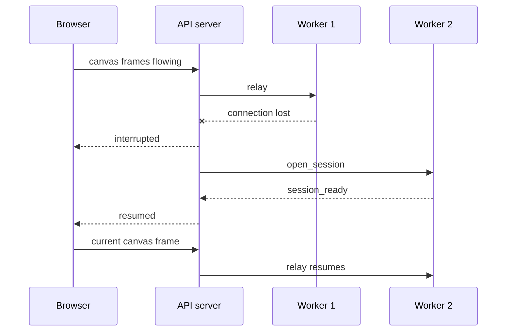
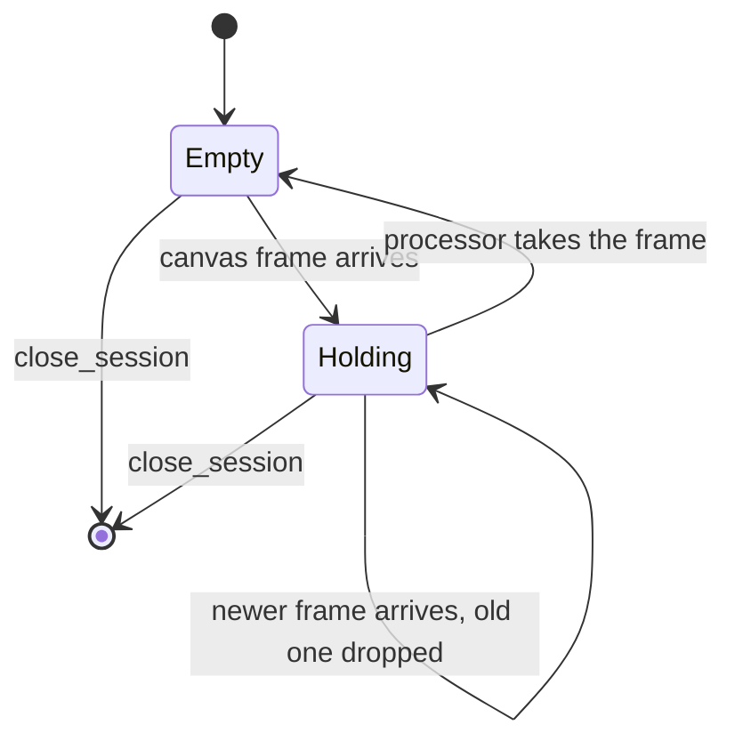

# Connection handling

The normative specification for every long lived connection in the system: the worker's fleet connection and the browser's realtime connection. Issues #15 and #19 implement against this document; the runnable simulation (see The simulation, below) exercises it end to end. [blueprint.md](blueprint.md) covers what surrounds these connections (scheduler, Redis relay, load balancer); this document covers the wire.

## Endpoints and transport

| Connection | Endpoint | Who dials | Carries |
|---|---|---|---|
| Fleet | `WS /api/v1/fleet` | worker, always outbound | registration, heartbeats, session control, frames |
| Realtime | `WS /api/v1/realtime` | browser | session control, canvas frames up, generated frames down |

Both connections mix two WebSocket message kinds:

- Text messages: JSON control, one object per message, `type` field mandatory. Readable in browser devtools by design.
- Binary messages: image frames. Fixed 17 byte header, then payload:

```
byte  0      frame kind: 0x01 canvas (browser to worker), 0x02 generated (worker to browser)
bytes 1-16   session id, UUID big endian
bytes 17-    image payload (WebP in production; the simulation carries opaque bytes)
```

Frames never contain JSON and control messages never contain image bytes; the two kinds are routable without parsing payloads.

> Shipped status (2026-07-30): the 17-byte header above is the current wire and contains no sequence number or revision: one kind byte plus one 16-byte session UUID. Issue #19, "Real-Time Generation Protocol", owns monotonic input revisions and generated-output correlation, so its protocol-versioned result will supersede this header description when implemented.

## Message catalogue

Fleet connection, worker to API:

| type | Fields | Notes |
|---|---|---|
| `hello` | `protocol_version`, `worker_id`, `models`, `realtime_slots`, `device`, `memory_mode` | first message after connect; `models` is the manifest list with capabilities as measured (the memory ladder in [architecture.md](architecture.md) may drop `realtime` on low VRAM workers). Each manifest may carry `realtime_p95_ms` (the measured single-frame p95 on this worker's card, absent until something has measured it) and `studio_capabilities` (narrows what the studio offers, absent when every capability is offered). `device` and `memory_mode` are static worker identity fields; the API accepts an N-1 worker that omits them |
| `heartbeat` | `slots_in_use`, `loaded_models`, `frame_p95_ms`, `gpu` (device, util, VRAM, temperature, power) | every 30 seconds. `frame_p95_ms` maps each model id to that worker's measured single-frame p95 on that card; the key is always present and is an empty object when nothing has been measured, and the API overwrites the hello value with it. Corrected 2026-07-23: the wire also carries `loaded_models` and a `gpu` sample. An N-1 worker may still send `memory_mode` here |
| `session_ready` | `session_id`, `control_generation` | slot acquired, model warm; answers the generation from `open_session` |
| `session_refused` | `session_id`, `control_generation`, `reason` | this worker cannot serve the session (model evicted, out of memory, no slot); the attempt failed, not the session |
| `session_checkpoint` | `session_id`, `control_generation`, `frames`, `gpu_ms`, `duration_ms` | cumulative totals for this attempt so far, sent periodically while a session is live, so a worker that dies abruptly has already reported what it did |
| `session_closed` | `session_id`, `control_generation`, `frames`, `gpu_ms`, `duration_ms`, `category`, optional `category_score` | this attempt's final cumulative totals, recorded as its segment exactly like a checkpoint and settled the same way. It does not itself create a usage event: the terminal transaction emits one aggregated event for the session, so a report for a stale generation contributes its segment without moving the session or billing separately |
| `job_progress` | `job_id`, `progress`, `dispatch_token` | fraction of denoising steps done |
| `job_done` | `job_id`, `dispatch_token`, `gpu_ms`, `duration_ms`, `category`, optional `category_score`, `width`, `height`, `input_fetch_ms` (optional), `load_ms` (optional), `postprocess_ms` (optional) | sent after the result uploaded to the dispatch target |
| `job_failed` | `job_id`, `dispatch_token`, `reason` | the job fails visibly; only worker death triggers the one retry |

`control_generation` is the realtime counterpart of `dispatch_token`, and it is a counter rather than a token because realtime needs ordering as well as identity. A token could tell two attempts apart but not say which came later, which is what a delayed `close_session` to a still-connected worker needs. It starts at 1 for a session's first attempt and increases by one for every attempt after it, travelling on every lifecycle control and on frames in both directions.

- The API believes a message only for the current generation and the current worker connection, so a worker id alone is not enough: a reconnected worker is a new incarnation.
- The worker accepts an `open_session` only above the highest generation it has seen for that session. An equal generation is idempotent, meaning it returns the state of the runner it already has rather than building a second one, and a lower one is stale and ignored. `update_session`, `close_session` and frames require equality with the active runner.
- After a close the worker keeps the session's highest generation as a tombstone, so a delayed open cannot resurrect a finished session. A tombstone is dropped when the worker's connection ends, since a new incarnation cannot be sent a stale control from the old one, and otherwise after the session-open timeout, which bounds how late a control can legitimately arrive. Session ids are version 4 UUIDs and are never reused, so a tombstone can never reject a genuinely new session; the design does not permit reuse precisely because a reused id starting again at generation 1 would be indistinguishable from a stale attempt.
- A retired generation loses lifecycle authority and keeps its accounting. A `session_closed` for a stale generation must not move the session, and its counters are still recorded as that attempt's segment, because a session that was reassigned three times consumed GPU time on three workers and dropping two of those segments would undercount it. This is the one place where "ignore stale messages" is the wrong instinct.

Adding required fields to existing messages changes the protocol, so the generation arrives with protocol version 4 rather than quietly under 3, which two implementations would otherwise both claim while meaning different things. The N-1 rule cannot be the one jobs use for a missing `dispatch_token`: believing an unfenced message reintroduces exactly the race fencing exists to prevent. A protocol 3 worker instead gets a narrower contract. It may serve a session's first attempt, where there is no earlier attempt to confuse it with, and it is never a reassignment candidate and never sent an `update_session`, which is the refusal that already ships for that message. Once the floor moves to 4 the exception disappears.

Designed with the session states below, not yet implemented; the shipped protocol version is 3.

`dispatch_token` is the value the API sent in `dispatch_job`, echoed back on every message about that job. A message carrying the wrong token is ignored: a stall requeue can hand a job back to the same worker, and without the token attempt one's late `job_done` is indistinguishable from attempt two's. The field is required from a protocol 3 worker, which is believed only with a matching token: a message that omits it is ignored exactly like one carrying a wrong token. A protocol 2 (N-1) worker is the one exception, accepted without it because that version does not send the field; the acceptance disappears when the compatibility floor moves to 3.

Fleet connection, API to worker:

| type | Fields | Notes |
|---|---|---|
| `registered` | | hello accepted |
| `checkpoint_ack` | `session_id`, `control_generation`, `frames`, `gpu_ms`, `duration_ms` | the totals the API has persisted for that attempt; sent only after the write commits, so an acknowledged checkpoint is a durable one |
| `rejected` | `reason`, `min_supported_version` | hello refused; the API closes after sending |
| `open_session` | `session_id`, `model_id`, `params`, `control_generation` | acquire a slot and warm the model. Accepted only when the generation is above the highest this worker has seen for the session, and an equal one is idempotent, so a delayed open from a superseded attempt cannot replace a live runner |
| `update_session` | `session_id`, `params`, `control_generation` | replace the session's params with the merged set (the browser's keys merged over the session's, the seed riding along); protocol version 4 and up, because an unfenced update cannot be matched to an attempt; the API refuses an update whose assigned worker predates that instead of sending it. It shipped at version 3 without the generation, which is the one place the floor moves rather than widens |
| `close_session` | `session_id`, `control_generation` | release the slot. Ignored unless the generation matches the active runner, so a stale close cannot pop the runner a newer attempt installed |
| `dispatch_job` | `job_id`, `model_id`, `params`, `dispatch_token`, `upload`, `thumb_upload` (optional), `input` (optional) | `upload.url` and `upload.headers`: where the worker PUTs the full result; `thumb_upload` is the same shape for a WebP thumbnail. `input.url`: presigned GET for the source image on image_to_image jobs. `dispatch_token` identifies this dispatch: it is echoed on the messages below and, on the local storage backend, rides in `upload.headers` as `X-Upload-Token` because the key alone is derivable by any worker that ever held the job. Older workers ignore the optional fields (N-1 safe). |

Realtime connection, browser to API:

| type | Fields | Notes |
|---|---|---|
| `open` | `model_id`, `params` (optional) | first message after connect; params follow the model's schema |
| `update_params` | `params` | a subset of the session's params to change live. The API validates against the manifest's schema with `required` removed; a `seed` is refused (fixed at session open) and so is an update whose assigned worker predates `update_session`; both are answered with an `error` that leaves the session running |
| `close` | | end the session cleanly |

Realtime connection, API to browser:

| type | Fields | Notes |
|---|---|---|
| `ready` | `session_id` | frames may flow |
| `params_updated` | `params` | the merged parameters the API holds for the session: the browser's keys merged over the session's, the seed riding along. That is what later frames are rendered with once a worker has them; the worker may fill in the manifest's declared defaults for keys nobody has set, so what it applies can be a superset. Sent even when no worker holds the session at that moment (a reassignment in flight); the worker picks the update up when it arrives |
| `interrupted` | | worker lost; hold frames, reassignment in progress |
| `resumed` | | new worker ready; re-send the current canvas |
| `error` | `code`, `message` | terminal; the API closes after sending. The one exception is a rejected `update_params` (invalid params, a `seed` change, or an assigned worker that predates `update_session`): that error is a refusal and the session keeps running |

Messages later issues add to this catalogue (queued position, credits ticks, drain) extend these tables; nothing here is expected to change shape.

## Connection establishment


```mermaid
sequenceDiagram
    participant W as Worker
    participant A as API server
    W->>A: WS connect /api/v1/fleet (X-Fleet-Token when FLEET_TOKEN_KEY is set)
    W->>A: hello (protocol_version, worker_id, models, realtime_slots, device, memory_mode)
    alt version supported
        A-->>W: registered
        Note over W,A: worker is dispatchable and heartbeats begin
    else version too old
        A-->>W: rejected (min_supported_version)
        A->>W: close 4002
    end
```

The version gate implements the N-1 promise: with current protocol version N, versions N and N-1 register, anything older is rejected. The browser side is symmetric but simpler: connect, `open`, then either `ready` or `error`.

### Browser authentication and authorization

Authenticate and authorize a browser realtime connection before queueing, reserving quota, or assigning a GPU. Bind the server-derived user, account session, role, and quota subject to the connection. A missing or expired principal is unauthorized; a viewer or other principal without permission to consume a realtime slot is forbidden. Both outcomes are terminal, create no admission or worker state, and send an error before closing. Logout, revocation, disable, deletion, or role change cancels queued work or closes indexed live connections. After gateway extraction, the browser presents a short-lived API-minted ticket and the gateway validates transport admission without taking API authority.

> Shipped status (2026-07-30): **not yet implemented.** The current endpoint accepts the WebSocket before `open`, binds only the implicit local user, and has no ticket, connection index, invalidation path, or unauthorized/forbidden close semantics. The governing decision is "Realtime authorization: bind once, invalidate explicitly"; issue #19, "Real-Time Generation Protocol", owns direct-socket behavior and "Gateway realtime tickets and revocation" owns the gateway path.

## GPU work is not interruptible

In-flight GPU work bounds how fast a worker can shut down or reconnect. The worker holds one
GPU lock around work that runs in a thread, and cancelling an `await` cannot stop a thread, so
the lock is only released once that thread finishes. A disconnect, a `close_session`, or a
Ctrl-C therefore waits for the current operation rather than abandoning it.

The wait is a full generation in the worst queued case, one frame for a realtime session, and
on a cold start a model download plus calibration, which can be minutes for multi-gigabyte
weights. Under compose the stop grace period will SIGKILL before a cold-start download
finishes. That is safe when nothing has been dispatched; a model load inside a
dispatched job can be killed with work outstanding. The socket dies with the
process, so `on_worker_lost` requeues it; the stall sweep covers the different
case of a worker that stays connected and goes quiet.

The alternative is worse: releasing the lock while the thread is still on the device lets the
next entrant run concurrently on a GPU the scheduler treats as serialized, which is what the
slot calibration in [decisions.md](decisions.md) is measured against.

## Timeouts and intervals

| What | Value | Why |
|---|---|---|
| Worker heartbeat interval | 30 s | keeps the connection alive through the ALB (120 s idle timeout, 4x margin) |
| Worker declared dead | 90 s without heartbeat | 3 missed heartbeats; sessions on it are reassigned, jobs requeued |
| Browser ping interval | 20 s | browsers on quiet canvases still traverse the ALB |
| Idle slot release | 60 s without canvas input | credit metering stops; canvas stays in the browser |
| Simulated inference time | configurable | the prototype sleeps instead of denoising |

> Shipped status (2026-07-30): **partially implemented.** Worker heartbeats and the 90-second reap path ship. The browser handler implements neither an application keepalive nor 60-second idle release; a ready slot stays pinned until close. Issue #19, "Real-Time Generation Protocol", governs both missing rows.

TCP-level disconnects are acted on immediately; the heartbeat timeout only matters when a connection dies silently, which load balancers make possible. Browser keepalive is an application-level control message because browser WebSocket APIs cannot send protocol pings.

## Session states

> Shipped status (2026-08-17): **designed, not yet implemented.** The states below are the accepted design (decisions.md, "The realtime session has states, a fencing generation, and one durable accounting owner"); today a session is a dataclass whose transitions are decided by whichever of four coroutines notices first, which is what issue #295 exists to replace. `queued` and `idle` also wait on the admission queue and idle release, designed above and unshipped.

A realtime session is in exactly one state, and one place moves it between them, comparing the expected state and transitioning atomically. Four coroutines can otherwise end the same session: the browser's handler, the fleet handler, `reassign`, and the worker.


```mermaid
stateDiagram-v2
    [*] --> queued: open accepted, no slot free
    [*] --> assigning: open accepted, slot taken
    queued --> assigning: slot free, attempt starts
    assigning --> live: session_ready for THIS generation
    assigning --> assigning: refused or lost, next candidate
    assigning --> queued: no candidate free
    live --> idle: about 60 s without input, slot released
    idle --> assigning: input returns, slot taken
    idle --> queued: input returns, no slot free
    live --> assigning: worker lost, reassignment starts
    queued --> ending: browser gone, cancelled, or authorization lost
    assigning --> ending: browser gone, cancelled, or authorization lost
    live --> ending: close, browser gone, authorization lost, or unservable anywhere
    idle --> ending: close, browser gone, cancelled, or authorization lost
    ending --> ended: lease drained, settlement recorded
    ended --> [*]
```

A failed attempt is not a failed session. A worker that evicts a model or runs out of memory has failed its attempt, so the session tries another candidate or waits for one; only the browser leaving, losing authorization, cancelling, or asking for what no worker can serve reaches `ending`. Every nonterminal state has that edge, including `assigning`, because a browser that closes while its worker is warming must still have a legal teardown or its slot leaks. `ended` is absorbing, and a transition attempted out of it is a no-op rather than an error, since a late message is exactly what fencing expects to see.

That table is the whole contract. A transition not on it does not exist: an implementer that finds itself wanting one has found either a missing state or a bug, and the answer is to change this table rather than to add a path around it.

Three rules make those transitions safe, and each comes from a defect the design replaces:

- Assignment carries a monotonically increasing `control_generation`, and every lifecycle message carries it. `session_ready` and `session_refused` answer one generation, so a late answer from an earlier attempt is ignored rather than completing a newer one. A worker accepts an open only above the highest generation it has seen for that session, equal is idempotent, lower is stale, and a tombstone after close stops a delayed open from resurrecting a finished session. A counter rather than an opaque identity, because an identity cannot say which of two delayed messages is newer, and the failure needing that ordering is a stale `close_session` popping the runner a newer attempt just installed on the same worker. Serialising attempts with a lock is not enough either: the answer arrives from the network, not from the code holding the lock.
- Accounting has one owner and that owner is durable. One place decides a session has ended, and terminal state commits together with an outbox record under a stable unique key, retried until acknowledged, duplicates a no-op, and sessions left `ending` reconciled after a restart. Deciding in one place only settles competing writers; it does not survive a crash between the decision and the commit. Arming the decision in a second place produced two events for one interleaving and zero for another.

  What gets settled is measured rather than estimated. A live attempt reports cumulative totals in `session_checkpoint`, and the API answers `checkpoint_ack` only after the write commits, so both sides agree on what is durable. `session_checkpoint` and `session_closed` are the same operation with different timing: both upsert one attempt row keyed by session id, generation and worker incarnation, keeping the larger of the stored and reported `frames`, `gpu_ms` and `duration_ms`. Because the totals are cumulative, the upsert is idempotent and order does not matter, so a repeat, a reorder and a close that repeats the last checkpoint all land on the same row with the same values. A session's final event is the sum of its attempt rows, emitted once by the terminal transaction and by nothing else. A worker that dies abruptly settles at its last acknowledged checkpoint, which is less than it truly did by at most one checkpoint interval, and that gap is deliberate: work that died with the process is not observable, and estimating it would be charging for a number nobody measured.
- Per-session mailboxes bound the relay. A shared reader never awaits delivery to one browser, a mailbox keeps only the latest frame, and lifecycle controls and heartbeats go ahead of frames. Measured with `scripts/prototype-slow-consumer.py`, a session stalled for 25 seconds does not slow its neighbours today, but it does resume to its entire backlog with the oldest frame 25 seconds stale, which is what keeping only the latest frame fixes.

Batch membership is not a session state. A batch is collected, executed and retired on its own, and a member that closes mid-batch ends alone while its mates finish; its slot is not free until the GPU cycle it joined completes.

## Reconnection and resume

Both dialers reconnect with exponential backoff: 1 s doubling to a 30 s cap, with up to 25 percent random jitter so a restarted API is not hit by the whole fleet in the same second. Reconnection is a fresh `hello`; the API holds no memory of previous incarnations of a worker.

Session recovery is asymmetric by design:

- Worker lost: the API keeps the browser connection, sends `interrupted`, picks another worker with a free slot, sends it `open_session`, and on `session_ready` tells the browser `resumed`. The browser re-sends its current canvas; at most the frames in flight are lost.
- Browser lost: the API closes the worker side of the session (`close_session`) and releases the slot. The canvas lives in the browser, so there is nothing to recover server side; a returning browser opens a new session.

> Shipped status (2026-07-30): **partially implemented.** Worker reconnect backoff and process-local worker-loss reassignment ship; browser reconnect remains design. Recovery cannot cross replicas, survive loss of the owning API process, or queue when no replacement slot is free; that last case closes with 4003. "Redis-optional Queues and FrameBus contracts", issue #19, "Real-Time Generation Protocol", and issue #20, "Multi-Worker Scheduling", govern cross-owner recovery and resume priority. The diagram below shows the designed successful path.


```mermaid
sequenceDiagram
    participant B as Browser
    participant A as API server
    participant W1 as Worker 1
    participant W2 as Worker 2
    B->>A: canvas frames flowing
    A->>W1: relay
    W1--xA: connection lost
    A-->>B: interrupted
    A->>W2: open_session
    W2-->>A: session_ready
    A-->>B: resumed
    B->>A: current canvas frame
    A->>W2: relay resumes
```

## Latest input wins

The worker never queues canvas frames. Per session it holds exactly one pending frame; a newer arrival overwrites an unprocessed older one, which is then counted as dropped. The processing loop takes the pending frame, runs inference, sends the generated frame, and looks again. Under load the user sees fewer, fresher frames instead of a growing delay, which is the correct failure mode for drawing.


```mermaid
stateDiagram-v2
    [*] --> Empty
    Empty --> Holding: canvas frame arrives
    Holding --> Holding: newer frame arrives, old one dropped
    Holding --> Empty: processor takes the frame
    Empty --> [*]: close_session
    Holding --> [*]: close_session
```

## Origin check

Both endpoints refuse a handshake whose `Origin` header is present and not allowed, before the socket is accepted. The connection fails as HTTP 403, so no close code applies. A request with no `Origin` is accepted: worker processes and other non-browser clients send none, while browsers always send one and cannot forge it.

Allowed origins are `PUBLIC_URL` plus anything in `ALLOWED_ORIGINS`. The dev loop needs the latter, because the vite server proxies `/api/v1` and the browser's origin is its own.

This is a boundary control, not authentication. WebSocket handshakes ignore the same-origin policy and send no preflight, so without it any page the operator visits can reach both sockets and the network restriction described in [README.md](../README.md) does not hold. Worker authentication is separate and covered below.

## Fleet authentication

A worker presents the shared secret as an `X-Fleet-Token` request header on the upgrade. The API compares it against `FLEET_TOKEN_KEY` before accepting, so a missing or wrong token fails the handshake with HTTP 403 and no close code applies. Header names are case-insensitive; send it however you like.

When `FLEET_TOKEN_KEY` is unset the socket stays permissive only for a peer whose address cannot route from the public internet, and the API warns at startup. The restriction does not cover a connection arriving through a proxy or Docker's userland proxy. Issue #245 tracks closing the socket by default. That keeps the one-command self-hosted start working, and [README.md](../README.md) explains why an unkeyed install still needs a private network or a secret. The secret is ASCII: it travels in an HTTP header.

Signed short-lived tokens are the cloud shape and are not implemented here; their minting side lives in the private repository (`docs/repository-boundary.md`).

## Close codes

| Code | Meaning | Sent to |
|---|---|---|
| 1000 | normal close | either |
| 4000 | protocol violation (first message was not hello or open, malformed JSON, a manifest the API cannot parse) | either |
| 4002 | unsupported protocol version | worker |
| 4003 | no worker capacity for the requested model | browser |
| 4004 | unknown model | browser |

> Shipped status (2026-07-30): code 4003 is currently an immediate full-pool rejection. The accepted "Full pool: admission queue with paid tier priority" design instead reports a queued state for an otherwise valid request. Issue #19, "Real-Time Generation Protocol", owns the protocol-versioned unauthorized, forbidden, drained, quota, and limit close codes; codes 4005 and up remain unassigned until that issue fixes their numbers.

## Delivery semantics

- Frames are at most once. A dropped frame is never retransmitted; the next canvas state supersedes it.
- Control messages are exactly once per connection: WebSocket ordering is relied upon, and a lost connection re-establishes state from scratch (hello, open) rather than replaying.
- Nothing about a session survives the API process in this prototype. Durable session records and the cross-replica relay are the cloud profile's concern (docs/blueprint.md); the interfaces here do not change when they arrive.

## The simulation

`scripts/simulate.py` runs the whole story against real TCP connections on localhost: it starts the API server, connects two workers, opens a browser session, streams canvas frames faster than the simulated inference can render (demonstrating latest input wins), kills a worker mid session (demonstrating interrupted and resumed), and prints a timestamped timeline with final counts.

```
docker not required
backend/.venv/bin/python scripts/simulate.py
```

The simulation is not test scaffolding kept apart from the product: it drives the same `/api/v1/fleet` and `/api/v1/realtime` endpoints and the same worker client that self-hosted installs run.
