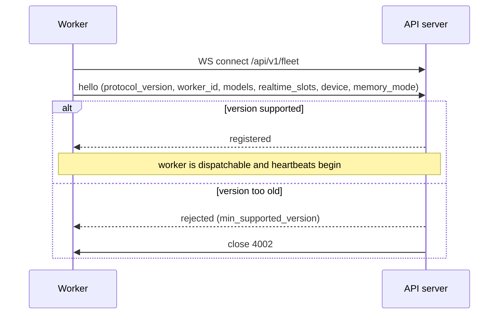
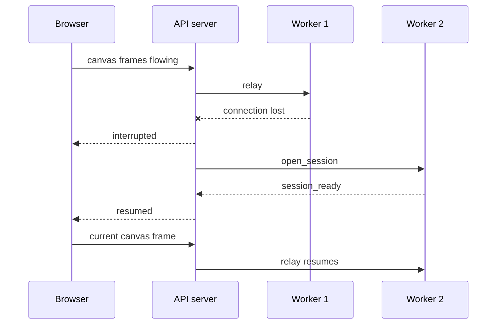
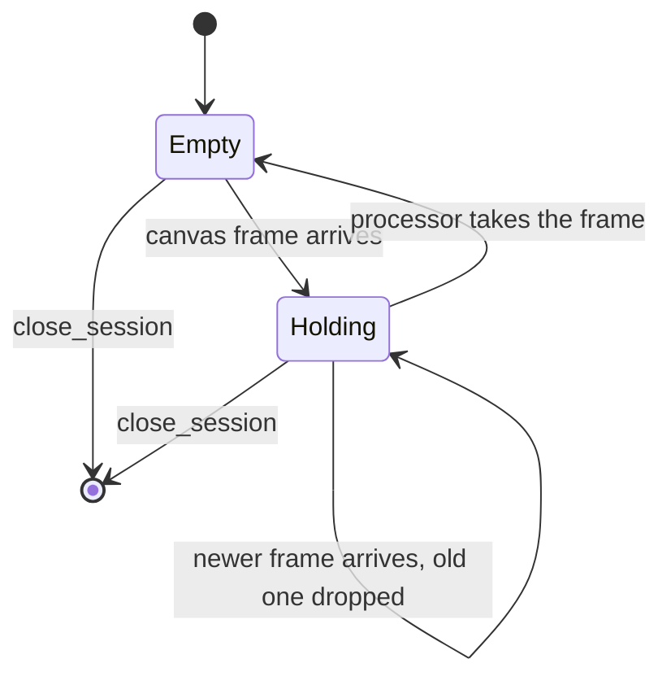

# Connection handling

The normative specification for every long lived connection in the system: the worker's fleet connection and the browser's realtime connection. Issues #15 and #19 implement against this document; the runnable simulation (see The simulation, below) exercises it end to end. [blueprint.md](blueprint.md) covers what surrounds these connections (scheduler, Redis relay, load balancer); this document covers the wire.

## Endpoints and transport

| Connection | Endpoint | Who dials | Carries |
|---|---|---|---|
| Fleet | `WS /api/v1/fleet` | worker, always outbound | registration, heartbeats, session control, frames |
| Realtime | `WS /api/v1/realtime` | browser | session control, canvas frames up, generated frames down |

Both connections mix two WebSocket message kinds:

- Text messages: JSON control, one object per message, `type` field mandatory. Readable in browser devtools by design.
- Binary messages: image frames. Fixed 17 byte header, then payload:

```
byte  0      frame kind: 0x01 canvas (browser to worker), 0x02 generated (worker to browser)
bytes 1-16   session id, UUID big endian
bytes 17-    image payload (WebP in production; the simulation carries opaque bytes)
```

Frames never contain JSON and control messages never contain image bytes; the two kinds are routable without parsing payloads.

> Shipped status (2026-07-30): the 17-byte header above is the current wire and contains no sequence number or revision: one kind byte plus one 16-byte session UUID. Issue #19, "Real-Time Generation Protocol", owns monotonic input revisions and generated-output correlation, so its protocol-versioned result will supersede this header description when implemented.

## Message catalogue

Fleet connection, worker to API:

| type | Fields | Notes |
|---|---|---|
| `hello` | `protocol_version`, `worker_id`, `models`, `realtime_slots`, `device`, `memory_mode` | first message after connect; `models` is the manifest list with capabilities as measured (the memory ladder in [architecture.md](architecture.md) may drop `realtime` on low VRAM workers). `device` and `memory_mode` are static worker identity fields; the API accepts an N-1 worker that omits them |
| `heartbeat` | `slots_in_use`, `loaded_models`, `gpu` (device, util, VRAM, temperature, power) | every 30 seconds. Corrected 2026-07-23: the wire also carries `loaded_models` and a `gpu` sample. An N-1 worker may still send `memory_mode` here |
| `session_ready` | `session_id` | slot acquired, model warm |
| `session_closed` | `session_id`, `frames`, `gpu_ms`, `duration_ms`, `category`, optional `category_score` | worker side accounting and completion-side usage event |
| `job_progress` | `job_id`, `progress` | fraction of denoising steps done |
| `job_done` | `job_id`, `gpu_ms`, `duration_ms`, `category`, optional `category_score`, `width`, `height`, `input_fetch_ms` (optional), `load_ms` (optional), `postprocess_ms` (optional) | sent after the result uploaded to the dispatch target |
| `job_failed` | `job_id`, `reason` | the job fails visibly; only worker death triggers the one retry |

Fleet connection, API to worker:

| type | Fields | Notes |
|---|---|---|
| `registered` | | hello accepted |
| `rejected` | `reason`, `min_supported_version` | hello refused; the API closes after sending |
| `open_session` | `session_id`, `model_id`, `params` | acquire a slot and warm the model |
| `close_session` | `session_id` | release the slot |
| `dispatch_job` | `job_id`, `model_id`, `params`, `upload`, `thumb_upload` (optional), `input` (optional) | `upload.url` and `upload.headers`: where the worker PUTs the full result; `thumb_upload` is the same shape for a WebP thumbnail. `input.url`: presigned GET for the source image on image_to_image jobs. Older workers ignore the optional fields (N-1 safe). |

Realtime connection, browser to API:

| type | Fields | Notes |
|---|---|---|
| `open` | `model_id`, `params` (optional) | first message after connect; params follow the model's schema |
| `close` | | end the session cleanly |

Realtime connection, API to browser:

| type | Fields | Notes |
|---|---|---|
| `ready` | `session_id` | frames may flow |
| `interrupted` | | worker lost; hold frames, reassignment in progress |
| `resumed` | | new worker ready; re-send the current canvas |
| `error` | `code`, `message` | terminal; the API closes after sending |

Messages later issues add to this catalogue (queued position, prompt updates, credits ticks, drain) extend these tables; nothing here is expected to change shape.

## Connection establishment


```mermaid
sequenceDiagram
    participant W as Worker
    participant A as API server
    W->>A: WS connect /api/v1/fleet
    W->>A: hello (protocol_version, worker_id, models, realtime_slots, device, memory_mode)
    alt version supported
        A-->>W: registered
        Note over W,A: worker is dispatchable and heartbeats begin
    else version too old
        A-->>W: rejected (min_supported_version)
        A->>W: close 4002
    end
```

The version gate implements the N-1 promise: with current protocol version N, versions N and N-1 register, anything older is rejected. The browser side is symmetric but simpler: connect, `open`, then either `ready` or `error`.

### Browser authentication and authorization

Authenticate and authorize a browser realtime connection before queueing, reserving quota, or assigning a GPU. Bind the server-derived user, account session, role, and quota subject to the connection. A missing or expired principal is unauthorized; a viewer or other principal without permission to consume a realtime slot is forbidden. Both outcomes are terminal, create no admission or worker state, and send an error before closing. Logout, revocation, disable, deletion, or role change cancels queued work or closes indexed live connections. After gateway extraction, the browser presents a short-lived API-minted ticket and the gateway validates transport admission without taking API authority.

> Shipped status (2026-07-30): **not yet implemented.** The current endpoint accepts the WebSocket before `open`, binds only the implicit local user, and has no ticket, connection index, invalidation path, or unauthorized/forbidden close semantics. The governing decision is "Realtime authorization: bind once, invalidate explicitly"; issue #19, "Real-Time Generation Protocol", owns direct-socket behavior and "Gateway realtime tickets and revocation" owns the gateway path.

## GPU work is not interruptible

In-flight GPU work bounds how fast a worker can shut down or reconnect. The worker holds one
GPU lock around work that runs in a thread, and cancelling an `await` cannot stop a thread, so
the lock is only released once that thread finishes. A disconnect, a `close_session`, or a
Ctrl-C therefore waits for the current operation rather than abandoning it.

The wait is a full generation in the worst queued case, one frame for a realtime session, and
on a cold start a model download plus calibration, which can be minutes for multi-gigabyte
weights. Under compose the stop grace period will SIGKILL before a cold-start download
finishes. That is safe when nothing has been dispatched; a model load inside a
dispatched job can be killed with work outstanding, and the API's stall sweep
recovers it.

The alternative is worse: releasing the lock while the thread is still on the device lets the
next entrant run concurrently on a GPU the scheduler treats as serialized, which is what the
slot calibration in [decisions.md](decisions.md) is measured against.

## Timeouts and intervals

| What | Value | Why |
|---|---|---|
| Worker heartbeat interval | 30 s | keeps the connection alive through the ALB (120 s idle timeout, 4x margin) |
| Worker declared dead | 90 s without heartbeat | 3 missed heartbeats; sessions on it are reassigned, jobs requeued |
| Browser ping interval | 20 s | browsers on quiet canvases still traverse the ALB |
| Idle slot release | 60 s without canvas input | credit metering stops; canvas stays in the browser |
| Simulated inference time | configurable | the prototype sleeps instead of denoising |

> Shipped status (2026-07-30): **partially implemented.** Worker heartbeats and the 90-second reap path ship. The browser handler implements neither an application keepalive nor 60-second idle release; a ready slot stays pinned until close. Issue #19, "Real-Time Generation Protocol", governs both missing rows.

TCP-level disconnects are acted on immediately; the heartbeat timeout only matters when a connection dies silently, which load balancers make possible. Browser keepalive is an application-level control message because browser WebSocket APIs cannot send protocol pings.

## Reconnection and resume

Both dialers reconnect with exponential backoff: 1 s doubling to a 30 s cap, with up to 25 percent random jitter so a restarted API is not hit by the whole fleet in the same second. Reconnection is a fresh `hello`; the API holds no memory of previous incarnations of a worker.

Session recovery is asymmetric by design:

- Worker lost: the API keeps the browser connection, sends `interrupted`, picks another worker with a free slot, sends it `open_session`, and on `session_ready` tells the browser `resumed`. The browser re-sends its current canvas; at most the frames in flight are lost.
- Browser lost: the API closes the worker side of the session (`close_session`) and releases the slot. The canvas lives in the browser, so there is nothing to recover server side; a returning browser opens a new session.

> Shipped status (2026-07-30): **partially implemented.** Worker reconnect backoff and process-local worker-loss reassignment ship; browser reconnect remains design. Recovery cannot cross replicas, survive loss of the owning API process, or queue when no replacement slot is free; that last case closes with 4003. "Redis-optional Queues and FrameBus contracts", issue #19, "Real-Time Generation Protocol", and issue #20, "Multi-Worker Scheduling", govern cross-owner recovery and resume priority. The diagram below shows the designed successful path.


```mermaid
sequenceDiagram
    participant B as Browser
    participant A as API server
    participant W1 as Worker 1
    participant W2 as Worker 2
    B->>A: canvas frames flowing
    A->>W1: relay
    W1--xA: connection lost
    A-->>B: interrupted
    A->>W2: open_session
    W2-->>A: session_ready
    A-->>B: resumed
    B->>A: current canvas frame
    A->>W2: relay resumes
```

## Latest input wins

The worker never queues canvas frames. Per session it holds exactly one pending frame; a newer arrival overwrites an unprocessed older one, which is then counted as dropped. The processing loop takes the pending frame, runs inference, sends the generated frame, and looks again. Under load the user sees fewer, fresher frames instead of a growing delay, which is the correct failure mode for drawing.


```mermaid
stateDiagram-v2
    [*] --> Empty
    Empty --> Holding: canvas frame arrives
    Holding --> Holding: newer frame arrives, old one dropped
    Holding --> Empty: processor takes the frame
    Empty --> [*]: close_session
    Holding --> [*]: close_session
```

## Origin check

Both endpoints refuse a handshake whose `Origin` header is present and not allowed, before the socket is accepted. The connection fails as HTTP 403, so no close code applies. A request with no `Origin` is accepted: worker processes and other non-browser clients send none, while browsers always send one and cannot forge it.

Allowed origins are `PUBLIC_URL` plus anything in `ALLOWED_ORIGINS`. The dev loop needs the latter, because the vite server proxies `/api/v1` and the browser's origin is its own.

This is a boundary control, not authentication. WebSocket handshakes ignore the same-origin policy and send no preflight, so without it any page the operator visits can reach both sockets and the trusted-LAN posture in [README.md](../README.md) does not hold. Worker authentication is separate and still deferred (`FLEET_TOKEN_KEY`).

## Close codes

| Code | Meaning | Sent to |
|---|---|---|
| 1000 | normal close | either |
| 4000 | protocol violation (first message was not hello or open, malformed JSON) | either |
| 4002 | unsupported protocol version | worker |
| 4003 | no worker capacity for the requested model | browser |
| 4004 | unknown model | browser |

> Shipped status (2026-07-30): code 4003 is currently an immediate full-pool rejection. The accepted "Full pool: admission queue with paid tier priority" design instead reports a queued state for an otherwise valid request. Issue #19, "Real-Time Generation Protocol", owns the protocol-versioned unauthorized, forbidden, drained, quota, and limit close codes; codes 4005 and up remain unassigned until that issue fixes their numbers.

## Delivery semantics

- Frames are at most once. A dropped frame is never retransmitted; the next canvas state supersedes it.
- Control messages are exactly once per connection: WebSocket ordering is relied upon, and a lost connection re-establishes state from scratch (hello, open) rather than replaying.
- Nothing about a session survives the API process in this prototype. Durable session records and the cross-replica relay are the cloud profile's concern (docs/blueprint.md); the interfaces here do not change when they arrive.

## The simulation

`scripts/simulate.py` runs the whole story against real TCP connections on localhost: it starts the API server, connects two workers, opens a browser session, streams canvas frames faster than the simulated inference can render (demonstrating latest input wins), kills a worker mid session (demonstrating interrupted and resumed), and prints a timestamped timeline with final counts.

```
docker not required
backend/.venv/bin/python scripts/simulate.py
```

The simulation is not test scaffolding kept apart from the product: it drives the same `/api/v1/fleet` and `/api/v1/realtime` endpoints and the same worker client that self-hosted installs run.
