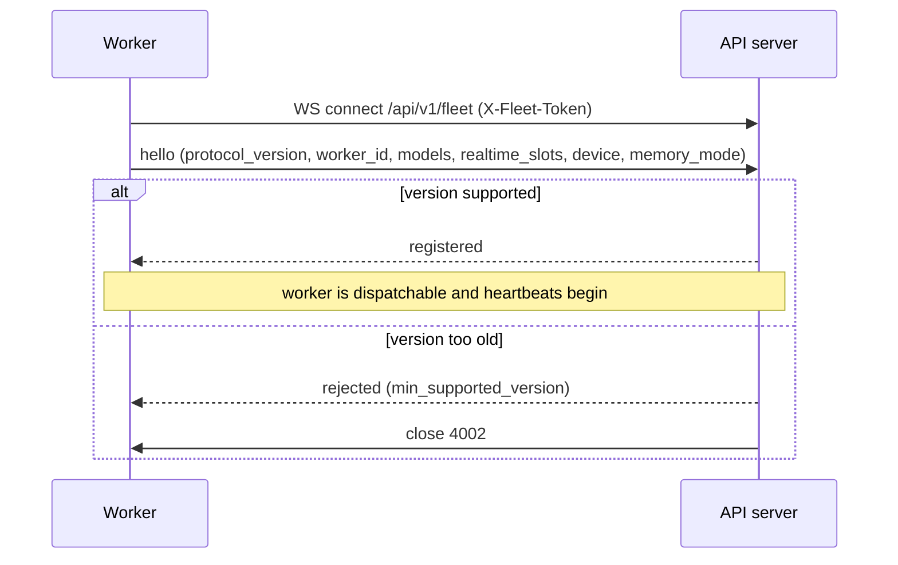
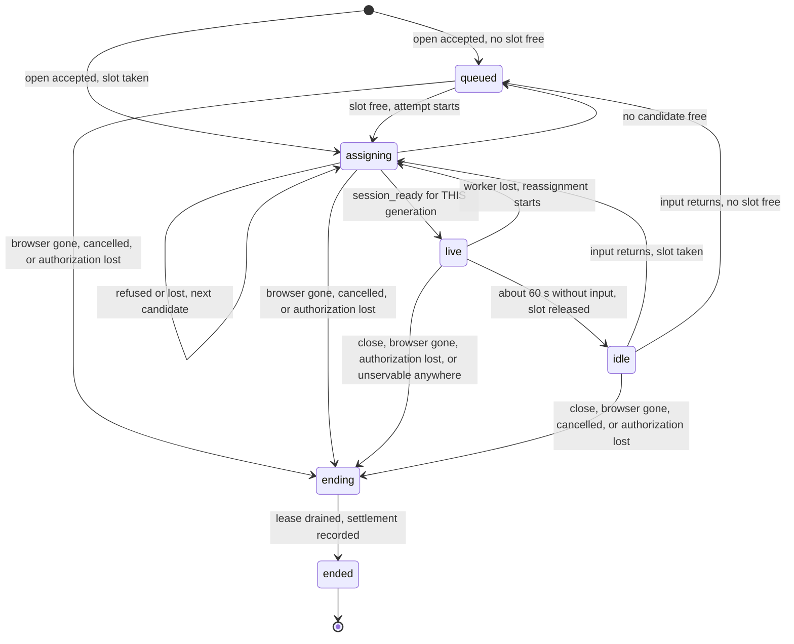
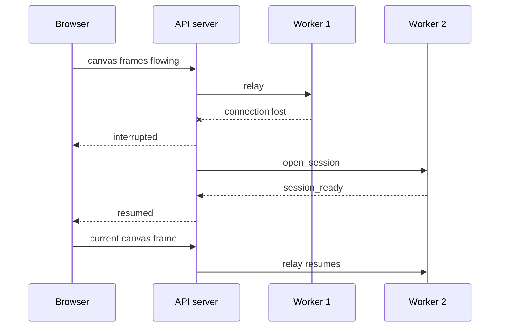
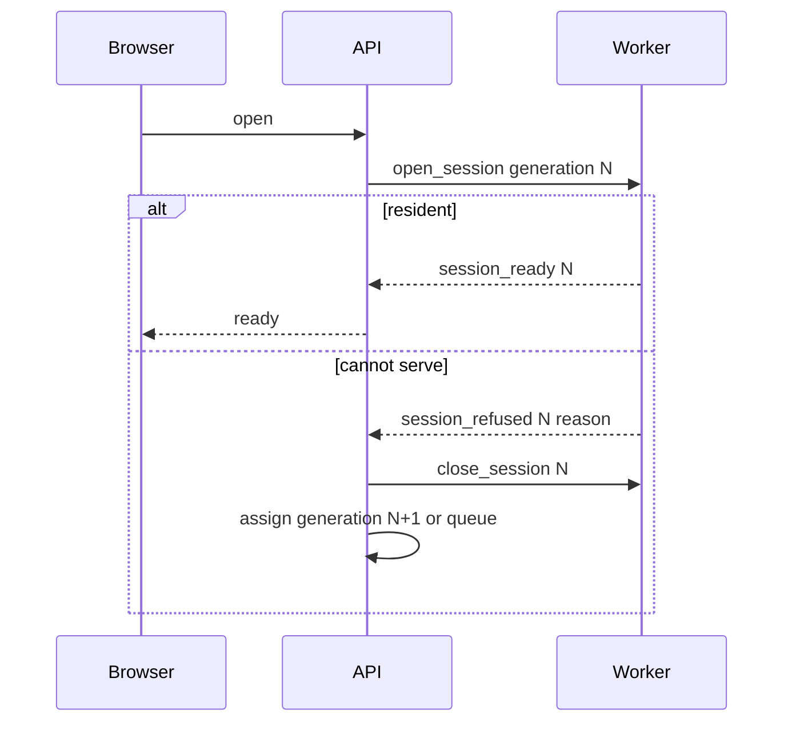
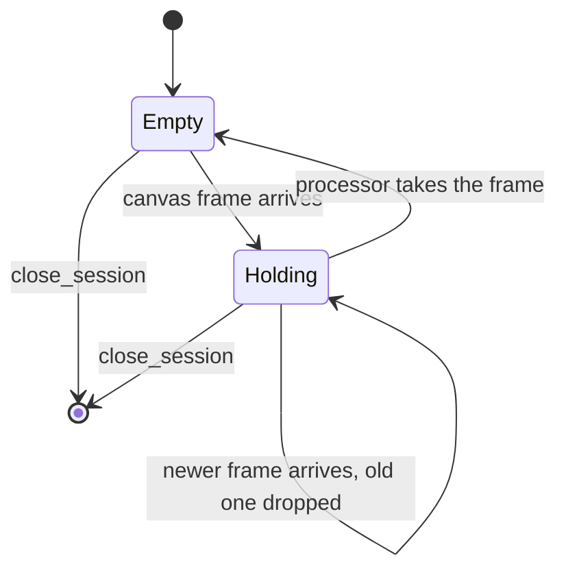

# Connection handling

The normative specification for every long lived connection in the system: the worker's fleet connection and the browser's realtime connection. Issues #15 and #19 implement against this document; the runnable simulation (see The simulation, below) exercises it end to end. [blueprint.md](blueprint.md) covers what surrounds these connections (scheduler, Redis relay, load balancer); this document covers the wire.

## Endpoints and transport

| Connection | Endpoint | Who dials | Carries |
|---|---|---|---|
| Fleet | `WS /api/v1/fleet` | worker, always outbound | registration, heartbeats, session control, frames |
| Realtime | `WS /api/v1/realtime` | browser | session control, canvas frames up, generated frames down |

Both connections mix two WebSocket message kinds:

- Text messages: JSON control, one object per message, `type` field mandatory. Readable in browser devtools by design.
- Binary messages: image frames. Fixed 21 byte header, then payload:

```
byte  0      frame kind: 0x01 canvas (browser to worker), 0x02 generated (worker to browser)
bytes 1-16   session id, UUID big endian
bytes 17-20  input revision, unsigned 32 bit big endian
bytes 21-    image payload (WebP in production; the simulation carries opaque bytes)
```

The revision is per session and belongs to the canvas input, not to the worker attempt: the first canvas frame of a session is revision 1, each accepted frame raises it by at least one, and it never restarts, not on a reassignment, not on an idle release and resume, not on an admission from the queue. A reconnect is a new session and starts again at 1. A generated frame carries the revision of the canvas it was rendered from, which is what correlates an output with the input it came from. A browser declares which header it speaks in `open` (`frame_header`, see the message catalogue): header 2 is the 21 byte form above, header 1 is the same frame without the 4 revision bytes, and a header 1 peer has its revisions stamped by the API on the way in and stripped on the way out. The worker socket speaks protocol 5 and always uses the 21 byte form; a protocol 4 worker is sent and accepted in the 17 byte form, and the API stamps the revision it last forwarded onto the frames that come back from it.

Canvas payloads larger than 1 MiB after whichever header the frame uses are dropped by the API and the realtime socket stays open. The drop is answered with a non-terminal `error` carrying code 4005 and the same 1 MiB in its `message`, posted at most once per session per second and never while another control still waits, so a stuck oversize encoder cannot flood its own mailbox; a browser that reads `ready.limits` frames nothing that large in the first place. The size refusal does not consume the revision the frame carried, so the next in-range frame may still be that one. Uvicorn receives at most 2 MiB (`--ws-max-size`). A larger message closes the socket with 1009. The worker takes the same 2 MiB on its fleet socket, so the largest canvas frame the API forwards (21 bytes plus 1 MiB) reaches it.

Frames never contain JSON and control messages never contain image bytes; the two kinds are routable without parsing payloads.

> Shipped status (2026-09-29): the 21 byte header above is the current wire, with protocol version 5 on the worker socket. A browser that does not ask for `frame_header: 2` keeps the 17 byte header of protocol 4, with no revision field of its own; the API stamps and strips those revisions so a session's counter is the same either way. Monotonic input revisions and generated-output correlation (issue #19) are implemented as described here.

## Message catalogue

Fleet connection, worker to API:

| type | Fields | Notes |
|---|---|---|
| `hello` | `protocol_version`, `worker_id`, `models`, `realtime_slots`, `realtime_p95_ms` (optional map), `realtime_batch_ms` (optional map), `device`, `memory_mode` | first message after connect; `models` is the manifest list with capabilities as measured (the memory ladder in [architecture.md](architecture.md) may drop `realtime` on low VRAM workers). Each manifest may carry `realtime_p95_ms` (the measured single-frame p95 on this worker's card, absent until something has measured it) and `studio_capabilities` (narrows what the studio offers, absent when every capability is offered). Optional top-level `realtime_p95_ms` is a map of model id to that same p95 for cost admission; optional `realtime_batch_ms` maps model ids to measured batch p95 curves. An N-1 worker omits these maps and the API keeps the shared integer pool. Current workers also set scalar `realtime_slots` to the measured capacity so an older API stays pessimistic. `device` and `memory_mode` are static worker identity fields; the API accepts an N-1 worker that omits them |
| `heartbeat` | `slots_in_use`, `loaded_models`, `frame_p95_ms`, `gpu` (device, util, VRAM, temperature, power) | every 30 seconds. `frame_p95_ms` maps each model id to that worker's measured single-frame p95 on that card; the key is always present and is an empty object when nothing has been measured. The API stores that live map for picker labels and, when hello carried admission maps, raises admission p95 only and drops that model's batch curve (a slower observation lowers new admissions; a faster one must not raise capacity on that connection). Corrected 2026-07-23: the wire also carries `loaded_models` and a `gpu` sample. An N-1 worker may still send `memory_mode` here |
| `session_ready` | `session_id`, `control_generation` | slot acquired, model warm; answers the generation from `open_session` |
| `session_refused` | `session_id`, `control_generation`, `reason` | this worker cannot serve the session (model evicted, out of memory, no slot); the attempt failed, not the session |
| `session_checkpoint` | `session_id`, `control_generation`, `frames`, `gpu_ms`, `duration_ms` | cumulative totals for this attempt so far, sent periodically while a session is live, so a worker that dies abruptly has already reported what it did |
| `session_closed` | `session_id`, `control_generation`, `frames`, `gpu_ms`, `duration_ms`, `category`, optional `category_score` | this attempt's final cumulative totals, recorded as its segment exactly like a checkpoint and settled the same way. It does not itself create a usage event: the terminal transaction emits one aggregated event for the session, so a report for a stale generation contributes its segment without moving the session or billing separately |
| `job_progress` | `job_id`, `progress`, `dispatch_token` | fraction of denoising steps done |
| `job_done` | `job_id`, `dispatch_token`, `gpu_ms`, `duration_ms`, `category`, optional `category_score`, `width`, `height`, `input_fetch_ms` (optional), `load_ms` (optional), `postprocess_ms` (optional) | sent after the result uploaded to the dispatch target |
| `job_failed` | `job_id`, `dispatch_token`, `reason` | the job fails visibly; only worker death triggers the one retry |
| `job_cancelled` | `job_id`, `dispatch_token`, `gpu_ms` | the worker stopped where it was asked to. The row is already `cancelled`, so this only says what the GPU cost before it stopped, and that time is charged. A worker that never sends it is not a fault: the API discards whatever such a worker uploads instead. |

`control_generation` is the realtime counterpart of `dispatch_token`, and it is a counter rather than a token because realtime needs ordering as well as identity. A token could tell two attempts apart but not say which came later, which is what a delayed `close_session` to a still-connected worker needs. It starts at 1 for a session's first attempt and increases by one for every attempt after it, travelling on every lifecycle control between an API and a worker. The version floor is 4, so a worker that has no generations cannot register at all: every peer the API speaks to answers the generation it was given, and an unfenced lifecycle message is ignored rather than believed. It does not travel on frames: the 4 revision bytes in the header are the session's input revision, a different counter that says which canvas a frame is rather than which attempt produced it. Frames are fenced by the runner they reach instead. A canvas frame lands on whichever runner the worker holds for that session, and on a protocol 4 or 5 worker that runner is the fenced one, because an open below the highest generation seen is refused and an accepted one replaces what came before. A generated frame is accepted only from the worker the session is assigned to. What narrows the gap is the rule below that accepting an open cancels the runner it replaces, so no superseded attempt starts new work. That is a weaker guarantee than fencing every frame, and the difference is worth stating rather than glossing. A runner cancelled inside its GPU work delivers nothing, because it cannot abandon the thread it started, so the frame in the lock finishes and is discarded where the send comes after the await that raises. A runner cancelled while already in its send may still deliver, because the bytes can be on the transport before the cancellation lands. So the bound is one frame: a superseded attempt can put at most the frame it had already produced in front of the user, immediately superseded by the new attempt's own, and it cannot produce another. For a live preview that is acceptable, and it is why this stays an inference rather than a check made on the frame itself: the header's revision field carries the input revision, not the generation. The cancellation also costs the replacing attempt up to one frame time, since its first frame waits for the old one to leave the lock. The header now has room for a second counter, so a later protocol could carry the generation there too and fence frames directly rather than by inference.

- The API believes a message only for the current generation and the current worker connection, so a worker id alone is not enough: a reconnected worker is a new incarnation.
- The worker accepts an `open_session` only above the highest generation it has seen for that session, and accepting one cancels and discards any runner already held for that session, so a superseded attempt cannot go on producing frames. An equal generation is idempotent, meaning it returns the state of the runner it already has rather than building a second one, and a lower one is stale and ignored. `update_session` and `close_session` require equality with the active runner.
- After a close the worker keeps the session's highest generation as a tombstone, so a delayed open cannot resurrect a finished session. A tombstone is dropped when the worker's connection ends, since a new incarnation cannot be sent a stale control from the old one, and otherwise after the session-open timeout, which bounds how late a control can legitimately arrive. Session ids are version 4 UUIDs and are never reused, so a tombstone can never reject a genuinely new session; the design does not permit reuse precisely because a reused id starting again at generation 1 would be indistinguishable from a stale attempt.
- A retired generation loses lifecycle authority and keeps its accounting. A `session_closed` for a stale generation must not move the session, and its counters are still recorded as that attempt's segment, because a session that was reassigned three times consumed GPU time on three workers and dropping two of those segments would undercount it. This is the one place where "ignore stale messages" is the wrong instinct.

Adding required fields to existing messages changes the protocol, so the generation arrives with protocol version 4 rather than quietly under 3, which two implementations would otherwise both claim while meaning different things. The N-1 rule cannot be the one jobs use for a missing `dispatch_token`: believing an unfenced message reintroduces exactly the race fencing exists to prevent. The floor is 4 now, so the narrower contract a protocol 3 worker used to get (one attempt only, no generations, an unfenced `update_session`, never a reassignment candidate) has no peer left to describe: a hello below 4 is refused with `min_supported_version` and the socket closes 4002.

Designed with the session states below. Protocol version 4 ships `control_generation` fencing and `session_refused`; protocol version 5 adds the 4 byte input revision to the frame header and takes the worker socket to 21 byte frames, keeping the 17 byte header for a browser that does not declare `frame_header: 2`. Per-session browser mailboxes ship (issue #19); checkpoints and the durable outbox do not. The shipped worker `SessionManager` owns each connection's active and retired runners, keeps generation tombstones, and waits for both sets during shutdown. The shipped browser session module owns the socket, capture loop, pending encode/decode work, resume handling and teardown; the panel retains the canvas DOM and controls. The current worker sends its close-time snapshot before shutdown waits for retired or in-flight runner tasks, so the reported counters can omit work that drains afterward.

`dispatch_token` is the value the API sent in `dispatch_job`, echoed back on every message about that job. A message carrying the wrong token is ignored: a stall requeue can hand a job back to the same worker, and without the token attempt one's late `job_done` is indistinguishable from attempt two's. The field is required from every registered worker. Protocol 2 cannot connect once the compatibility floor is 4, so a message that omits the token is ignored exactly like one carrying a wrong token.

Fleet connection, API to worker:

| type | Fields | Notes |
|---|---|---|
| `registered` | | hello accepted; the registration writes one `fleet.worker_registered` audit event carrying the worker id, its peer address and its model ids; the address is the peer as uvicorn saw it, so behind a proxy it is the proxy, or a client-asserted `X-Forwarded-For` when the proxy is trusted, not an authenticated identity |
| `checkpoint_ack` | `session_id`, `control_generation`, `frames`, `gpu_ms`, `duration_ms` | the totals the API has persisted for that attempt; sent only after the write commits, so an acknowledged checkpoint is a durable one |
| `rejected` | `reason`, `min_supported_version` | hello refused; the API closes after sending |
| `open_session` | `session_id`, `model_id`, `params`, `control_generation` | acquire a slot and warm the model. Accepted only when the generation is above the highest this worker has seen for the session, and an equal one is idempotent, so a delayed open from a superseded attempt cannot replace a live runner |
| `update_session` | `session_id`, `params`, `control_generation` | replace the session's params with the merged set (the browser's keys merged over the session's, the seed riding along); carries the generation from protocol version 4, and every worker the floor admits reads it, so there is no unfenced variant and no refusal for a worker too old to understand it |
| `close_session` | `session_id`, `control_generation` | release the slot. Ignored unless the generation matches the active runner, so a stale close cannot pop the runner a newer attempt installed |
| `cancel_job` | `job_id`, `dispatch_token` | Stop this job. Best effort and bounded: the job is already `cancelled` in PostgreSQL before this is sent, so a worker that never reads it costs the fleet one wasted image and nothing else. Cancellation is cooperative, taken between diffusion steps or between upscale tiles, because an `await` cannot interrupt the thread holding the GPU. A worker that does not know this message ignores it, which is why it needs no protocol bump. |
| `dispatch_job` | `job_id`, `model_id`, `params`, `dispatch_token`, `upload`, `thumb_upload` (optional), `input` (optional) | `upload.url` and `upload.headers`: where the worker PUTs the full result; `thumb_upload` is the same shape for a WebP thumbnail. `input.url`: presigned GET for the source image on image_to_image jobs. `dispatch_token` identifies this dispatch: it is echoed on the messages below and, on the local storage backend, rides in `upload.headers` as `X-Upload-Token` because the key alone is derivable by any worker that ever held the job. Older workers ignore the optional fields (N-1 safe). |

Realtime connection, browser to API:

| type | Fields | Notes |
|---|---|---|
| `open` | `model_id`, `params` (optional), `frame_header` (optional) | first message after connect; params follow the model's schema. `frame_header` is the binary header this socket will speak: 2 for the 21 byte frame with an input revision, 1 for the 17 byte frame without one, and absent means 1. Any other value, including a non-integer one, is a malformed open answered `error` 4000 |
| `update_params` | `params` | a subset of the session's params to change live. The API validates against the manifest's schema with `required` removed; a `seed` is refused (fixed at session open), and that refusal is answered with an `error` that leaves the session running |
| `close` | | end the session cleanly. The studio client may instead close the socket with 1000 and send no JSON; the API treats disconnect as end. |

Realtime connection, API to browser:

| type | Fields | Notes |
|---|---|---|
| `ready` | `session_id`, `limits` | frames may flow. `limits` is `max_frame_bytes` (the 1 MiB payload cap above), `formats` (`webp`, `png`), `width` and `height` (512, the worker's canvas size, `REALTIME_SIZE` in worker/engine.py), so a browser can hold back an over-cap frame before encoding it. Additive: an older browser ignores the field, and an older API that omits it means the browser does not self-check |
| `params_updated` | `params` | the merged parameters the API holds for the session: the browser's keys merged over the session's, the seed riding along. That is what later frames are rendered with once a worker has them; the worker may fill in the manifest's declared defaults for keys nobody has set, so what it applies can be a superset. Sent even when no worker holds the session at that moment (a reassignment in flight); the worker picks the update up when it arrives. The browser re-sends the current canvas when this arrives, because a param change is not a pixel change and capture may have stopped |
| `interrupted` | | worker lost; hold frames, reassignment in progress |
| `resumed` | | new worker ready; re-send the current canvas |
| `keepalive` | | no-op traffic. The session sweep posts it every 30 seconds to each open socket that is not queued (a queued one is reposted its position instead) and has no control already waiting, so a canvas left untouched still crosses a proxy idle timeout and a browser that stopped reading holds one at most. The browser must not change state or show anything for it |
| `error` | `code`, `message` | terminal; the API closes after sending. The exceptions are a rejected `update_params` (invalid params or a `seed` change) and a `4005` canvas frame over the payload cap: both are refusals that leave the session running, and the 4005 is posted at most once per session per second. A rejected `open` (bad `frame_header` among them) is terminal like any other |

Messages later issues add to this catalogue (queued position, credits ticks, drain) extend these tables; nothing here is expected to change shape.

## Connection establishment


```mermaid
sequenceDiagram
    participant W as Worker
    participant A as API server
    W->>A: WS connect /api/v1/fleet (X-Fleet-Token)
    W->>A: hello (protocol_version, worker_id, models, realtime_slots, device, memory_mode)
    alt version supported
        A-->>W: registered
        Note over W,A: worker is dispatchable and heartbeats begin
    else version too old
        A-->>W: rejected (min_supported_version)
        A->>W: close 4002
    end
```

The version gate implements the N-1 promise: with current protocol version N, versions N and N-1 register, anything older is rejected. That promise covers an API at or ahead of its workers. Extra hello fields from a worker one version ahead of its API are dropped with `extra="ignore"`. Narrowing fields such as `studio_capabilities` are the concrete case: an older API drops the field, honours `benchmark_only: false`, and offers a realtime-only model in queued generate, which the recorded narrowing refuses. Leave the field on the wire; do not gate it on protocol version. From protocol 4, a worker ahead of its API also ignores every `open_session` that lacks `control_generation`, so realtime never becomes ready (after the ready timeout the session waits in the queue, retried on each session sweep). Jobs are unaffected. Self-hosted upgrade order is therefore API first, then the worker. Compose brings both from one image, so operators who follow compose do not hit this. The browser side is symmetric but simpler: connect, `open`, then either `ready` or `error`.

A protocol 6 hello is a closed shape (`docs/protocol6-vectors.json` is the frozen catalogue). It carries `incarnation`, a fresh random UUID per connection, a random `grant_nonce`, `capabilities` and `compatible_versions`. When `ROOT_KEYS` is set, the API records the connection in `worker_connections` under the current `scheduler_leases` row and answers `registered` with `protocol_version` 6, `worker_id`, `incarnation`, `transport_owner_id`, `region`, `grant_nonce`, `lease_id`, `owner_epoch`, `lease_expires_at`, `ready` and `remaining_ms`. The worker then sends `grant_request` with a new `grant_nonce` and receives `work_grant` with the same identity and lease fields, `ready` and `remaining_ms`. Its `heartbeat` also renews the durable row; an expired lease or closed row closes the socket 4000. Without `ROOT_KEYS`, a none-mode worker that lists 5 in `compatible_versions` is registered as protocol 5 (`registered` carries `protocol_version` 5); any other is refused with `recovery_unavailable` and closes 4002. A schema containing `$ref` refuses the hello. While its grant is current, a protocol 6 worker is given generation jobs, never realtime sessions. Each `dispatch_job` and `cancel_job` is a closed protocol 6 command with `command_sequence`, `command_id`, `body_hash`, the lease identity and, for jobs, `dispatch_sequence`. The worker answers each with `command_ack` naming that exact command; an ACK that does not match is ignored. Commands are sent as they commit, and after a matching ACK the oldest command still pending is sent again. A pending command may be sent again with identical bytes, so the worker must dedupe by `command_id`. Its job_progress, job_done, job_failed and job_cancelled messages finish the job through the same handlers as protocol 5. See "Protocol 6 workers register under a PostgreSQL scheduler lease" and "Protocol 6 job commands are committed with the claim, encrypted, and acknowledged" in docs/decisions.md.

### Browser authentication and authorization

Authenticate and authorize a browser realtime connection before queueing, reserving quota, or assigning a GPU. Bind the server-derived user, account session, role, and quota subject to the connection. A missing or expired principal is unauthorized. A viewer or other principal without permission to consume a realtime slot is forbidden. Both outcomes are terminal. They create no admission or worker state. They send an error before closing. Logout, revocation, disable, deletion, or role change closes indexed live connections. Designed: it would also cancel queued work. After gateway extraction, the browser presents a short-lived API-minted ticket. The gateway validates transport admission without taking API authority.

> Shipped status: **authentication, authorization, open/ready/frames, update_params, idle release with transparent resume, the per-account session cap, SessionManager, and the studio WebSocket client are implemented.**
>
> In `AUTH_MODE=none` the socket binds the implicit local user.
> In `AUTH_MODE=accounts` the upgrade resolves the session cookie before `accept`.
> No cookie fails the handshake as HTTP 403.
> A cookie that resolves to nothing closes `4401`.
> A principal that may not spend a realtime slot closes `4403`.
> That includes a `viewer` and any account that is not `active`.
> The principal binds once. The browser cannot select it.
> Logout, disable, deletion, and a role change revoke the account session.
> That revocation closes the live socket with `4401`.
> Logout does **not** cancel queued jobs.
> That close walks a socket index inside the process that holds the socket.
> A revocation in another process reaches nothing.
> The owning process asks PostgreSQL every thirty seconds which bound account sessions are still live.
> It closes the rest with the same code.
> The connection binds the server-derived user id and account session id.
> It does not bind a role or a quota subject.
> The role is checked once at the handshake. It is not carried on the session.
> A role change is enforced by revoking the account session and closing the socket.
>
> Idle release and resume ship (issue #526): a live session with no canvas
> input for about 60 seconds is released by the session sweep, and its next
> canvas frame re-places it on a worker, forwarding only the newest frame.
> The browser is never told and the canvas stays put. One account may hold at
> most two realtime sockets at once, idle ones included; a third is refused
> `4003` with "too many realtime sessions for this account".
>
> Issue #19 still owns the missing work.
> That list is role and quota-subject binding, codec negotiation, and writer isolation.
> The gateway ticket path is owned by "Gateway realtime tickets and revocation".
> The governing decision is "Realtime authorization: bind once, invalidate explicitly".

## GPU work is not interruptible

In-flight GPU work bounds how fast a worker can shut down or reconnect. The worker holds one
GPU lock around work that runs in a thread, and cancelling an `await` cannot stop a thread, so
the lock is only released once that thread finishes. A disconnect, a `close_session`, or a
Ctrl-C therefore waits for the current operation rather than abandoning it.

The wait is a full generation in the worst queued case, one frame for a realtime session, and
on a cold start a model download plus calibration, which can be minutes for multi-gigabyte
weights. Under compose the stop grace period will SIGKILL before a cold-start download
finishes. That is safe when nothing has been dispatched; a model load inside a
dispatched job can be killed with work outstanding. The socket dies with the
process, so `on_worker_lost` requeues it; the stall sweep covers the different
case of a worker that stays connected and goes quiet.

The alternative is worse: releasing the lock while the thread is still on the device lets the
next entrant run concurrently on a GPU the scheduler treats as serialized, which is what the
slot calibration in [decisions.md](decisions.md) is measured against.

## Timeouts and intervals

| What | Value | Why |
|---|---|---|
| Worker heartbeat interval | 30 s | keeps the connection alive through the ALB (120 s idle timeout, 4x margin) |
| Worker declared dead | 90 s without heartbeat | 3 missed heartbeats; sessions on it are reassigned, jobs requeued |
| First message wait | 10 s | a browser socket that sends nothing is refused 4000 after SESSION_READY_TIMEOUT; the fleet socket waits the same for hello |
| Browser ping interval | 20 s | browsers on quiet canvases still traverse the ALB |
| Idle slot release | 60 s without canvas input | credit metering stops; canvas stays in the browser |
| Simulated inference time | configurable | the prototype sleeps instead of denoising |

> Shipped status (2026-07-30, corrected 2026-09-25): **partially implemented.** Worker heartbeats, the 90-second reap path, and 60-second idle release (via the session sweep) ship. The session sweep now also posts an application `keepalive` to every open, non-queued browser socket each pass, and the browser treats it as a no-op; the browser-side ping in the table above remains issue #19's. The idle release is invisible to the browser: the slot is returned, the canvas stays put, and the next canvas frame re-places the session. Issue #19, "Real-Time Generation Protocol", governs the browser ping and the admission queue.

TCP-level disconnects are acted on immediately; the heartbeat timeout only matters when a connection dies silently, which load balancers make possible. Browser keepalive is an application-level control message because browser WebSocket APIs cannot send protocol pings.

Browser capture targets 250 or 500 ms between frame starts, based on the
last encode and send cost. After an encode, only the unused part of that
period is delayed. A tick that does no work waits a full period: it must not
subtract the old encode cost again. This bounds retries while the socket is
busy and keeps the latest drawing pending until the socket can send it.
It does not change the wire format or prove a GPU cost saving.

## Session states

> Shipped status (2026-08-19, corrected 2026-09-26): **partially implemented.** Protocol 4 ships named states `assigning` / `live` / `idle` / `ending` / `ended`, `control_generation` fencing, and `session_refused` as an attempt failure (issue #270). Idle release and transparent resume ship (issue #526): a live session with no input for about 60 seconds is released to `idle`, and its next canvas frame moves it to `assigning` and re-places it on a worker, with only the newest frame forwarded once it is live again. `queued` ships with the in-process admission queue (issue #19): no free slot at open, at reassignment or at an idle resume moves the session to `queued`, and a freed slot, a registered worker or the session sweep moves it back to `assigning`. Per-session browser mailboxes ship (issue #19). Checkpoints and the durable outbox do not ship. The governing design is decisions.md, "The realtime session has states, a fencing generation, and one durable accounting owner".

A realtime session is in exactly one state, and one place moves it between them, comparing the expected state and transitioning atomically. Four coroutines can otherwise end the same session: the browser's handler, the fleet handler, `reassign`, and the worker.


```mermaid
stateDiagram-v2
    [*] --> queued: open accepted, no slot free
    [*] --> assigning: open accepted, slot taken
    queued --> assigning: slot free, attempt starts
    assigning --> live: session_ready for THIS generation
    assigning --> assigning: refused or lost, next candidate
    assigning --> queued: no candidate free
    live --> idle: about 60 s without input, slot released
    idle --> assigning: input returns, slot taken
    idle --> queued: input returns, no slot free
    live --> assigning: worker lost, reassignment starts
    queued --> ending: browser gone, cancelled, or authorization lost
    assigning --> ending: browser gone, cancelled, or authorization lost
    live --> ending: close, browser gone, authorization lost, or unservable anywhere
    idle --> ending: close, browser gone, cancelled, or authorization lost
    ending --> ended: lease drained, settlement recorded
    ended --> [*]
```

A failed attempt is not a failed session. A worker that evicts a model or runs out of memory has failed its attempt, so the session tries another candidate or waits for one; only the browser leaving, losing authorization, cancelling, or asking for what no worker can serve reaches `ending`. Every nonterminal state has that edge, including `assigning`, because a browser that closes while its worker is warming must still have a legal teardown or its slot leaks. `ended` is absorbing, and a transition attempted out of it is a no-op rather than an error, since a late message is exactly what fencing expects to see.

That table is the whole contract. A transition not on it does not exist: an implementer that finds itself wanting one has found either a missing state or a bug, and the answer is to change this table rather than to add a path around it.

Three rules make those transitions safe, and each comes from a defect the design replaces:

- Assignment carries a monotonically increasing `control_generation`, and every lifecycle message carries it. `session_ready` and `session_refused` answer one generation, so a late answer from an earlier attempt is ignored rather than completing a newer one. A worker accepts an open only above the highest generation it has seen for that session, equal is idempotent, lower is stale, and a tombstone after close stops a delayed open from resurrecting a finished session. A counter rather than an opaque identity, because an identity cannot say which of two delayed messages is newer, and the failure needing that ordering is a stale `close_session` popping the runner a newer attempt just installed on the same worker. Serialising attempts with a lock is not enough either: the answer arrives from the network, not from the code holding the lock.
- Accounting has one owner and that owner is durable. One place decides a session has ended, and terminal state commits together with an outbox record under a stable unique key, retried until acknowledged, duplicates a no-op, and sessions left `ending` reconciled after a restart. Deciding in one place only settles competing writers; it does not survive a crash between the decision and the commit. Arming the decision in a second place produced two events for one interleaving and zero for another.

  What gets settled is measured rather than estimated. A live attempt reports cumulative totals in `session_checkpoint`, and the API answers `checkpoint_ack` only after the write commits, so both sides agree on what is durable. `session_checkpoint` and `session_closed` are the same operation with different timing: both upsert one attempt row keyed by session id, generation and worker incarnation, keeping the larger of the stored and reported `frames`, `gpu_ms` and `duration_ms`. Because the totals are cumulative, the upsert is idempotent and order does not matter, so a repeat, a reorder and a close that repeats the last checkpoint all land on the same row with the same values. A session's final event is the sum of its attempt rows, emitted once by the terminal transaction and by nothing else: that transaction writes the session's terminal state and one `settlement_outbox` row under the settlement key. That key is the source key the ledger already deduplicates on (see the outage posture in [blueprint.md](blueprint.md)), which is what makes a redelivery after an unrecorded acknowledgement a no-op instead of a second charge; the outbox retries, the ledger discards the repeat, and neither side has to remember whether the last attempt got through. The transaction waits until every attempt the session created is accounted for, which is a determinate condition rather than an open-ended one: the API issued the generations, so it knows how many there are, and each is either reported or lost. A worker still connected has until the session-open timeout to answer its close; one whose connection is gone is declared lost at once, since nothing more can arrive from it. A segment can only turn up after its attempt was declared lost through that timeout, since a worker whose connection is gone cannot speak again and a reconnection is a new incarnation with no runner. Such a segment is still recorded and emits a supplementary event as its own outbox row, keyed by the settlement key and that generation rather than by the session alone, so it cannot collide with the aggregate it corrects. The ledger adds it once and discards a repeat, because it deduplicates on that same key. That is the tail case, and it exists so that a late report corrects the total instead of being dropped or restating it. The attempt rows carry the closing `category` too, because a restart that could rebuild the totals but not the classification would settle an incomplete event. `session_closed` is the only classification source, so a worker that dies before sending one leaves no category even if its final frame arrived: the worker classifies that frame and attaches the label to the close, and the label does not travel on the frame itself. The event then settles with the usage it can prove and no classification, which is a property of the data rather than a gap to fill, since anything else would be inventing a label for an image the API cannot see. A worker that dies abruptly settles at its last acknowledged checkpoint, which is less than it truly did by at most one checkpoint interval, and that gap is deliberate: work that died with the process is not observable, and estimating it would be charging for a number nobody measured.
- Per-session mailboxes bound the relay. Each browser socket has one writer task, which is the only thing that writes to it (`browser_writer` in `backend/app/realtime.py`). Everything else posts to that session's mailbox and never waits: lifecycle and error controls queue in order, a generated frame overwrites any unsent older one, and a terminal close goes out after the queued controls. The shared fleet reader therefore never awaits delivery to one browser. Measured with `scripts/stress.py --scenario slow-consumer` (1 MB frames, one browser stalled for 8 seconds): before the mailboxes, the stalled browser held up its neighbour on the same worker, whose latency p95 was 6.7 seconds; with them it is 125 ms, and the API's resident set grows by less than 11 MB. The stalled browser still receives the frames the kernel socket buffers took in the first second or so of the stall (13 frames on this machine, the oldest 7.9 seconds old), because bytes already handed to the kernel cannot be recalled; the next frame after those is the newest. A browser that never reads parks its writer inside one send, holding one frame and no slot. Heartbeats to the browser ride these same mailboxes: each session sweep posts a `keepalive` to every open, non-queued socket, so the tick never waits on a browser either.

Batch membership is not a session state. A batch is collected, executed and retired on its own, and a member that closes mid-batch ends alone while its mates finish; its slot is not free until the GPU cycle it joined completes.

## Reconnection and resume

Both dialers reconnect with exponential backoff: 1 s doubling to a 30 s cap, with up to 25 percent random jitter so a restarted API is not hit by the whole fleet in the same second. Reconnection is a fresh `hello`; the API holds no memory of previous incarnations, but a hello whose `worker_id` is still connected is refused 4000 (reason: `worker id already connected`) until the old socket's cleanup or the 90 s reaper frees the id, and the worker's backoff retries.

Session recovery is asymmetric by design:

- Worker lost, or this worker sends `session_refused`: the API keeps the browser connection, sends `interrupted` when the session was already live, picks another worker, sends it `open_session` with the next `control_generation`, and on `session_ready` tells the browser `resumed`. The browser re-sends its current canvas; at most the frames in flight are lost, and the session's input revision does not restart, so a frame from before the loss is still recognised as old. If no candidate remains, the session is queued: the browser gets `queued` and, once admitted, `resumed`.
- Browser lost: the API closes the worker side of the session (`close_session`) and releases the slot. The canvas lives in the browser, so there is nothing to recover server side; a returning browser opens a new session.

> Shipped status (2026-07-30, corrected 2026-09-26): **partially implemented.** Worker reconnect backoff and process-local worker-loss reassignment ship; browser reconnect remains design. Recovery cannot cross replicas or survive loss of the owning API process. When no replacement slot is free the session is queued (the browser gets `interrupted`, then `queued`, then `resumed` on admission). "Redis-optional Queues and FrameBus contracts", issue #19, "Real-Time Generation Protocol", and issue #20, "Multi-Worker Scheduling", govern cross-owner recovery and resume priority. The diagram below shows the designed successful path.


```mermaid
sequenceDiagram
    participant B as Browser
    participant A as API server
    participant W1 as Worker 1
    participant W2 as Worker 2
    B->>A: canvas frames flowing
    A->>W1: relay
    W1--xA: connection lost
    A-->>B: interrupted
    A->>W2: open_session
    W2-->>A: session_ready
    A-->>B: resumed
    B->>A: current canvas frame
    A->>W2: relay resumes
```

A worker that cannot make the model resident sends `session_refused` instead of `session_ready`. That fails the attempt, not the session:


```mermaid
sequenceDiagram
    participant Browser
    participant API
    participant Worker
    Browser->>API: open
    API->>Worker: open_session generation N
    alt resident
        Worker-->>API: session_ready N
        API-->>Browser: ready
    else cannot serve
        Worker-->>API: session_refused N reason
        API->>Worker: close_session N
        API->>API: assign generation N+1 or queue
    end
```

## Latest input wins

The worker never queues canvas frames. Per session it holds exactly one pending frame; a newer arrival overwrites an unprocessed older one, which is then counted as dropped. The processing loop takes the pending frame, runs inference, sends the generated frame, and looks again. A frame whose input revision is at or below the highest this runner accepted is not newer input at all: it is dropped before it becomes pending and is not counted as dropped, because a replay is not congestion. Under load the user sees fewer, fresher frames instead of a growing delay, which is the correct failure mode for drawing. A frame's pixels outside a small sketch change may be the previous frame's; see [decisions.md](decisions.md), "Realtime frames keep unchanged pixels when the sketch change is small". A frame's pixels outside an active selection are the previous frame's too, unless another param changed; on such a frame the mask's optional `prompt` replaces the session prompt and the inside is denoised against that frozen outside; see [decisions.md](decisions.md), "A selection freezes the realtime frame outside it; masks are normalized polygons in params".


```mermaid
stateDiagram-v2
    [*] --> Empty
    Empty --> Holding: canvas frame arrives
    Holding --> Holding: newer frame arrives, old one dropped
    Holding --> Empty: processor takes the frame
    Empty --> [*]: close_session
    Holding --> [*]: close_session
```

## Origin check

Both endpoints refuse a handshake whose `Origin` header is present and not allowed, before the socket is accepted. The connection fails as HTTP 403, so no close code applies. A request with no `Origin` is accepted: worker processes and other non-browser clients send none, while browsers always send one and cannot forge it.

Allowed origins are `PUBLIC_URL` plus anything in `ALLOWED_ORIGINS`. The dev loop needs the latter, because the vite server proxies `/api/v1` and the browser's origin is its own.

This is a boundary control, not authentication. WebSocket handshakes ignore the same-origin policy and send no preflight, so without it any page the operator visits can reach both sockets and the network restriction described in [README.md](../README.md) does not hold. Worker authentication is separate and covered below.

## Fleet authentication

A worker presents the shared secret as an `X-Fleet-Token` request header on the upgrade. The API compares it against `FLEET_TOKEN_KEY` before accepting, so a missing or wrong token fails the handshake with HTTP 403 and no close code applies. Header names are case-insensitive; send it however you like.

When `FLEET_TOKEN_KEY` is unset the handshake is refused with HTTP 403. The API also refuses to start, with a message that names `scripts/preflight.sh`. Issues #245 and #260 are the implementation. The secret is ASCII: it travels in an HTTP header.

Signed short-lived tokens are the cloud shape and are not implemented here; their minting side lives in the private repository (`docs/repository-boundary.md`).

## Close codes

| Code | Meaning | Sent to |
|---|---|---|
| 1000 | normal close | either |
| 4000 | protocol violation (first message was not hello or open, malformed JSON, a manifest the API cannot parse, a `frame_header` that is not 1 or 2, a frame shorter than the header this socket declared) | either |
| 4002 | unsupported protocol version | worker |
| 4003 | the account already holds its two realtime sessions (a full pool queues instead) | browser |
| 4004 | unknown model | browser |
| 4005 | canvas frame over the 1 MiB payload cap; sent as a non-terminal `error` message while the session stays open, never as a close | browser |
| 4401 | authentication required or no longer valid | browser |
| 4403 | authenticated, but not permitted to open a realtime session | browser |

> Shipped status (2026-07-30, corrected 2026-09-26): code 4003 refuses a session only when its account already holds the two-socket per-account cap. A full pool no longer closes anything: the session is queued (issue #19, "Full pool: admission queue with paid tier priority"). Issue #19, "Real-Time Generation Protocol", owns the protocol-versioned unauthorized, forbidden, drained, quota, and limit close codes; 4005 is assigned (issue #617) to the over-cap canvas frame refusal, which the API sends as an `error` message with the socket kept open rather than as a close, and codes 4006 and up remain unassigned until that issue fixes their numbers. 4401 and 4403 are shipped and come from the authentication contract.

## Delivery semantics

- Frames are at most once. A dropped frame is never retransmitted; the next canvas state supersedes it.
- Control messages are exactly once per connection: WebSocket ordering is relied upon, and a lost connection re-establishes state from scratch (hello, open) rather than replaying.
- Nothing about a session survives the API process in this prototype. Durable session records and the cross-replica relay are the cloud profile's concern (docs/blueprint.md); the interfaces here do not change when they arrive.

## The simulation

`scripts/simulate.py` runs the whole story against real TCP connections on localhost: it starts the API server, connects two workers, opens a browser session, streams canvas frames faster than the simulated inference can render (demonstrating latest input wins), kills a worker mid session (demonstrating interrupted and resumed), and prints a timestamped timeline with final counts.

```
docker not required
backend/.venv/bin/python scripts/simulate.py
```

The simulation is not test scaffolding kept apart from the product: it drives the same `/api/v1/fleet` and `/api/v1/realtime` endpoints and the same worker client that self-hosted installs run.
