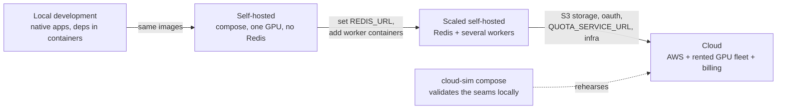

# Deployment profiles and migration

How one codebase is every deployment, and how an installation moves between profiles. This document consolidates the reuse mechanics scattered across [architecture.md](architecture.md), [blueprint.md](blueprint.md) and [decisions.md](decisions.md) into one place, then specifies the migration paths those mechanics make possible.

## The base principle

The self-hosted version is the base and the cloud is a configuration of it, never a fork. Three rules enforce this:

1. One build. A release tag produces one set of container images and one SPA artifact. GHCR serves self-hosters, ECR mirrors the same digests for the cloud. There is no cloud build.
2. No mode branches. Application code never asks "am I self-hosted or cloud"; it reads specific settings (`REDIS_URL`, `STORAGE_BACKEND`, `AUTH_MODE`, `QUOTA_SERVICE_URL`, `BILLING_ENABLED`, `SAFETY_CHECKS`). Every difference between deployments is one of these values.
3. Seams with two implementations. Where behavior must differ, an interface owns the difference: `Queues` and `FrameBus` (in-process or Redis), `Storage` (local filesystem or S3 with signed URLs), `QuotaService` (unlimited or the billing service over HTTP), and the auth mode module (`none`, `local`, `oauth`). The interfaces are specified in [blueprint.md](blueprint.md); the wire and API surface above them never change.

The proof mechanism is the cloud-sim compose in [local-development.md](local-development.md): the application demonstrably cannot tell nginx from an ALB or MinIO from S3, because the seams are the only place the difference could show.

## The profile spectrum

Profiles are points on one axis, not different products. Each arrow is configuration, not code.

| Setting | Local dev | Self-hosted | Scaled self-hosted | cloud-sim | Cloud |
|---|---|---|---|---|---|
| AUTH_MODE | none | none or local | local | local | oauth |
| OAUTH_PROVIDERS | | | | | google,github,apple |
| BILLING_ENABLED | false | false | false | true (fake) | true |
| SAFETY_CHECKS | false | false | false | false | true |
| DATABASE_URL | dev compose | compose postgres | compose postgres | compose postgres | RDS |
| REDIS_URL | empty | empty | compose redis | compose redis | ElastiCache |
| STORAGE_BACKEND | local | local | local | s3 (MinIO) | s3 + CloudFront signing |
| QUOTA_SERVICE_URL | empty | empty | empty | fake service | billing service |
| EMAIL_BACKEND | none or Mailpit | none | smtp | Mailpit | SES |
| LOG_FORMAT | plain | plain | plain | plain | json |
| Workers | 1, native | 1, compose | N, compose | 1-2 | rented fleet, autoscaled |

The scaled self-hosted column deserves a note: it is not a separately designed product. Setting `REDIS_URL` switches dispatch and the frame relay to the Redis implementations, and additional worker containers simply dial the same fleet endpoint. A lab or studio with three GPU machines gets multi-worker scheduling with the exact scheduler the cloud runs (issue #20), for the cost of one Redis container.

## What is shared, layer by layer

| Layer | Shared across every profile | Varies |
|---|---|---|
| REST and WebSocket API | every endpoint, request, response, close code in [api.md](api.md) | nothing |
| Frontend | one static build; behavior driven by `GET /api/v1/config` | the values that endpoint returns |
| Worker | the whole worker, protocol, manifests, `DEVICE=cuda/rocm/cpu`, the low VRAM memory ladder (`MEMORY_MODE`, [architecture.md](architecture.md)) | the hostname it dials, where weights come from (HF or R2); the ladder matters on consumer GPUs, the cloud fleet runs fully resident |
| Database schema | identical, one migration history | instance it runs on |
| Dispatch and relay | the interfaces and the scheduler logic | in-process vs Redis implementation |
| Storage | the interface, storage keys, asset rows | filesystem vs S3; plain paths vs signed URLs |
| Quota | the reserve/commit/refund interface, metering events | unlimited vs the billing service |
| Auth | session mechanics, cookie, revocation | which methods exist |
| Not shared at all | | AWS infrastructure; the private billing and autoscaler services |

## Migration paths

Every path below is possible because the schema, storage keys and API are identical everywhere. Paths that need a small tool name the issue that ships it; nothing here requires code the architecture does not already plan.

### Local filesystem to S3 compatible storage

1. Create the bucket (S3, MinIO, R2 - anything S3 compatible).
2. Copy the asset tree: `aws s3 sync /data/assets s3://bucket/` (or `mc mirror`). Storage keys are backend agnostic, so objects land under the same keys the database rows already reference.
3. Set `STORAGE_BACKEND=s3` with the bucket settings and restart the API.
4. Nothing else changes: URLs are minted per request by the adapter, so history and share links keep working. Rollback is the reverse flip (sync back first if writes happened in between).

### Enabling accounts on an install that ran without them

`AUTH_MODE=none` runs everything as one implicit local user who owns every row. Switching to `local` is the config change plus one ownership step: the first registered account adopts the existing library. That adoption command ships with issue #9 (it is a one-statement update behind a confirmation). Going further to `oauth` is purely additive: local identities remain valid, providers appear beside them.

### Adding Redis and more workers (self-hosted scale-out)

1. Add a Redis container and set `REDIS_URL`.
2. Restart the API: queues rebuild from PostgreSQL job rows (Redis is never the source of truth, so there is nothing to migrate into it), the session cache warms lazily, and the frame relay switches to pub/sub.
3. Start more worker containers pointing at the same `API_URL`. They register, advertise slots, and the scheduler spreads sessions.
4. Reversal: unset `REDIS_URL` and drop to one worker. Nothing is lost.

### Self-hosted into the cloud, and back out

The same schema and storage layout make an install portable in both directions:

- In: `pg_dump` the database, restore into RDS (same migration history, so versions must match or be upgraded first); `aws s3 sync` the assets into the images bucket; users log in again (sessions are deliberately not migrated). Billing state starts fresh because credit ledgers live in the private service and never existed self-hosted.
- Out (the no-lock-in direction, and the point of the GPL): the same steps in reverse, or per user via the GDPR export (issue #10), which yields their data without operator involvement. A customer can leave the cloud for their own GPU and keep their library.

Cross-install migration is mechanics the architecture guarantees, not a polished launch feature; the first packaged tooling for it can come whenever demand appears, and will be thin because the hard part is already free.

### Version migrations within any profile

Already decided and specified elsewhere, listed here for completeness: one project version per release tag; the worker protocol supports N-1 so fleets and self-hosters upgrade without lockstep ([connection-handling.md](connection-handling.md)); database migrations are expand-contract, applied as a gated task in the cloud and automatically on API startup self-hosted ([decisions.md](decisions.md)).

## What can never migrate

The private repository services (billing, fleet autoscaler) and the AWS infrastructure are the commercial layer; they integrate over HTTP boundaries (`QUOTA_SERVICE_URL`, metering events, worker fleet tokens) and are not part of any self-hosted profile. The open source repository stays complete without them: the default implementations allow everything, which is both the self-hosted behavior and the reason the GPL boundary holds.
