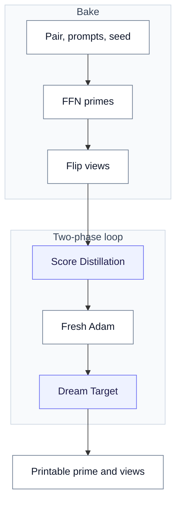
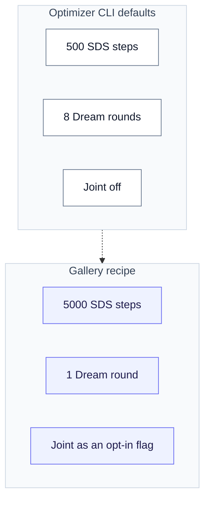
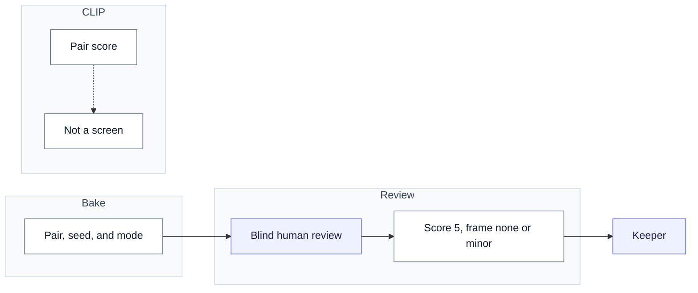
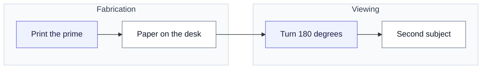

# Diffusion Illusions

Public study for the `/illusions` page (issue #121). The optimizer CLI
is on PR #118. That branch is not merged. Product defaults are unchanged.
A typeset paper can follow. This document is the public study.

Figures on `/illusions` are webp exports built by
`scripts/render-illusion-figures.py`: drawio boxes, arrows, and math
generated from code, with real keeper photos composited by PIL in a
second step (headless drawio cannot load images). Regen with
`python3 scripts/render-illusion-figures.py --out /tmp/illfig`, convert
each PNG to webp, and copy to `frontend/static/illusions/`. Photo wells
read from `frontend/static/illusions` and from the gitignored research
exports under `.local/`; without those files the structure still
renders with dashed wells.

The method is Burgert et al.,
[Diffusion Illusions](https://diffusionillusions.com). Optimize printable
prime images so a fixed physical arrangement of them reads as a different
subject. Here the arrangement is a flip of the sheet. The primes are the
only free variables. Arrangements model real physics and are
differentiable. A frozen diffusion model scores each derived view against
its prompt.

## Architecture

The optimizer has four parts, in dependency order. In code they are
`FourierFeatureNetwork`, the `ILLUSIONS` flip arrangement, and
`DiffusionAdapter`; the paper calls the same parts prime images,
arrangement processes, and the frozen model (paper Sec. 2-3).

1. Each prime is a Fourier Feature Network rendering RGB
   `(1, 3, 512, 512)` in `[0, 1]`. Only its weights move: about 264k
   parameters per prime.
2. Fixed arrangements turn primes into derived views. Flip is
   `a1(p) = p` and `a2(p) = rot180(p)`.
3. A frozen diffusion model scores those views: Score Distillation on
   frozen SD 1.5, then Dream Target SDEdit on DreamShaper LCM.
4. Only the prime network is trained. Gradients never flow through the
   UNet or the VAE decoder.

<!-- figure: architecture -->
*Figure: flip pipeline with the elephant–swan keeper (seed 11, oil, joint). Colors follow paper Fig. 3: green input, blue trainable, white frozen, red intermediate. Arrangement math is paper Table 1, flip row.*

Rotate and hidden overlay exist in the paper and in the unmerged CLI. The
public page shows flip only. Flip is the type the reliability program
measured.

This workflow bakes the gallery keepers.

<!-- figure: workflow -->

## The prime network

Each prime is an implicit image: a Fourier Feature Network. Pixel
coordinates on a 512 x 512 grid in `[-1, 1]` go through a fixed random
Gaussian projection (`2 x 256`, scale 10). Then sine and cosine wrap
that projection into 512 features. Then a small MLP
(`512-256-256-256-3`, ReLU x3) maps the features to sigmoid RGB. The
loop optimizes those weights, not raw pixels. That keeps the signal in
printable structure. Pixel-space optimization hides the signal in high
frequencies. A printer cannot hold that noise (paper Sec. 4.3).

<!-- figure: ffn -->
*Figure: the prime network with its real output, the elephant–swan printable prime. Dimensions are the optimizer defaults (paper Sec. 4.3 motivates the FFN over pixels).*

Flip uses one prime and two views: identity and a 180-degree turn.
Rotate uses two primes and stacked transparencies. Hidden uses four
primes plus a product overlay. Multiplication models light through film.
Those overlay types are not on the public page.

## Score Distillation

Phase 1 uses frozen Stable Diffusion 1.5 (fp16 on GPU). The step
encodes each derived view to `(1, 4, 64, 64)` latents. It adds noise at
one shared random timestep in `[0.02, 0.98]` of the schedule. The frozen
UNet scores the noised latents with high classifier-free guidance
(default 100). All prompt-target views share one CFG-doubled UNet
forward per step (`sds_loss_batch`). The step applies the guided noise
residual as a gradient on those latents through the
`(latent * residual.detach()).sum()` trick. That gradient updates only
the prime network at Adam learning rate 1e-3.

The paper printed pseudocode computes an absolute residual under
`no_grad` (paper Eq. 2-3). That form has no gradient path to the image.
The authors' code uses residual-as-gradient. Every SDS implementation
uses that form.

<!-- figure: sds -->
*Figure: one batched SDS step (paper Eq. 2–3, with the residual-as-gradient correction). Values are the optimizer defaults.*

## Two-phase loop

The optimizer CLI defaults are 500 Score Distillation steps and 8 Dream
Target rounds. Joint Dream is off. We baked the gallery on `/illusions`
with a research recipe: 5000 SDS steps and one Dream round.

The loop creates a fresh Adam optimizer at the phase boundary. SDS
gradients run about four orders of magnitude larger than Dream Target
gradients. Without the reset, phase 2 moved loss by under 2 percent per
round. With the reset, it moved 44 to 60 percent (issue #122). Those
figures come from a short flip run: 250 SDS steps and 4 Dream Target
rounds of 150 steps each.

<!-- figure: two-phase -->
*Figure: real checkpoints from the window-2 giraffe–penguin calibration smoke run: SDS steps 250–5000, Dream round 1, final.*

Phase 2 is Dream Target (paper Eq. 4-6). It uses DreamShaper LCM with
an LCMScheduler swap at guidance 2. Each round asks img2img for a
cleaner target at strength `s`. Strength starts high (0.95) and decays
to a light polish (0.05). The target stays frozen for the round while
`(1 - SSIM) + MSE` pulls the derived views toward it for 300 steps.
Then the next round re-dreams from the improved views. Extra Dream
rounds after the first made images worse.

<!-- figure: dream -->
*Figure: a real round-1 triple from the same smoke run: derived view, dreamed target, regressed view (paper Eq. 4–6).*

## Joint Dream

Independent Dream Targets can fight over the same pixels. Joint Dream
(`--dream-joint`, `sdedit_joint`) denoises both flip views together. At
every step it decodes each view's predicted image, rotates the B
prediction into the upright frame, averages both in pixel space
(`reconcile_flip`), re-encodes, and steps from that consensus. The two
views become two orientations of one image, and the returned targets are
two orientations of that same consensus.

The loop averages in pixel space on purpose. The SD 1.5 VAE does not
commute with a 180-degree turn in latent space (measured 0.78-0.97
relative latent error). Joint Dream is an opt-in flag. It is not the
product default. It can rescue a pair whose shapes can be one
picture. It can also collapse a pair whose subjects cannot.

<!-- figure: joint -->
*Figure: joint Dream with the elephant–swan keeper, which ran in joint mode. Pixel-space reconciliation, as the code requires.*

## Math symbols

Every symbol used in the figures, in one place. Paper references are
Burgert et al. sections and equations. Code references are
`worker/worker/illusions.py` on PR #118.

| Symbol | Meaning | Source |
|---|---|---|
| p | One prime image: the printable artifact, RGB `(1, 3, 512, 512)` in `[0, 1]` | paper Sec. 3.1, `FourierFeatureNetwork` |
| a₁, a₂ | Flip arrangements: a₁(p) = p, a₂(p) = rot₁₈₀(p). Fixed, differentiable, physically realizable | paper Sec. 3.2 + Table 1, `ILLUSIONS["flip"]` |
| d₁, d₂ | Derived views: what a human sees upright and inverted | paper Sec. 2, `_flip` |
| θ | FFN weights, about 264k per prime. The only thing training updates | `optimize_illusion` |
| x, y | Pixel coordinates on a 512 x 512 grid in `[-1, 1]` | `FourierFeatureNetwork.image` |
| B | Fixed random Gaussian projection, shape 2 x 256, scale 10 | paper Sec. 4.3 |
| v | Fourier features: v = [sin(2πBx) ‖ cos(2πBx)], 512-d | `FourierFeatureNetwork.forward` |
| σ | Sigmoid: squashes MLP output to RGB in `[0, 1]` | same |
| z | A view encoded to VAE latents, `(1, 4, 64, 64)` | `DiffusionAdapter.encode_latent` |
| t | Diffusion timestep, sampled in `[0.02, 0.98]` of the schedule | `sds_loss_batch` |
| ε | Gaussian noise added to the latent at step t | paper Eq. 2 |
| ε̂c / ε̂u | UNet noise estimate, conditioned on the prompt / unconditioned | CFG-doubled forward |
| w (G = 100) | Guidance weight pulling the estimate toward the prompt | `--sds-guidance` |
| r | Guided noise residual, applied as the latent gradient | paper Eq. 3, corrected form |
| r̄ | r detached: the gradient stops here, never entering the UNet | `(z * r.detach()).sum()` |
| η | Adam step on θ only, learning rate 1e-3, fresh optimizer per phase | issue #122 |
| s | SDEdit strength: how far the target may drift from the view, 0.95 → 0.05 | `strength_schedule` |
| z (Dream) | Dreamed target image, frozen for one round | paper Eq. 4, `sdedit` |
| L | Round loss: (1 − SSIM) + MSE between views and targets | paper Eq. 5-6 |
| d′ | Derived view after regressing toward the target | phase 2 loop |
| x̂ | Predicted clean image decoded during joint denoise | `sdedit_joint` |
| c | Consensus: c = (x̂A + rot₁₈₀(x̂B)) / 2, averaged in pixel space | `reconcile_flip` |

## What we measured

The reliability program on PR #118 recorded these results. PR #150
merged into that branch. Do not treat these as product defaults.

- A keeper is a specific pair, seed, and viewing mode. It is not a
  recipe that works every time.
- Human review is the gate. CLIP pair score ROC-AUC was 0.706 against a
  required 0.75, so no automatic screen.
- Prompt wording is the biggest lever. It is not predictable by
  argument. Frame artifacts belong to the specific phrase. They do not
  belong to sketch versus oil as a medium.
- We kept oil for color and fewer photographic frames. We did not keep
  oil because it yielded more keepers than sketch.
- We rejected negative prompts.
- Extra Dream rounds after the first made images worse.
- 256 px primes were enough. 512 px cost about 3.3 times as much for no
  visible gain.

These conclusions came after the gallery was baked. The keepers on
`/illusions` span both wordings and both styles.

<!-- figure: recipe -->

Gallery images are window-2 clean keepers: score 4 or 5, frame rated
none or minor, export `window2-2026-08-clean`. The gallery shows all 26
cells at that bar: 14 at score 5 and 12 at score 4, grouped by pair.
Some pairs earned several keepers across seeds, styles, and arms, which
is expected because a keeper is one specific cell, not a recipe.
Sixteen of twenty-six used joint Dream; the rest used independent
targets. Provenance for every card (pair, seed, style, mode, arm,
source PNG, sha256) is in
`frontend/src/lib/illusion-public-facts.ts`.

Below the gallery, `/illusions` shows a candidates tray
(`ILLUSION_CANDIDATES` in the same file): 60 more cells from older and
later exports, each tagged with its score, seed, mode, and export. Some
are middle stages, and the oldest export never rated frames. Nothing
there is a keeper yet; the tray exists so a human can flip each card
and promote what reads clean.

<!-- figure: review -->

## Print

<!-- figure: print -->

Flip needs paper. Rotate and hidden types need transparency film and a
backlight. They are not on the public page.

## Status

No illusion job in the API (#116) and no studio designer (#117). Both
wait on the optimizer (#115 / PR #118). This document is the public
study of the research. It is not a shipping checklist.
