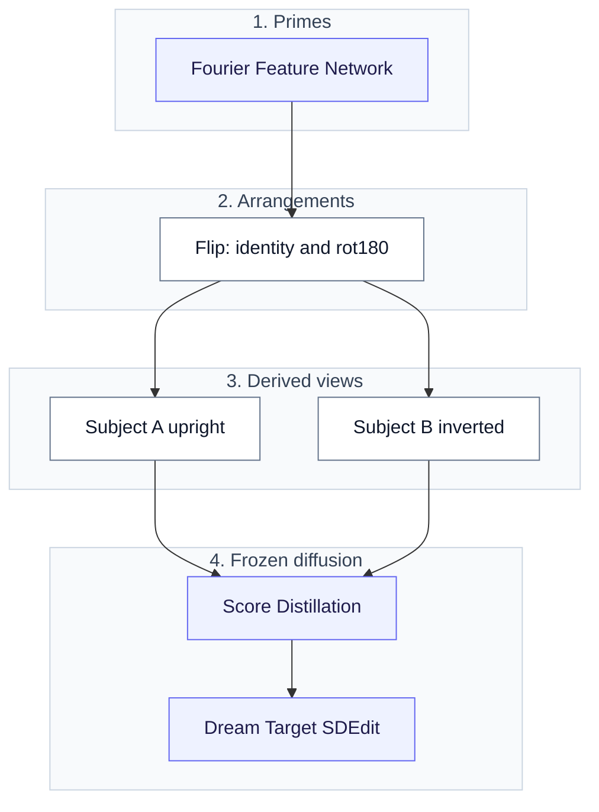
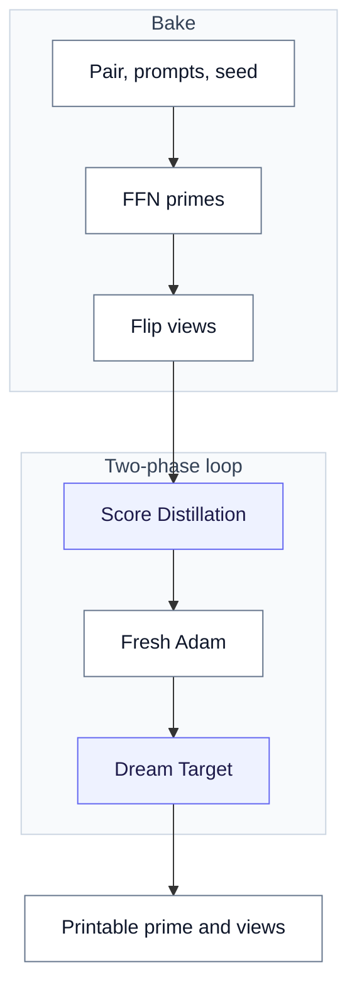
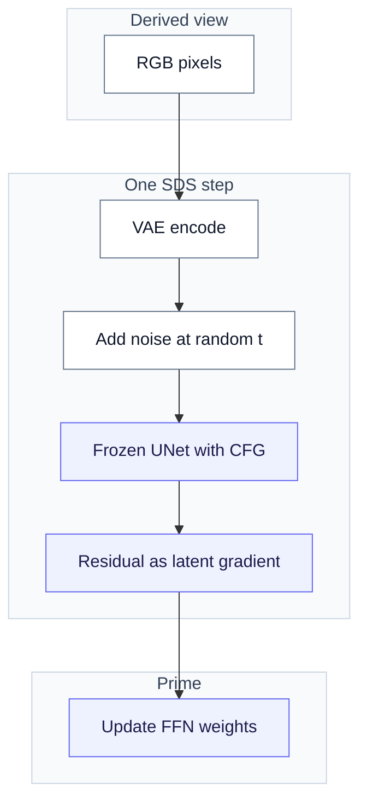
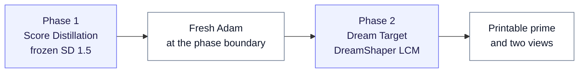
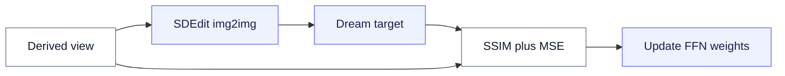
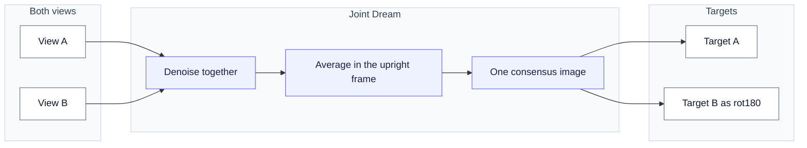
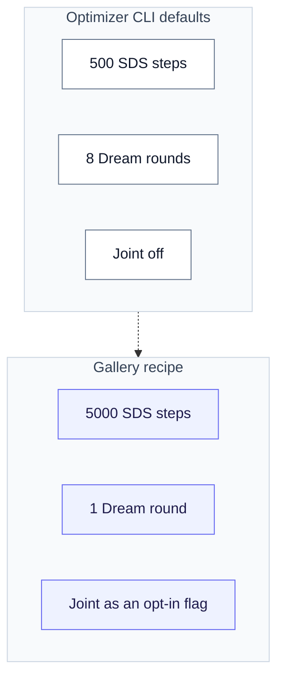
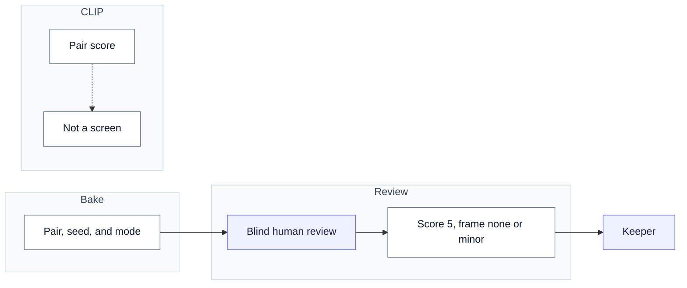
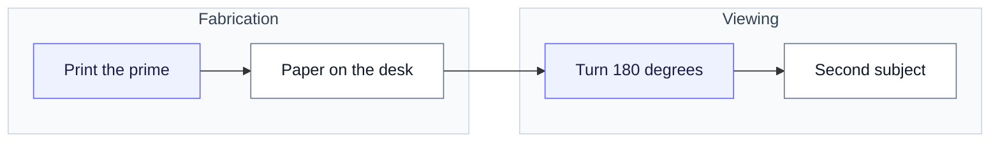

# Diffusion Illusions

Public study for the `/illusions` page (issue #121). The optimizer CLI
is on PR #118. That branch is not merged. Product defaults are unchanged.
A typeset paper can follow. This document is the public study.

Figures on `/illusions` are webp exports of the mermaid blocks below.
Render with mermaid-cli (`mmdc`) to PNG. Then convert the PNG to webp.
Use Chrome `--no-sandbox`. Use scale 2. Do not force a large width on
top-down graphs.

The method is Burgert et al.,
[Diffusion Illusions](https://diffusionillusions.com). Optimize printable
prime images so a fixed physical arrangement of them reads as a different
subject. Here the arrangement is a flip of the sheet. The primes are the
only free variables. Arrangements model real physics and are
differentiable. A frozen diffusion model scores each derived view against
its prompt.

## Architecture

The optimizer has four parts, in dependency order.

1. Each prime is a Fourier Feature Network.
2. Fixed arrangements turn primes into derived views.
3. A frozen diffusion model scores those views.
4. Only the prime network is trained. Gradients never flow through the
   UNet.

<!-- figure: architecture -->

Rotate and hidden overlay exist in the paper and in the unmerged CLI. The
public page shows flip only. Flip is the type the reliability program
measured.

This workflow bakes the gallery keepers.

<!-- figure: workflow -->

## The prime network

Each prime is an implicit image: a Fourier Feature Network. Pixel
coordinates go through a fixed random Gaussian projection. Then sine and
cosine wrap that projection. Then a small MLP maps the features to
sigmoid RGB. The loop optimizes those weights, not raw pixels. That keeps
the signal in printable structure. Pixel-space optimization hides the
signal in high frequencies. A printer cannot hold that noise (paper
Sec. 4.3).

<!-- figure: ffn -->

Flip uses one prime and two views: identity and a 180-degree turn.
Rotate uses two primes and stacked transparencies. Hidden uses four
primes plus a product overlay. Multiplication models light through film.
Those overlay types are not on the public page.

## Score Distillation

Phase 1 uses frozen Stable Diffusion 1.5. The step encodes each derived
view to latents. It adds noise at a random timestep. The frozen UNet
scores the noised latents with high classifier-free guidance. The step
applies the guided noise residual as a gradient on those latents. That
gradient updates only the prime network.

The paper printed pseudocode computes an absolute residual under
`no_grad`. That form has no gradient path to the image. The authors' code
uses residual-as-gradient. Every SDS implementation uses that form.

<!-- figure: sds -->

## Two-phase loop

The optimizer CLI defaults are 500 Score Distillation steps and 8 Dream
Target rounds. Joint Dream is off. We baked the gallery on `/illusions`
with a research recipe: 5000 SDS steps and one Dream round.

The loop creates a fresh Adam optimizer at the phase boundary. SDS
gradients run about four orders of magnitude larger than Dream Target
gradients. Without the reset, phase 2 moved loss by under 2 percent per
round. With the reset, it moved 44 to 60 percent (issue #122). Those
figures come from a short flip run: 250 SDS steps and 4 Dream Target
rounds of 150 steps each.

<!-- figure: two-phase -->

Phase 2 is Dream Target. It uses DreamShaper LCM. Each round asks img2img
for a cleaner target. Strength starts high and decays to a light polish.
Then SSIM and MSE pull the derived views toward that target. Extra Dream
rounds after the first made images worse.

<!-- figure: dream -->

## Joint Dream

Independent Dream Targets can fight over the same pixels. Joint Dream
denoises both flip views together. It averages them in the upright frame.
Then it steps from that consensus. The two views become two orientations
of one image.

The loop averages in pixel space. The SD 1.5 VAE does not commute with a
180-degree turn in latent space. Joint Dream is an opt-in flag. It is not
the product default. It can rescue a pair whose shapes can be one
picture. It can also collapse a pair whose subjects cannot.

<!-- figure: joint -->

## What we measured

The reliability program on PR #118 recorded these results. PR #150
merged into that branch. Do not treat these as product defaults.

- A keeper is a specific pair, seed, and viewing mode. It is not a
  recipe that works every time.
- Human review is the gate. CLIP pair score ROC-AUC was 0.706 against a
  required 0.75, so no automatic screen.
- Prompt wording is the biggest lever. It is not predictable by
  argument. Frame artifacts belong to the specific phrase. They do not
  belong to sketch versus oil as a medium.
- We kept oil for color and fewer photographic frames. We did not keep
  oil because it yielded more keepers than sketch.
- We rejected negative prompts.
- Extra Dream rounds after the first made images worse.
- 256 px primes were enough. 512 px cost about 3.3 times as much for no
  visible gain.

These conclusions came after the gallery was baked. The keepers on
`/illusions` span both wordings and both styles.

<!-- figure: recipe -->

Gallery images are window-2 clean keepers: score 5, frame rated none or
minor, export `window2-2026-08-clean`. Five of six used joint Dream. The
giraffe and penguin pair used independent targets. Provenance is in
`frontend/src/lib/illusion-public-facts.ts`.

<!-- figure: review -->

## Print

<!-- figure: print -->

Flip needs paper. Rotate and hidden types need transparency film and a
backlight. They are not on the public page.

## Status

No illusion job in the API (#116) and no studio designer (#117). Both
wait on the optimizer (#115 / PR #118). This document is the public
study of the research. It is not a shipping checklist.
