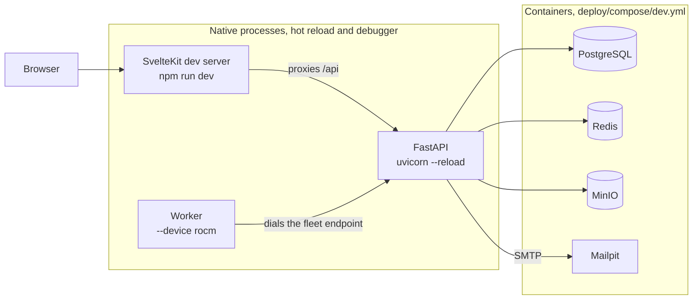
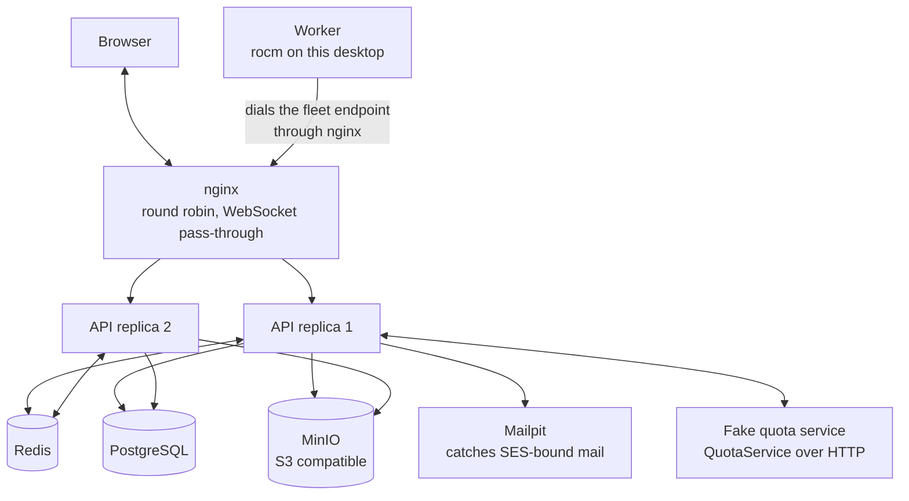
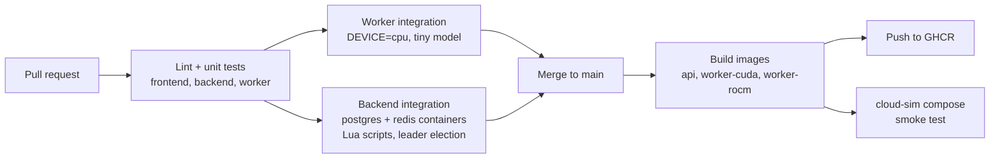
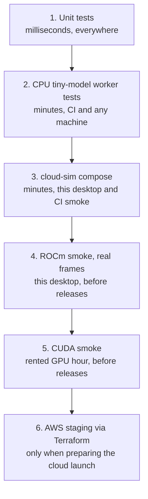

# Local development and testing

How the project is developed and tested without paying for any cloud infrastructure. The self-hosted profile is implemented and tested first; the cloud profile is then validated locally against a simulated topology built from generic containers, and only after that against real AWS (the scaled-down staging in [cloud-infrastructure.md](cloud-infrastructure.md)).

## The development machine

The reference development desktop, measured:

| Resource | Value | Implication |
|---|---|---|
| GPU | AMD Radeon RX 7600 class, 8 GB VRAM | ROCm target, not CUDA; fits SD-Turbo class models at min_vram_gb 8 |
| CPU | 32 threads | comfortably runs the full cloud simulation plus native dev servers |
| RAM | 61 GiB | no constraint |
| Disk | 674 GB free | model weights (5 to 10 GB each) and images are fine |
| Docker | 29.x, Compose v5 | current; no changes needed |

The GPU is the one that matters: the worker supports three device targets (see [decisions.md](decisions.md)):

- `DEVICE=cuda`: NVIDIA, what the cloud fleet and most self-hosters run.
- `DEVICE=rocm`: AMD, a fully supported target. Published as its own worker image variant built on the ROCm PyTorch base. This desktop is the standing AMD test machine.
- `DEVICE=cpu`: no GPU, used by CI with a tiny model and by contributors without a GPU. Functional, not fast.

ROCm notes for this machine: the in-kernel amdgpu driver is enough for the containerized worker; the container brings the ROCm userspace. The container needs `/dev/kfd` and `/dev/dri` passed through and the `video` group added. The RX 7600 is gfx1102; if the ROCm build in use predates its support, `HSA_OVERRIDE_GFX_VERSION=11.0.2` is the known workaround, worth documenting in the worker README rather than discovering twice.

```yaml
# worker service, AMD variant
worker:
  image: ghcr.io/portocolom-studio/potocolom-worker:v0.x-rocm
  environment:
    DEVICE: rocm
    API_URL: ws://api:8080/api/v1/fleet
  devices: ["/dev/kfd", "/dev/dri"]
  group_add: ["video"]
```

The NVIDIA variant (`:v0.x-cuda`) uses the `deploy.resources.reservations.devices` block from [blueprint.md](blueprint.md) instead. Everything above the device layer is identical code.

## Day-to-day development loop

Dependencies run in containers; the three applications run natively for instant reload and debugger access:

```
deploy/compose/dev.yml        # postgres, redis, minio, mailpit; nothing else
backend:  uvicorn app:app --reload          # against the dev containers
frontend: npm run dev                        # Vite dev server, proxies /api to backend
worker:   python -m worker --device rocm     # dials ws://localhost:8000/api/v1/fleet
```



The containerized applications are still exercised constantly: by the cloud simulation below, by CI image builds, and by running the shipped compose file before every release.

### Running each component

```
# dependencies (PostgreSQL, Redis, MinIO, Mailpit)
docker compose -f deploy/compose/dev.yml up -d

# backend, from backend/
python3 -m venv .venv && .venv/bin/pip install -e ".[dev]"
.venv/bin/uvicorn app.main:app --reload          # http://localhost:8000/api/v1/health
.venv/bin/ruff check . && .venv/bin/pytest       # lint and tests

# frontend, from frontend/
npm install
npm run dev                                      # http://localhost:5173
npm run lint && npm run check                    # format check and type check

# worker, from worker/
python3 -m venv .venv && .venv/bin/pip install -e ".[dev]"
.venv/bin/python -m worker                       # inference arrives with issue #15
.venv/bin/ruff check . && .venv/bin/pytest
```

## The local cloud simulation

The cloud profile is not tested by emulating AWS. It is tested by reproducing the cloud topology with generic containers, which the pluggable seams make cheap: the code cannot tell nginx from an ALB or MinIO from S3, and that is the point of the seams.

```
deploy/compose/cloud-sim.yml
```



| Cloud piece | Local stand-in | What it validates |
|---|---|---|
| ALB | nginx (round robin, long WebSocket timeouts) | two-replica routing, WebSocket pass-through, health checks |
| ECS Fargate, 2+ API tasks | the same API image, two containers | scheduler leader election, session cache invalidation across replicas |
| ElastiCache Redis | redis container | queues, pub/sub frame relay between replicas, rate limits |
| RDS PostgreSQL | postgres container | migrations, the gated expand-contract discipline |
| S3 + presigned URLs | MinIO | the S3 storage adapter, direct worker uploads |
| CloudFront signed URLs | MinIO presigned GET | approximate; real CloudFront signing is staging-only |
| SES | Mailpit (SMTP catcher with web UI) | verification and sign-in notification emails, end to end |
| Billing service (private repo) | a 100-line fake implementing QuotaService | reserve, commit, refund, insufficient-credits paths |
| Stripe | Stripe CLI in test mode, against the fake | webhook handling, later, when the billing service exists |
| GPU fleet on RunPod | the local worker | dispatch, streaming, drain; N-1 by running the previous image tag |

Deliberately not used: LocalStack or other AWS emulators. MinIO and Mailpit already cover the two AWS APIs the application code touches (S3 and SMTP). Everything else AWS-specific (ALB details, ECS, IAM, CloudFront signing) is control plane that emulators reproduce poorly; it gets validated once, on the real scaled-down staging, via Terraform.

Useful runs this enables on one desktop:

- Kill a worker mid job and mid session: retry-once and session recovery paths.
- Kill the leader API replica: scheduler failover within the lease window.
- Stop Redis: degradation behavior, nobody logged out, queue rebuilt on return.
- Run the previous release's worker image against the current API: the N-1 promise.
- Open the drawing tool in two browsers against a one-slot worker: admission queue and position display.

## What only real AWS can validate

Kept honest and short, this is the list staging exists for: Terraform itself, IAM policies, ALB idle timeout and deregistration behavior, CloudFront signed URLs and cache behaviors, SES deliverability and sandbox exit, Fargate networking and Service Connect, real latency. Nothing on this list is application logic; by the time staging comes up, the application has already been proven against the simulated topology.

## Continuous integration

GitHub-hosted runners, no GPU, per issue #13:

1. Lint and unit tests per component (frontend, backend, worker), on every pull request.
2. Worker integration test with `DEVICE=cpu` and the tiny model: manifest loading, dispatch, frame streaming, safety checker, end to end in minutes.
3. Backend integration tests against postgres and redis service containers, including the Lua scripts and the leader election.
4. On main: build all images (cuda and rocm worker variants), push to GHCR, then run the cloud-sim compose against the built images as a smoke test.



GPU inference is never in CI. The release checklist runs it manually twice: ROCm on this desktop, CUDA on a rented machine for an hour.

## Testing ladder

Each rung is cheaper and faster than the next; a change climbs only as far as it needs.



Until rung 6 is reached, the monthly infrastructure cost of this entire plan is zero.
