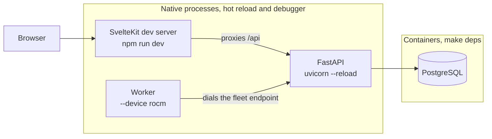
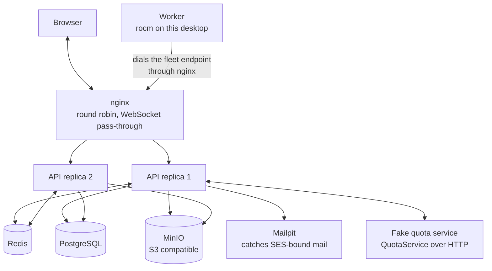
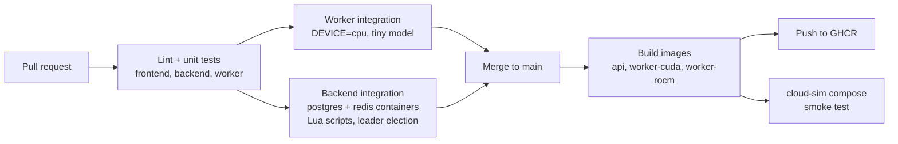
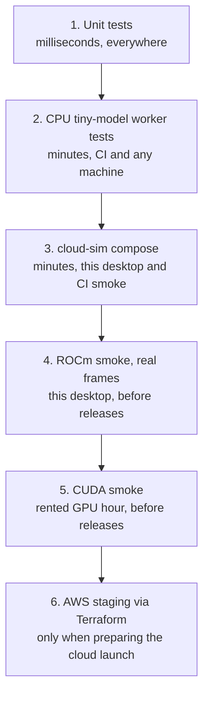

# Local development and testing

How the project is developed and tested without paying for any cloud infrastructure. The self-hosted profile is implemented and tested first; the cloud profile is then validated locally against a simulated topology built from generic containers, and only after that against real AWS (the scaled-down staging in [cloud-infrastructure.md](cloud-infrastructure.md)).

## The development machine

The reference development desktop, measured:

| Resource | Value | Implication |
|---|---|---|
| GPU | AMD Radeon RX 7600 class, 16 GB VRAM | ROCm target, not CUDA; reference benchmarks and local studio dev |
| CPU | 32 threads | comfortably runs the full cloud simulation plus native dev servers |
| RAM | 61 GiB | no constraint |
| Disk | 674 GB free | model weights (5 to 10 GB each) and images are fine |
| Docker | 29.x, Compose v5 | current; no changes needed |

The GPU is the one that matters: the worker supports three device targets (see [decisions.md](decisions.md)):

- `DEVICE=cuda`: NVIDIA, what the cloud fleet and most self-hosters run.
- `DEVICE=rocm`: AMD, a fully supported target. Published as its own worker image variant built on the ROCm PyTorch base. This desktop is the standing AMD test machine.
- `DEVICE=cpu`: no GPU, used by CI with a tiny model and by contributors without a GPU. Functional, not fast.

ROCm notes for this machine: the in-kernel amdgpu driver is enough for the containerized worker; the container brings the ROCm userspace. The container needs `/dev/kfd` and `/dev/dri` passed through and the `video` group added. The RX 7600 is gfx1102; torch 2.9+rocm6.3 wheels ship gfx1102 kernels natively, so do not set `HSA_OVERRIDE_GFX_VERSION` (on other RDNA3 cards it forces the wrong ISA).

CUDA notes: on an NVIDIA Linux box the bare-metal loop is `make setup` then `make setup-cuda`, and `make worker-cuda` (or `make dev-start`, which detects CUDA). The PyPI torch wheels bundle the CUDA runtime, so the host needs only the NVIDIA driver. The compose gpu profile needs nvidia-container-toolkit on the host. A 4 GB laptop (RTX 3050 class) can generate stills offloaded; it will not advertise the live draw-and-render loop. See [self-hosting.md](self-hosting.md).

```yaml
# worker service, AMD variant
worker:
  image: ghcr.io/portocolom-studio/potocolom-worker:v0.x-rocm
  environment:
    DEVICE: rocm
    API_URL: ws://api:8080/api/v1/fleet
  devices: ["/dev/kfd", "/dev/dri"]
  group_add: ["video"]
```

The NVIDIA variant (`:v0.x-cuda`) uses the `deploy.resources.reservations.devices` block from [blueprint.md](blueprint.md) instead. Everything above the device layer is identical code.

## First run on a new machine

Two doors. Do not mix them on the same ports.

**Run the product** (Docker, studio at http://localhost:8080): `make selfhost`, or `scripts/preflight.sh` then `docker compose -f deploy/compose/compose.yml --profile gpu up -d --build` (use `--profile rocm` on AMD). Preflight checks Docker and the GPU and writes `deploy/compose/.env`; it does not install Python or Node.

**Hack on the code** (native, studio at http://localhost:5173):

```
make init            # venvs, GPU extras, secrets, postgres
make dev             # API + studio + worker; make dev-status if the studio is blank
make verify          # optional; the same lint/test/build CI runs
```

`make setup` recreates a `.venv` that has Python but no pip (a leftover from a failed first run). You can also `rm -rf backend/.venv worker/.venv` and run it again. Do not copy `.venv` between an AMD machine and an NVIDIA machine.

`make deps` uses the Compose project `potocolom-dev` so it does not share PostgreSQL with the self-hosted stack in `compose.yml` (different password). If leftover `compose-postgres-1` is still holding :5432, `make deps` stops that self-hosted stack first.

## Day-to-day development loop

Dependencies run in containers; the three applications run natively for instant reload and debugger access:

The `make api` target sets `TELEMETRY=false`, so the native development loop never reports telemetry.

```
deploy/compose/dev.yml        # postgres; redis, minio and mailpit behind --profile cloud-sim
backend:  uvicorn app:app --reload          # against the dev containers
frontend: npm run dev                        # Vite dev server, proxies /api to backend
worker:   python -m worker --device rocm     # dials ws://localhost:8000/api/v1/fleet
```

Default native loop (what `make deps` starts). Redis, MinIO and Mailpit only appear when you add `--profile cloud-sim` / `make deps-all`; see the cloud simulation section below.


```mermaid
flowchart LR
    subgraph NATIVE["Native processes, hot reload and debugger"]
        FE["SvelteKit dev server<br>npm run dev"]
        BE["FastAPI<br>uvicorn --reload"]
        WK["Worker<br>--device rocm"]
    end
    subgraph DEPS["Containers, make deps"]
        P[("PostgreSQL")]
    end
    B["Browser"] --> FE
    FE -->|"proxies /api"| BE
    WK -->|"dials the fleet endpoint"| BE
    BE --> P
```

The containerized applications are still exercised constantly: by the cloud simulation below, by CI image builds, and by running the shipped compose file before every release.

### Running each component

```
# dependencies: PostgreSQL is the only one the native loop uses. Redis, MinIO
# and Mailpit are cloud-profile substitutes; add --profile cloud-sim for them.
# Host 5432 already taken? DEV_POSTGRES_PORT=5433 docker compose ... up -d, and
# point DATABASE_URL at the same port for the backend and the tests. Use a
# database name of its own for the test URL: exporting one shares it with every
# run in that shell, while the suite otherwise gives each run its own.
docker compose -f deploy/compose/dev.yml up -d
# project name potocolom-dev is in the file; do not share this with compose.yml

# Prefer `make setup` (picks a 3.11+ interpreter, installs into .venv only).
# Manual equivalent - the interpreter must be 3.11+, not a system python3 of 3.10:
# backend, from backend/
python3.11 -m venv .venv && .venv/bin/pip install -U pip && .venv/bin/pip install -e ".[dev]"
.venv/bin/uvicorn app.main:app --reload          # http://localhost:8000/api/v1/health
.venv/bin/ruff check . && .venv/bin/pytest       # lint and tests

# frontend, from frontend/
npm install
npm run dev                                      # http://localhost:5173
npm run lint && npm run check                    # format check and type check
```

Those ports are what this checkout gets. A linked git worktree derives its own
from its path, so two checkouts can run the dev loop at once without either
knowing about the other: `scripts/checkout-ports.sh` prints what yours will use,
`make api` and `make web` follow it, and the dev database gains a matching
suffix. The derivation applies to the Make targets only: running `uvicorn`,
`npm run dev` or `python -m worker` by hand, as the blocks above and below show,
gets the canonical ports and the bare `potocolom` database unless you export
`API_PORT`, `WEB_PORT` and `DATABASE_URL` yourself. Set `API_PORT` or `WEB_PORT`
to override. Only the main worktree gets the canonical `8000` and `5173` above.

The test suite goes further and takes a database per **run**, not per checkout,
named for the checkout path plus the process. Two runs at once is ordinary here:
an editor test runner beside a terminal run, or the self-hosted CI runner working
on the same machine. They used to share job rows, and the failures landed on the
retry tests as a 403 on an upload key that had just been issued, which reads as
an application bug rather than as two suites colliding. A run drops its own
database when it ends; `make test-db-clean` collects whatever a hard kill leaves.

An exported `DATABASE_URL` opts out of that: it is shared by every run in the
shell, and the suite will migrate it and write to it, though it never drops,
rebuilds or empties it. Give it a database name of its own.

The database test harness keeps setup, routes, and disposal on one event loop.
The runtime database engine uses a bounded connection pool.

```bash

# worker, from worker/
python3.11 -m venv .venv && .venv/bin/pip install -U pip && .venv/bin/pip install -e ".[dev]"
.venv/bin/python -m worker                       # dials the API and retries until one
                                                 # is running; Ctrl+C to stop
.venv/bin/ruff check . && .venv/bin/pytest
```

## Trying accounts mode locally

`AUTH_MODE` defaults to `none` and the dev loop wants it that way: every request
resolves to one implicit local administrator, so nothing asks you to sign in.

To exercise the account path, `make auth-enable` writes `ROOT_KEYS`, sets
`AUTH_MODE=accounts`, records the switch in PostgreSQL and prints a one-use call
that claims the administrator account. It is one way: the same database refuses
to start in `none` mode afterwards. Point it at a throwaway database, or expect
to drop and recreate the one you use, because there is no undo short of an
offline destructive reset.

Sign-in is not implemented yet, so accounts mode answers `401` for everything
except that one call. The password policy is fifteen to one hundred and twenty
eight characters against a bundled blocklist.

## Mail, and doing without it

`EMAIL_BACKEND` defaults to `none` and the dev loop wants it that way. Nothing
is sent, nothing is queued, and an invitation link is copied out of the API
response by hand. That is the shipped self-hosted default, not a development
shortcut.

Set `EMAIL_BACKEND=smtp` with `SMTP_HOST` and `MAIL_FROM` to exercise the
outbox. The cloud-sim compose stack runs Mailpit for exactly this; see the
ports it maps before pointing `SMTP_HOST` at it. A capability is written to the
`mail_outbox` table in the same transaction that mints it, and a sweep delivers
it a few seconds later, so a relay that is down queues and retries rather than
failing the request that created it.

An install configured for mail that cannot send refuses to start, naming the
variable it is missing. That is deliberate: an operator who believes
invitations are going out is worse off than one whose API will not boot. It
also refuses a `PUBLIC_URL` that is not https, and plaintext SMTP to anywhere
but a relay on this machine, because the link in the mail is the capability.
`http://localhost` is the exception, which is what the dev loop uses.

Switching `EMAIL_BACKEND` back to `none` does not simply pause the queue. The
next sweep marks every queued row failed and drops its payload, because
nothing can deliver those rows any more and each one still holds a live link.
Re-mint the invitation rather than expecting the queue to resume.

## The local cloud simulation

The cloud profile is not tested by emulating AWS. It is tested by reproducing the cloud topology with generic containers, which the pluggable seams make cheap: the code cannot tell nginx from an ALB or MinIO from S3, and that is the point of the seams.

```
deploy/compose/dev.yml (profile: cloud-sim)
```


```mermaid
flowchart TB
    B["Browser"]
    N["nginx<br>round robin, WebSocket pass-through"]
    A1["API replica 1"]
    A2["API replica 2"]
    R[("Redis")]
    P[("PostgreSQL")]
    M[("MinIO<br>S3 compatible")]
    MP["Mailpit<br>catches SES-bound mail"]
    Q["Fake quota service<br>QuotaService over HTTP"]
    W["Worker<br>rocm on this desktop"]
    B <--> N
    N --> A1
    N --> A2
    A1 <--> R
    A2 <--> R
    A1 --> P
    A2 --> P
    A1 --> M
    A2 --> M
    A1 --> MP
    A1 <--> Q
    W -->|"dials the fleet endpoint<br>through nginx"| N
```

| Cloud piece | Local stand-in | What it validates |
|---|---|---|
| ALB | nginx (round robin, long WebSocket timeouts) | two-replica routing, WebSocket pass-through, health checks |
| ECS Fargate, 2+ API tasks | the same API image, two containers | scheduler leader election, session cache invalidation across replicas |
| ElastiCache Redis | redis container | queues, pub/sub frame relay between replicas, rate limits |
| RDS PostgreSQL | postgres container | migrations, the gated expand-contract discipline |
| S3 + presigned URLs | MinIO | the S3 storage adapter, direct worker uploads |
| CloudFront signed URLs | MinIO presigned GET | approximate; real CloudFront signing is staging-only |
| SES | Mailpit (SMTP catcher with web UI) | verification and sign-in notification emails, end to end |
| Billing service (private repo) | a 100-line fake implementing QuotaService | reserve, commit, refund, insufficient-credits paths |
| Stripe | Stripe CLI in test mode, against the fake | webhook handling, later, when the billing service exists |
| GPU fleet on RunPod | the local worker | dispatch, streaming, drain; N-1 by running the previous image tag |

Deliberately not used: LocalStack or other AWS emulators. MinIO and Mailpit already cover the two AWS APIs the application code touches (S3 and SMTP). Everything else AWS-specific (ALB details, ECS, IAM, CloudFront signing) is control plane that emulators reproduce poorly; it gets validated once, on the real scaled-down staging, via Terraform.

Useful runs this enables on one desktop:

- Kill a worker mid job and mid session: retry-once and session recovery paths.
- Kill the leader API replica: scheduler failover within the lease window.
- Stop Redis: degradation behavior, nobody logged out, queue rebuilt on return.
- Run the previous release's worker image against the current API: the N-1 promise.
- Open the drawing tool in two browsers against a one-slot worker: admission queue and position display.

## What only real AWS can validate

Kept honest and short, this is the list staging exists for: Terraform itself, IAM policies, ALB idle timeout and deregistration behavior, CloudFront signed URLs and cache behaviors, SES deliverability and sandbox exit, Fargate networking and Service Connect, real latency. Nothing on this list is application logic; by the time staging comes up, the application has already been proven against the simulated topology.

## Continuous integration

GitHub Actions runs lint and tests on every pull request (issue #13). By default workflows target a **self-hosted runner** on the reference desktop so CI keeps working when hosted minutes are exhausted; see [self-hosted-runner.md](self-hosted-runner.md). Switch workflows back to `ubuntu-latest` when hosted quota is available.

Per component, no GPU:

1. Lint and unit tests per component (frontend, backend, worker), on every pull request. Each job runs the matching `make verify-<component>` target, so what CI checks and what `make verify` checks are the same lines.
2. On changes to the `Makefile` or a dependency manifest: `make verify-guards` proves the setup guards still refuse a toolchain without Python 3.11+ and recreate a pip-less venv, then `make setup` runs the onboarding path end to end, so a broken `make setup` fails here instead of on a new contributor's machine.
3. On changes under `deploy/`: `make verify-compose` validates every compose file and profile, then `scripts/compose-smoke.sh` builds the shipped stack and drives one generation through it with the simulated worker, no GPU needed.
4. Worker integration test with `DEVICE=cpu` and the tiny model: manifest loading, dispatch, frame streaming, safety checker, end to end in minutes.
5. Backend integration tests against postgres and redis service containers, including the Lua scripts and the leader election.
6. On main: build all images (cuda and rocm worker variants), push to GHCR, then run the cloud-sim compose against the built images as a smoke test.


```mermaid
flowchart LR
    PR["Pull request"] --> LINT["Lint + unit tests<br>frontend, backend, worker"]
    LINT --> WCPU["Worker integration<br>DEVICE=cpu, tiny model"]
    LINT --> BINT["Backend integration<br>postgres + redis containers<br>Lua scripts, leader election"]
    WCPU --> MAIN["Merge to main"]
    BINT --> MAIN
    MAIN --> IMG["Build images<br>api, worker-cuda, worker-rocm"]
    IMG --> GHCR["Push to GHCR"]
    IMG --> SIM["cloud-sim compose<br>smoke test"]
```

GPU inference is never in CI. The release checklist runs it manually twice: ROCm on this desktop, CUDA on a rented machine for an hour.

## Testing ladder

Each rung is cheaper and faster than the next; a change climbs only as far as it needs.


```mermaid
flowchart TB
    R1["1. Unit tests<br>milliseconds, everywhere"]
    R2["2. CPU tiny-model worker tests<br>minutes, CI and any machine"]
    R3["3. cloud-sim compose<br>minutes, this desktop and CI smoke"]
    R4["4. ROCm smoke, real frames<br>this desktop, before releases"]
    R5["5. CUDA smoke<br>rented GPU hour, before releases"]
    R6["6. AWS staging via Terraform<br>only when preparing the cloud launch"]
    R1 --> R2 --> R3 --> R4 --> R5 --> R6
```

Until rung 6 is reached, the monthly infrastructure cost of this entire plan is zero.
