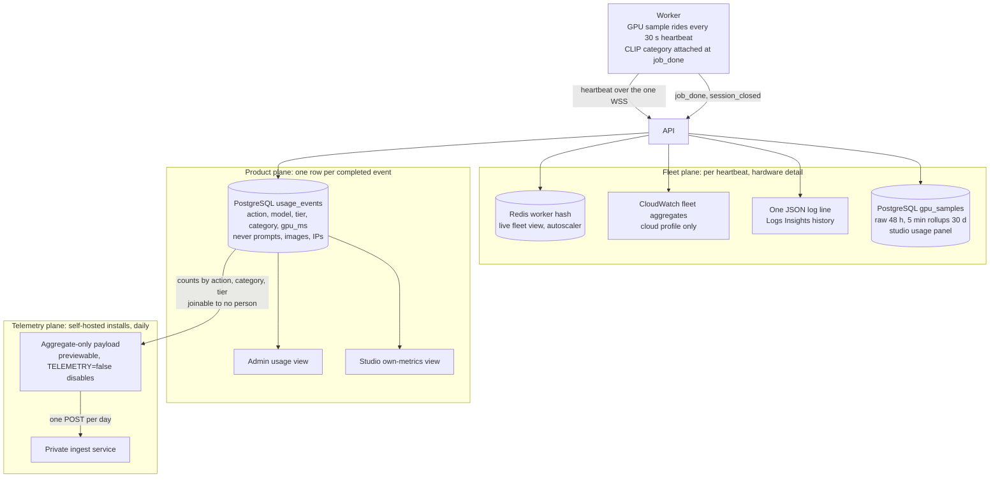

# Usage metrics and telemetry

What the platform measures about its own use, where those measurements live, and what leaves a self-hosted install. The goal is to answer product and investor questions - what are people creating, with which models, how often do they come back - without cookies, third party trackers or any client side beacon. Everything here is server side rows derived from requests the API already handles.

## The questions this answers

- What are users creating: art, photo editing, design assets, characters, NSFW content, split by day and by plan.
- Which models and tiers do they choose, and how does the optional `model_id` routing actually get used.
- How much time do they spend: realtime drawing minutes, queued generations per session, days active per week.
- Retention and cohorts: DAU/WAU, how usage changes after the first week, which categories retain.
- The self-hosted install base: how many installs exist, which versions, which GPUs and memory ladder rungs.

The first four come from usage events; the last one from telemetry. They are separate streams with separate privacy rules.

The planes at a glance - what flows where, and what never leaves the deployment:



## Usage events: per-event rows in the deployment's own database

Every completed job and every closed realtime session writes one row to a `usage_events` table in the deployment's own PostgreSQL. The same code runs in both modes: a self-hosted admin gets the same view of their instance that the cloud has of its fleet. Nothing about this stream crosses the network.

| Field | Content |
|---|---|
| user_id | FK to users; deleted with the account purge |
| kind | `job` or `realtime` |
| action | `generate`, `edit`, `enhance` or `draw` |
| model_id, tier | what actually ran, after routing |
| category, category_score | top label from the output categorizer below |
| gpu_ms, duration_ms, frames | cost and effort of the event |
| created_at | timestamp |

Deliberately never stored in this table: prompt text, images, IP addresses, user agents. Time-on-project metrics derive from these server-visible rows (session durations, first to last activity per day), not from any frontend ping; the frontend contains no analytics code at all.

Rows are user-linked because that is what retention, cohort and funnel analysis need. The obligations that come with that: rows are hard deleted with the account's 30 day purge, and they appear in the GDPR export like everything else ([architecture.md](architecture.md), content safety and privacy).

## Content categorization

The worker categorizes each output image with a CLIP zero-shot pass against a fixed label set - `art`, `photo_edit`, `design`, `character`, `nsfw`, `other` - and attaches the top label and score to `job_done` (for queued jobs) and to `session_closed` (for realtime, classifying the final frame). SD-class pipelines already ship a CLIP encoder, so this is one extra embedding comparison at a point where the image is already in memory, in both modes and on every device type.

Categorization is metrics, not moderation: it runs regardless of `SAFETY_CHECKS`, and the diffusers safety checker remains the only enforcement path. A self-hosted install with safety off still labels its own NSFW output correctly in its own statistics.

## Telemetry from self-hosted installs

Self-hosted installs report anonymous daily aggregates to project infrastructure, on by default with a single switch to disable (`TELEMETRY=false`). This supersedes the original zero-phone-home decision ([decisions.md](decisions.md)); the design keeps the properties that make opt-out defensible:

- The payload is aggregates only. No user ids, emails, prompts, images or per-user rows ever leave the install; the report cannot be joined back to a person.
- The full payload is documented here and printable locally (`GET /api/v1/telemetry/preview` shows exactly what would be sent).
- The API logs the destination, the payload summary and the off switch at every startup, so no admin discovers it by reading traffic.

One POST per day to the ingest endpoint (private repo service, versioned like the quota contract):

```json
POST https://telemetry.potocolom.com/v1/report
{
  "install_id": "random uuid, generated at first boot, carries no identity",
  "version": "0.3.1",
  "day": "2026-07-09",
  "active_users": 3,
  "events": {"job": 41, "realtime": 12},
  "by_action": {"generate": 30, "draw": 12, "edit": 8, "enhance": 3},
  "by_category": {"art": 25, "photo_edit": 9, "design": 6, "nsfw": 8, "other": 5},
  "by_tier": {"draft": 35, "standard": 18},
  "realtime_minutes": 74,
  "workers": [{"device": "rocm", "memory_mode": "model_offload"}]
}
```

A failed send is dropped, never queued: telemetry must never affect the install that emits it.

## Operational metrics: planes and export paths

Usage events and telemetry are the product plane. Three more planes cover operating the system, each with one export path and one rule about where detail lives:

| Plane | Source | Export path | Where it lands |
|---|---|---|---|
| Fleet and GPU | worker heartbeat samples | the existing WSS connection - workers are never AWS principals | Redis worker hash (live), CloudWatch fleet aggregates, one JSON log line per heartbeat |
| Service | API and private services | `PutMetricData` in the `potocolom` namespace + structured JSON logs | CloudWatch metrics, Logs Insights |
| Money path | API outbox, billing webhooks, autoscaler | same as service plane | CloudWatch metrics and alarms; machine-hour rows in the autoscaler's store |

The cardinality rule that keeps CloudWatch cheap: aggregates become metrics, detail stays in Redis (live) and logs (history). Per-worker CloudWatch dimensions would multiply ephemeral worker ids by metric names at a price per metric; the admin fleet view and Logs Insights already answer per-worker questions for free.

## GPU fleet metrics

The worker samples its card once per heartbeat - GPU utilization, VRAM used and total, temperature, power - via NVML on CUDA and amd-smi on ROCm, behind the same device layer as inference. The API fans each heartbeat out three ways: the `worker:{id}` Redis hash (the admin fleet view and the autoscaler read this), fleet-level CloudWatch aggregates (workers connected, slots in use and free, average and max GPU utilization, minimum VRAM free), and one JSON log line for history.

A multi-GPU machine runs one worker process per GPU, pinned by device index, so every GPU is one connection, one heartbeat stream and one set of slots - the fleet view lists them all individually with no special casing. The admin area is the live many-GPU console; CloudWatch is for trends and alarms; Logs Insights is for the post-mortem on one specific worker.

The studio's own usage panel has a fourth consumer: each heartbeat's GPU sample is also written to the deployment's PostgreSQL (`gpu_samples`, raw rows kept 48 hours) and rolled into five-minute buckets (`gpu_sample_rollups`, kept 30 days) by a maintenance loop in the API. `GET /api/v1/metrics/gpu/history` serves both: raw rows for windows up to an hour, rollups beyond. This is per-install history for the user's own hardware; the CloudWatch plane above stays aggregate-only.

## Frame loop metrics

Two recorded decisions depend on observing the realtime loop, so its numbers are first class: per-model p95 frame time, measured at the worker (inference) and at the relay (end to end), and the frame drop rate from latest-input-wins. Worker-side p95 feeds the slot calibration benchmark's ongoing sanity check; relay-side p95 is the explicit trigger for the gateway extraction ([decisions.md](decisions.md), "Realtime relay"); a rising drop rate says sessions are degrading before users say it.

## Unit economics

The number the pricing model stands on is utilization: gpu_ms sold (summed from `usage_events`) divided by machine-hours bought (the autoscaler's per-machine-hour accounting rows). The warehouse computes it by joining the two; it is reviewed weekly against the pricing assumptions, and a sustained fall below the assumed floor is a money alarm, not a curiosity.

## Dashboards and the boundary

- Both modes: the admin area (issue #28) gains a usage view over the instance's own `usage_events` - top models, categories, active users, GPU time.
- Cloud only, private repo: the analytics warehouse. It reads the cloud deployment's `usage_events` and the telemetry ingest database, and produces the investor-facing numbers (growth, retention, category mix, install base). Per the boundary rules in [repository-boundary.md](repository-boundary.md) it never imports public code; the telemetry payload above is a public, versioned contract exactly like the quota interface.

## Commitments, in one place

No cookies beyond the session cookie. No third party analytics or trackers, self-hosted or cloud. No prompt or image content in any metrics store. Usage events die with the account. The telemetry payload is public, aggregate-only, previewable and one variable away from off.
