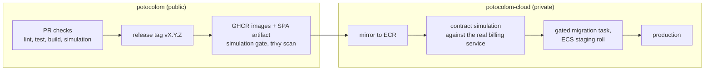

# Repository boundary, licensing and delivery pipeline

How the open source project and the commercial cloud relate: which code lives where, under which license, how the two repositories test against each other, and how CI grows without arriving ahead of its issues. This document goes deeper on the boundary that [architecture.md](architecture.md) states and [decisions.md](decisions.md) records.

## The shape in one sentence

There is no closed source cloud version of the application: the cloud runs the same GPL images, byte for byte, that self-hosters run. What is closed is everything that is not the application. Open product, closed business.

## Licensing

The public repository is GPL-3.0 and stays GPL-3.0.

- GPL-3.0 permits commercial SaaS use with no obligations the project does not already meet. GPL has no network clause, so even a modified cloud deployment would owe nothing; ours is unmodified by construction (the one-build rule in [deployment-profiles.md](deployment-profiles.md)).
- AGPL was considered as a defense against competitors hosting potocolom and rejected. A competitor hosting unmodified AGPL code has no obligation beyond pointing at source that is already public; AGPL only forces disclosure of their modifications. It would buy little here while costing adoption, since many organizations ban AGPL dependencies outright, and the self-hosted community is who the license serves. The actual moat is the closed business layer and the operations behind it, not the license.
- The arms-length rule that keeps the private side legally clean: a program that imports GPL code becomes a derivative work and must be GPL; a separate process speaking HTTP to it does not. Therefore the private repository never imports a single module from this one. It codes against the documented HTTP contract, period.
- Relicensing is trivial only while the project has one copyright holder. If that ever changes, a DCO (commit sign-off) is the cheap insurance to introduce when external contributions open up.

## The two repositories

| | potocolom (public, GPL-3.0) | potocolom-cloud (private) |
|---|---|---|
| Contents | frontend, backend, worker, compose, docs, the fake QuotaService | billing service (Stripe, credit ledger), fleet autoscaler (RunPod), Terraform environments, alert runbooks |
| Talks to the other via | nothing; it defines the contracts | `QUOTA_SERVICE_URL` HTTP, metering events, fleet token minting |
| Images | GHCR, built by public CI | pulls public images from GHCR, mirrors to ECR, adds its two private images |
| CI responsibility | ends at "images published" | begins at "images published" |
| Deploy secrets | none | all of them |

What lives where, at the edges:

- The Terraform environments (state, sizes, account wiring) are commercial operational data and live in the private repository. The [aws-setup.md](aws-setup.md) guide stays public: it documents how anyone could stand up their own cloud, which is good GPL citizenship and costs nothing, because the moat is operations, not configuration.
- The fake QuotaService ships in the public repository as part of cloud-sim ([local-development.md](local-development.md)). It is not just a development convenience; it is the executable contract.

## Boundary rules

1. No imports across the boundary, ever. HTTP only.
2. The contract is the tested artifact. The public repository tests the API against the fake QuotaService; the private repository's CI pulls the public images from GHCR and runs the same simulation against the real billing service. If both pass, the boundary holds. No shared code, no shared types: the contract lives in [blueprint.md](blueprint.md) and [api.md](api.md) plus the fake.
3. The contract is versioned like the worker protocol. A `/v1/` path on the quota and metering endpoints, expand-contract changes only, and the private repository pins which public release it deploys against. Worker to API already promises N-1 ([connection-handling.md](connection-handling.md)); the quota boundary gets the same discipline.

## Delivery pipeline

The handoff point between the repositories is the container registry:

### CI in the public repository, staged so nothing arrives before its issue

Already in place: per-component path-triggered workflows (lint, type check, test, build), the connection simulation as a CI job, and Dependabot.

Worth adding now, independent of any issue:

- docs.yml, path-triggered on `docs/**`: render every Mermaid block with mermaid-cli, check the draw.io XML parses, run a link checker. This converts the "validate before push" convention into an enforced check.
- Concurrency groups with cancel-in-progress on the PR workflows, so force-pushes stop stale runs instead of paying for them.
- CodeQL (Python and JavaScript, weekly and on PRs): free for public repositories, near-zero noise at this size.

Arriving with their issues, not before:

- Migration check (with Alembic, issues #14/#16): upgrade from empty to head against the postgres service container, plus a drift check so a model change without its migration fails CI.
- Image build check on PRs touching Dockerfiles: build, do not push.
- release.yml (this is issue #18): on a `v*` tag, build and push `api`, `worker-cuda` and `worker-rocm` to GHCR, run the simulation against the built images as the release gate, scan them with trivy, attach the SPA artifact. It ends at GHCR deliberately.
- The ROCm rung stays a manual pre-release verification on the reference AMD desktop, as decided; CI does not pretend to cover it.

### CI in the private repository

Its pipeline picks up where release.yml ends: mirror GHCR to ECR through the OIDC deploy role, run the contract simulation against the real billing service, apply the gated migration task, roll ECS staging, then production. Deploy CI living privately also keeps every deploy secret out of the public repository's attack surface entirely.

### Deliberately not added

Coverage gates, browser end-to-end rigs (waits for issue #3), nightly builds, workflow linting, PR title linting: process weight with no current failure mode behind it.
