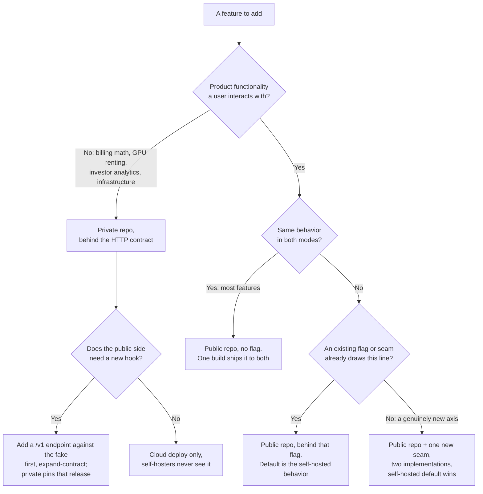
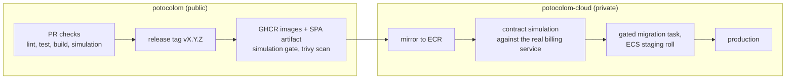

# Repository boundary, licensing and delivery pipeline

How the open source project and the commercial cloud relate: which code lives where, under which license, how the two repositories test against each other, and how CI grows without arriving ahead of its issues. This document goes deeper on the boundary that [architecture.md](architecture.md) states and [decisions.md](decisions.md) records.

## The shape in one sentence

There is no closed source cloud version of the application: the cloud runs the same AGPL images, byte for byte, that self-hosters run. What is closed is everything that is not the application. Open product, closed business.

## Licensing

The public repository is AGPL-3.0, with commercial exceptions sold by the project ([COMMERCIAL.md](../COMMERCIAL.md)). This supersedes the original GPL-3.0 choice; the decision record in [decisions.md](decisions.md) keeps both entries.

- What AGPL changes: anyone who modifies the platform and offers it over a network must publish their modified source (section 13), or buy a commercial license from us. Self-hosting, private use, internal use and contribution are unaffected. The license is a funnel for commercial derivatives, not a wall.
- What AGPL does not do, stated plainly because the original decision got this right: a competitor hosting unmodified code owes nothing beyond pointing at source that is already public, and some organizations ban AGPL dependencies outright. The moat remains the closed business layer and the operations behind it; our own cloud is unaffected because it runs unmodified images by construction (the one-build rule in [deployment-profiles.md](deployment-profiles.md)) and the project owns the copyright anyway.
- The arms-length rule that keeps the private side legally clean: a program that imports AGPL code becomes a derivative work and must be AGPL; a separate process speaking HTTP to it does not. Therefore the private repository never imports a single module from this one. It codes against the documented HTTP contract, period.
- Dual licensing works only while the project can relicense, which means retaining full copyright. Contributions therefore require a DCO sign-off ([CONTRIBUTING.md](../CONTRIBUTING.md)).

## The two repositories

| | potocolom (public, AGPL-3.0) | potocolom-cloud (private) |
|---|---|---|
| Contents | frontend, backend, worker, compose, docs, the fake QuotaService | billing service (Stripe, credit ledger), fleet autoscaler (RunPod), Terraform environments, alert runbooks |
| Talks to the other via | nothing; it defines the contracts | `QUOTA_SERVICE_URL` HTTP, metering events, fleet token minting |
| Images | GHCR, built by public CI | pulls public images from GHCR, mirrors to ECR, adds its two private images |
| CI responsibility | ends at "images published" | begins at "images published" |
| Deploy secrets | none | all of them |

What lives where, at the edges:

- The Terraform environments (state, sizes, account wiring) are commercial operational data and live in the private repository. The [aws-setup.md](aws-setup.md) guide stays public: it documents how anyone could stand up their own cloud, which is good open source citizenship and costs nothing, because the moat is operations, not configuration.
- The fake QuotaService ships in the public repository as part of cloud-sim ([local-development.md](local-development.md)). It is not just a development convenience; it is the executable contract.

## Boundary rules

1. No imports across the boundary, ever. HTTP only.
2. The contract is the tested artifact. The public repository tests the API against the fake QuotaService; the private repository's CI pulls the public images from GHCR and runs the same simulation against the real billing service. If both pass, the boundary holds. No shared code, no shared types: the contract lives in [blueprint.md](blueprint.md) and [api.md](api.md) plus the fake.
3. The contract is versioned like the worker protocol. A `/v1/` path on the quota and metering endpoints, expand-contract changes only, and the private repository pins which public release it deploys against. Worker to API already promises N-1 ([connection-handling.md](connection-handling.md)); the quota boundary gets the same discipline.

## Adding a feature: where the code goes and how it reaches each mode

One codebase means a feature is never built twice. The question is where its single implementation lives and how its behavior is selected per mode. Four cases cover everything, and the first one is almost all of them.

The editable version is the Feature placement page in [diagrams/](diagrams/).

| Case | Where | How the mode is selected | Example |
|---|---|---|---|
| Shared behavior | Public repo, no flag | Nothing; it is the same everywhere | A new drawing tool, a new model parameter, the usage_events row |
| Mode-conditional | Public repo, behind an existing flag or seam | `AUTH_MODE`, `BILLING_ENABLED`, `STORAGE_BACKEND`, `REDIS_URL`, `SAFETY_CHECKS`, `TELEMETRY`, or a seam implementation | The plan management panel appears only when `billing_enabled`; URLs are signed only when `STORAGE_BACKEND=s3` |
| New axis of difference | Public repo, plus one new seam | A new flag or `Protocol` with two implementations; the default is always the self-hosted one | Hypothetically, pluggable email was this once, now settled as `EMAIL_BACKEND` |
| Commercial only | Private repo | Not deployed to self-hosters at all; reached over HTTP if the app needs it | Stripe subscription tiers, the fleet autoscaler's bidding, the analytics warehouse |

Two rules keep the table honest. A new seam is a cost, so YAGNI applies hard: reach for case three only when a real second implementation exists now, not because a difference might appear later; until then it is case two behind a flag, or case one. And a mode-specific feature still puts its code in the public repository. Cloud-only UI like the billing panel is public code gated by `billing_enabled`; only the commercial logic behind the HTTP contract is private. The test for "does this go private" is not "is it cloud-only," it is "is it business rather than product."

### The workflow per case

- Cases one to three (public): the existing flow. An issue, a stacked draft PR that `Closes` it, CI runs lint, type check, test, build and the connection simulation, it merges, and the next release tag publishes one set of images to GHCR. Self-hosters pull that image; the cloud mirrors the identical digest to ECR. The feature reaches both modes through the same single build, whether its behavior is shared or flag-gated.
- Case four (private): an issue and PR in potocolom-cloud. Its CI pulls the pinned public image from GHCR and runs the contract simulation against the real billing service, then deploys to the cloud only. Self-hosters are never involved because the code was never in their image.
- The crossing case (four with a public hook): the public repository adds the endpoint against the fake QuotaService first and releases it; the private repository then pins that release and implements the real side. Expand-contract ordering makes this safe in one direction: the fake and the `/v1` contract change in a public PR, ship, and only then does the private implementation follow. The reverse order would deploy a caller before the thing it calls exists.

The through line: self-hosted is never a reduced build of the cloud, and the cloud is never a fork of self-hosted. Both are the same public images; the cloud only adds private processes beside them, reached over HTTP, plus a handful of environment variables. Adding a feature is choosing which of those two places its code belongs, and for product features the answer is almost always the public repository.

## Delivery pipeline

The handoff point between the repositories is the container registry:

### CI in the public repository, staged so nothing arrives before its issue

Already in place: per-component path-triggered workflows (lint, type check, test, build), the connection simulation as a CI job, and Dependabot.

Worth adding now, independent of any issue:

- docs.yml, path-triggered on `docs/**`: render every Mermaid block with mermaid-cli, check the draw.io XML parses, run a link checker. This converts the "validate before push" convention into an enforced check.
- Concurrency groups with cancel-in-progress on the PR workflows, so force-pushes stop stale runs instead of paying for them.
- CodeQL (Python and JavaScript, weekly and on PRs): free for public repositories, near-zero noise at this size.

Arriving with their issues, not before:

- Migration check (with Alembic, issues #14/#16): upgrade from empty to head against the postgres service container, plus a drift check so a model change without its migration fails CI.
- Image build check on PRs touching Dockerfiles: build, do not push.
- release.yml (this is issue #18): on a `v*` tag, build and push `api`, `worker-cuda` and `worker-rocm` to GHCR, run the simulation against the built images as the release gate, scan them with trivy, attach the SPA artifact. It ends at GHCR deliberately.
- The ROCm rung stays a manual pre-release verification on the reference AMD desktop, as decided; CI does not pretend to cover it.

### CI in the private repository

Its pipeline picks up where release.yml ends: mirror GHCR to ECR through the OIDC deploy role, run the contract simulation against the real billing service, apply the gated migration task, roll ECS staging, then production. Deploy CI living privately also keeps every deploy secret out of the public repository's attack surface entirely.

### Deliberately not added

Coverage gates, browser end-to-end rigs (waits for issue #3), nightly builds, workflow linting, PR title linting: process weight with no current failure mode behind it.
